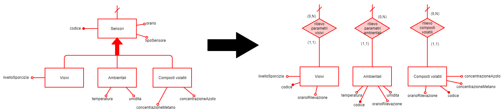
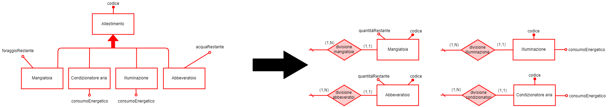
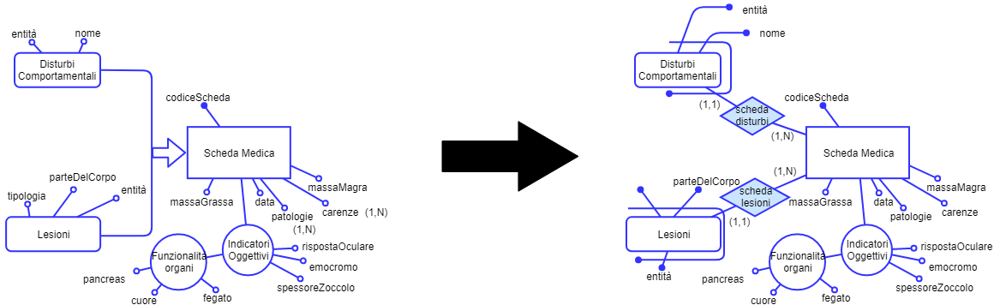

------------------------------------------------------------------------

  
**Relazione per il Progetto di Base Dati 2019**  
*FarmHouse 4.0*  
Guillaume Quint,  
Francesco Bonciani

Università di Pisa, Ingegneria Informatica  
  

Glossario
=========

Sono qui descritte le varie entità e relazioni di ogni area, assieme ai
relativi attributi e collegamenti con le altre parti del database.

Questo glossario è stato realizzato prima della progettazione del
diagramma Entità-Relazioni: ogni modifica dovuta al processo di
ristrutturazione verrà indicata nella relativa sezione
<a href="#sec:ristrutturazione" data-reference-type="ref" data-reference="sec:ristrutturazione">2</a>
a pag. , oppure, nel caso di ridondanze tra entità e relazioni, anche
nel paragrafo
<a href="#subsec:ridondanze-ent-rel" data-reference-type="ref" data-reference="subsec:ridondanze-ent-rel">3.2</a>
a pag.

Area Allevamento
----------------

### Entità

<table style="width:90%;">
<colgroup>
<col style="width: 14%" />
<col style="width: 20%" />
<col style="width: 36%" />
<col style="width: 20%" />
</colgroup>
<thead>
<tr class="header">
<th style="text-align: left;"><strong>Nome entità</strong></th>
<th style="text-align: left;"><strong>Descrizione</strong></th>
<th style="text-align: left;"><strong>Attributi</strong></th>
<th style="text-align: left;"><strong>Collegamenti</strong></th>
</tr>
</thead>
<tbody>
<tr class="odd">
<td style="text-align: left;">Abbeveratoio</td>
<td style="text-align: left;">Dispositivo per la distribuzione dell’acqua agli animali nei locali</td>
<td style="text-align: left;"><ul>
<li>
acquaRestante
</li>
</ul></td>
<td style="text-align: left;">Locale, Pasto per Locale</td>
</tr>
<tr class="even">
<td style="text-align: left;">Acqua</td>
<td style="text-align: left;">Acqua eventualmente arricchita per l’idratazione degli animali</td>
<td style="text-align: left;"><ul>
<li>
codiceAcqua
</li>
</ul></td>
<td style="text-align: left;">Pasto</td>
</tr>
<tr class="odd">
<td style="text-align: left;">Agriturismo</td>
<td style="text-align: left;">Struttura attrezzata per l’allevamento degli animali e l’accoglienza dei clienti conforme agli standard di <em>Industry 4.0</em></td>
<td style="text-align: left;"><ul>
<li>
nome
</li>
<li>
indirizzo
</li>
<li>
indirizzo web
</li>
<li>
contatto
</li>
</ul></td>
<td style="text-align: left;">Cliente, Stanza, Stalla, Formaggio</td>
</tr>
<tr class="even">
<td style="text-align: left;">Allestimento</td>
<td style="text-align: left;">Mangiatoie, Abbeveratoi, e dispositivi di illuminazione e condizionamento aria di ogni locale</td>
<td style="text-align: left;"><ul>
<li>
codice
</li>
</ul></td>
<td style="text-align: left;">Locale</td>
</tr>
<tr class="odd">
<td style="text-align: left;">Ambientali</td>
<td style="text-align: left;">Sensore di temperatura ed umidità del locale</td>
<td style="text-align: left;"><ul>
<li>
temperatura
</li>
<li>
umidità
</li>
</ul></td>
<td style="text-align: left;">Locale</td>
</tr>
<tr class="even">
<td style="text-align: left;">Animale</td>
<td style="text-align: left;">Anagrafica degli animali di <em>FarmHouse 4.0</em></td>
<td style="text-align: left;"><ul>
<li>
codice
</li>
<li>
dataNascita
</li>
<li>
peso
</li>
<li>
altezza
</li>
<li>
razza
</li>
<li>
sesso
</li>
<li>
specie
</li>
<li>
famiglia
</li>
</ul></td>
<td style="text-align: left;">Mungitura, Latte, Scheda Medica, Animale Acquisito, Terapia, GPS, Indici Salute, Riproduzione, Visita</td>
</tr>
<tr class="odd">
<td style="text-align: left;">Animale Acquisito</td>
<td style="text-align: left;">Generalizzazione di un Animale non nato all’interno di un agriturismo, bensì acquisito da un fornitore esterno</td>
<td style="text-align: left;"><ul>
<li>
codAcquisizione
</li>
<li>
dataAcquisto
</li>
<li>
dataArrivo
</li>
</ul></td>
<td style="text-align: left;">Animale, Fornitore</td>
</tr>
<tr class="even">
<td style="text-align: left;">Area Pascolo</td>
<td style="text-align: left;">Spazio dell’agriturismo destinato al pascolo degli animali</td>
<td style="text-align: left;"><ul>
<li>
codiceArea
</li>
<li>
estensione
</li>
</ul></td>
<td style="text-align: left;">Attività Pascolo, Recinzione Divisoria e Zona Pascolo</td>
</tr>
<tr class="odd">
<td style="text-align: left;">Arricchita</td>
<td style="text-align: left;">Variante di Acqua arricchita di sali minerali e/o vitamine</td>
<td style="text-align: left;"><ul>
<li>
concentrazioneSali
</li>
<li>
concentrazioneVitamine
</li>
</ul></td>
<td style="text-align: left;">Pasto</td>
</tr>
<tr class="even">
<td style="text-align: left;">Attività Pascolo</td>
<td style="text-align: left;">Esercizio di pascolo che coinvolge tutti gli animali di un locale</td>
<td style="text-align: left;"><ul>
<li>
codAttività
</li>
<li>
giorno
</li>
<li>
orario
</li>
</ul></td>
<td style="text-align: left;">Locale, Area Pascolo</td>
</tr>
<tr class="odd">
<td style="text-align: left;">Composti Volatili</td>
<td style="text-align: left;">Sensore della concentrazione di azoto e metano nel locale</td>
<td style="text-align: left;"><ul>
<li>
concentrazioneMetano
</li>
<li>
concentrazioneAzoto
</li>
</ul></td>
<td style="text-align: left;">Locale</td>
</tr>
<tr class="even">
<td style="text-align: left;">Condizionatore aria</td>
<td style="text-align: left;">Dispositivo di condizionamento dell’aria all’interno dei locali</td>
<td style="text-align: left;"><ul>
<li>
codice
</li>
<li>
consumo energetico
</li>
</ul></td>
<td style="text-align: left;">Locale</td>
</tr>
<tr class="odd">
<td style="text-align: left;">Foraggio</td>
<td style="text-align: left;">Alimentazione degli animali identificato dai suoi ingredienti vegetali</td>
<td style="text-align: left;"><ul>
<li>
fibre
</li>
<li>
proteine
</li>
<li>
glucidi
</li>
<li>
cereali
</li>
<li>
frutta
</li>
<li>
piante
</li>
<li>
kcal/kg
</li>
<li>
forma (fieno/insilato)
</li>
</ul></td>
<td style="text-align: left;">Pasto</td>
</tr>
<tr class="even">
<td style="text-align: left;">Fornitore</td>
<td style="text-align: left;">Fornitore di capi di bestiame per la rete di agriturismi</td>
<td style="text-align: left;"><ul>
<li>
ragioneSociale
</li>
<li>
nome
</li>
<li>
indirizzo
</li>
<li>
partitaIVA
</li>
</ul></td>
<td style="text-align: left;">Animale Acquisito</td>
</tr>
<tr class="odd">
<td style="text-align: left;">GPS</td>
<td style="text-align: left;">Dispositivo di localizzazione per ogni animale</td>
<td style="text-align: left;"><ul>
<li>
codiceGPS
</li>
<li>
posizione
</li>
<li>
orario
</li>
</ul></td>
<td style="text-align: left;">Animale</td>
</tr>
<tr class="even">
<td style="text-align: left;">Illuminazione</td>
<td style="text-align: left;">Dispositivo di illuminazione artificiale dei locali</td>
<td style="text-align: left;"><ul>
<li>
codice
</li>
<li>
consumo energetico
</li>
</ul></td>
<td style="text-align: left;">Locale</td>
</tr>
<tr class="odd">
<td style="text-align: left;">Insuccesso</td>
<td style="text-align: left;">Riproduzioni non andate a buon fine</td>
<td style="text-align: left;"><ul>
<li>
complicanza
</li>
</ul></td>
<td style="text-align: left;">Animale, Veterinario</td>
</tr>
<tr class="even">
<td style="text-align: left;">Locale</td>
<td style="text-align: left;">Divisione della stalla per specie ospitata e tipo di allestimento</td>
<td style="text-align: left;"><ul>
<li>
codice
</li>
<li>
pavimentazione
</li>
<li>
capienzaMax
</li>
<li>
specieOspitata
</li>
<li>
orientazioneFinestre
</li>
<li>
altezza
</li>
<li>
lunghezza
</li>
<li>
larghezza
</li>
<li>
temperatura
</li>
<li>
umidità
</li>
<li>
tollerabilitàSporcizia
</li>
<li>
tollerabilitàAzoto
</li>
<li>
tollerabilitàMetano
</li>
</ul></td>
<td style="text-align: left;">Stalla, Sensori, Pulizia Locale, Allestimento, Attività Pascolo, Animale, Pasto per Locale</td>
</tr>
<tr class="odd">
<td style="text-align: left;">Mangiatoia</td>
<td style="text-align: left;">Dispositivo per la distribuzione del foraggio agli animali nei locali</td>
<td style="text-align: left;"><ul>
<li>
foraggioRestante
</li>
</ul></td>
<td style="text-align: left;">Locale, Pasto per Locale</td>
</tr>
<tr class="even">
<td style="text-align: left;">Pasto</td>
<td style="text-align: left;">Alimentazione somministrata automaticamente nelle mangiatoie e negli abbeveratoi di ogni locale</td>
<td style="text-align: left;"><ul>
<li>
fibre
</li>
<li>
proteine
</li>
<li>
glucidi
</li>
<li>
codAcqua
</li>
</ul></td>
<td style="text-align: left;">Pasto per Locale, Acqua, Foraggio</td>
</tr>
<tr class="odd">
<td style="text-align: left;">Pasto per Locale</td>
<td style="text-align: left;">Pasto specifico che viene somministrato in un locale in una certa data con un certo orario</td>
<td style="text-align: left;"><ul>
<li>
giorno
</li>
<li>
orario
</li>
</ul></td>
<td style="text-align: left;">Locale, Pasto</td>
</tr>
<tr class="even">
<td style="text-align: left;">Pulizia Locale</td>
<td style="text-align: left;">Richieste d’intervento di pulizia di un locale</td>
<td style="text-align: left;"><ul>
<li>
orarioRilevazione
</li>
<li>
dataRilevazione
</li>
<li>
stato
</li>
<li>
personale
</li>
<li>
concentrazioneMetano
</li>
<li>
concentrazioneAzoto
</li>
<li>
livelloSporcizia
</li>
<li>
codLocale
</li>
</ul></td>
<td style="text-align: left;">Locale</td>
</tr>
<tr class="odd">
<td style="text-align: left;">Recinzione Divisoria e Zona Pascolo</td>
<td style="text-align: left;">Ogni Area di pascolo è divisa in zone recintate dinamicamente</td>
<td style="text-align: left;"><ul>
<li>
codiceZona
</li>
<li>
posizione
</li>
</ul></td>
<td style="text-align: left;">Area Pascolo</td>
</tr>
<tr class="even">
<td style="text-align: left;">Riproduzione</td>
<td style="text-align: left;">Storico dei tentativi di riproduzione effettuati, sia riusciti che non</td>
<td style="text-align: left;"><ul>
<li>
codiceRiproduzione
</li>
<li>
stato
</li>
<li>
orario
</li>
<li>
data
</li>
</ul></td>
<td style="text-align: left;">Animale, Veterinario</td>
</tr>
<tr class="odd">
<td style="text-align: left;">Scheda Gestazione</td>
<td style="text-align: left;">Descrive i diversi interventi di controllo decisi dal veterinario in fase di gestazione</td>
<td style="text-align: left;"><ul>
<li>
codiceGestazione
</li>
<li>
interventiControlloProgrammati
</li>
</ul></td>
<td style="text-align: left;">Riproduzione, Visita, Veterinario</td>
</tr>
<tr class="even">
<td style="text-align: left;">Sensori</td>
<td style="text-align: left;">Generalizzazione dei sensori visivi, ambientali e dei composti volatili del locale</td>
<td style="text-align: left;"><ul>
<li>
codice
</li>
<li>
orario
</li>
<li>
tipoSensore
</li>
</ul></td>
<td style="text-align: left;">Locale</td>
</tr>
<tr class="odd">
<td style="text-align: left;">Stalla</td>
<td style="text-align: left;">Insieme di locali adibiti all’alloggio e alla nutrizione degli animali</td>
<td style="text-align: left;"><ul>
<li>
numProgressivo
</li>
<li>
nomeAgriturismo
</li>
</ul></td>
<td style="text-align: left;">Agriturismo, Locale</td>
</tr>
<tr class="even">
<td style="text-align: left;">Successo</td>
<td style="text-align: left;">Riproduzioni andate a buon fine</td>
<td style="text-align: left;"><ul>
<li>
codiceNeonato
</li>
<li>
esitoVisitaControllo
</li>
</ul></td>
<td style="text-align: left;">Animale, Veterinario, Scheda Gestazione</td>
</tr>
<tr class="odd">
<td style="text-align: left;">Visivi</td>
<td style="text-align: left;">Sensore visivo del livello di sporcizia del locale</td>
<td style="text-align: left;"><ul>
<li>
livelloSporcizia
</li>
</ul></td>
<td style="text-align: left;">Locale</td>
</tr>
</tbody>
</table>

### Relazioni

<table style="width:90%;">
<colgroup>
<col style="width: 16%" />
<col style="width: 24%" />
<col style="width: 50%" />
</colgroup>
<thead>
<tr class="header">
<th style="text-align: left;"><strong>Nome     relazione</strong></th>
<th style="text-align: left;"><strong>Attributi</strong></th>
<th style="text-align: left;"><strong>Cardinalità</strong></th>
</tr>
</thead>
<tbody>
<tr class="odd">
<td style="text-align: left;">abita</td>
<td style="text-align: left;"></td>
<td style="text-align: left;"><ul>
<li>
(1,1) con Animale: ogni animale abita un solo locale dell’agriturismo
</li>
<li>
(1,N) con Locale: ogni locale può ospitare diversi animali
</li>
</ul></td>
</tr>
<tr class="even">
<td style="text-align: left;">acqua contenuta</td>
<td style="text-align: left;"></td>
<td style="text-align: left;"><ul>
<li>
(1,N) con Abbeveratoio: un abbeveratoio può essere impiegato per più pasti
</li>
<li>
(1,N) con Pasto per Locale: uno specifico pasto può essere distribuito su più abbeveratoi dello stesso locale
</li>
</ul></td>
</tr>
<tr class="odd">
<td style="text-align: left;">acquisto animale</td>
<td style="text-align: left;"></td>
<td style="text-align: left;"><ul>
<li>
(1,1) con Animale Acquisito: un animale, se acquistato, può provenire da un solo fornitore
</li>
<li>
(1,N) con Fornitore: un fornitore può vendere più di un animale
</li>
</ul></td>
</tr>
<tr class="even">
<td style="text-align: left;">attività locale</td>
<td style="text-align: left;"></td>
<td style="text-align: left;"><ul>
<li>
(1,N) con Locale: gli animali di un locale possono effettuare più attività di pascolo
</li>
<li>
(1,1) con Attività pascolo: ogni attività di pascolo coinvolge tutti gli animali di un solo locale
</li>
</ul></td>
</tr>
<tr class="odd">
<td style="text-align: left;">coinvolge</td>
<td style="text-align: left;">codicePadre</td>
<td style="text-align: left;"><ul>
<li>
(0,N) con Animale: ogni coppia di animale può intraprendere o no più di una riproduzione
</li>
<li>
(1,1) con Riproduzione: ogni riproduzione richiede un animale madre e un animale padre
</li>
</ul></td>
</tr>
<tr class="even">
<td style="text-align: left;">collocazione attività</td>
<td style="text-align: left;"></td>
<td style="text-align: left;"><ul>
<li>
(1,1) con Attività pascolo: ogni attività di pascolo viene svolta in una sola area dedicata
</li>
<li>
(1,N) con Area pascolo: ogni area di pascolo di un agriturismo può essere impiegata per più attività di pascolo
</li>
</ul></td>
</tr>
<tr class="odd">
<td style="text-align: left;">composizione acqua</td>
<td style="text-align: left;"></td>
<td style="text-align: left;"><ul>
<li>
(1,1) con Pasto: ad un pasto è associato un solo tipo di acqua
</li>
<li>
(1,N) con Acqua: un tipo di acqua può andare a comporre più pasti
</li>
</ul></td>
</tr>
<tr class="even">
<td style="text-align: left;">composizione foraggio</td>
<td style="text-align: left;"></td>
<td style="text-align: left;"><ul>
<li>
(1,1) con Pasto: ad un pasto è associato un solo tipo di foraggio
</li>
<li>
(1,N) con Foraggio: un tipo di foraggio può andare a comporre più pasti
</li>
</ul></td>
</tr>
<tr class="odd">
<td style="text-align: left;">determina</td>
<td style="text-align: left;"></td>
<td style="text-align: left;"><ul>
<li>
(1,1) con Scheda gestazione: ogni scheda di gestazione è associata ad una sola gravidanza che ha successo
</li>
<li>
(1,1) con Successo: per ogni gravidanza che ha successo si compila una sola scheda di gestazione
</li>
</ul></td>
</tr>
<tr class="even">
<td style="text-align: left;">divisione allestimanti</td>
<td style="text-align: left;"></td>
<td style="text-align: left;"><ul>
<li>
(1,N) con Locale: Ogni locale è dotato di uno o più allestimenti
</li>
<li>
(1,1) con Allestimento: un allestimento è associato ad un solo locale
</li>
</ul></td>
</tr>
<tr class="odd">
<td style="text-align: left;">divisione  condizionatori</td>
<td style="text-align: left;"></td>
<td style="text-align: left;"><ul>
<li>
(1,N) con Locale: Ogni locale è dotato di uno o più condizionatori
</li>
<li>
(1,1) con Condizionatore aria: un condizionatore è associato ad un solo locale
</li>
</ul></td>
</tr>
<tr class="even">
<td style="text-align: left;">divisione    illuminazione</td>
<td style="text-align: left;"></td>
<td style="text-align: left;"><ul>
<li>
(1,N) con Locale: Ogni locale è dotato di uno o più dispositivi di illuminazione
</li>
<li>
(1,1) con Illuminazione: un dispositivo di illuminazione è associato ad un solo locale
</li>
</ul></td>
</tr>
<tr class="odd">
<td style="text-align: left;">divisione locali</td>
<td style="text-align: left;"></td>
<td style="text-align: left;"><ul>
<li>
(1,N) con Stalla: ogni stalla è divisa in più locali
</li>
<li>
(1,1) con Locale: un Locale appartiene ad una sola stalla
</li>
</ul></td>
</tr>
<tr class="even">
<td style="text-align: left;">divisione pascolo</td>
<td style="text-align: left;"></td>
<td style="text-align: left;"><ul>
<li>
(1,N) con Area pascolo: ogni area di pascolo è divisa in più zone recintate
</li>
<li>
(1,1) con Recinzione divisoria e zona di pascolo: ogni zona recintata appartiene ad una sola area di pascolo
</li>
</ul></td>
</tr>
<tr class="odd">
<td style="text-align: left;">divisione stalle</td>
<td style="text-align: left;"></td>
<td style="text-align: left;"><ul>
<li>
(1,N) con Agriturismo: un agriturismo è diviso in più stalle
</li>
<li>
(1,1) con Stalle: ogni stalla appartiene ad un solo Agriturismo
</li>
</ul></td>
</tr>
<tr class="even">
<td style="text-align: left;">foraggio contenuto</td>
<td style="text-align: left;"></td>
<td style="text-align: left;"><ul>
<li>
(1,N) con Mangiatoia: una mangiatoia può essere impiegata per più pasti
</li>
<li>
(1,N) con Pasto per Locale: uno specifico pasto può essere distribuito su più mangiatoie dello stesso locale
</li>
</ul></td>
</tr>
<tr class="odd">
<td style="text-align: left;">locale assegnato</td>
<td style="text-align: left;"></td>
<td style="text-align: left;"><ul>
<li>
(1,N) con Locale: un locale può contenere più pasti
</li>
<li>
(1,1) con Pasto per Locale: uno specifico pasto deve essere distribuito su un solo locale
</li>
</ul></td>
</tr>
<tr class="even">
<td style="text-align: left;">localizzato</td>
<td style="text-align: left;"></td>
<td style="text-align: left;"><ul>
<li>
(1,1) con Animale: ogni GPS localizza un solo animale
</li>
<li>
(1,1) con GPS: ogni animale viene localizzato da un solo GPS
</li>
</ul></td>
</tr>
<tr class="odd">
<td style="text-align: left;">madre</td>
<td style="text-align: left;"></td>
<td style="text-align: left;"><ul>
<li>
(0,N) con Animale: ogni animale può o no essere madre di più figli
</li>
<li>
(0,1) con Animale: ogni animale è figlio di al massimo una madre: se è stato acquisito, la madre può non essere registrata
</li>
</ul></td>
</tr>
<tr class="even">
<td style="text-align: left;">padre</td>
<td style="text-align: left;"></td>
<td style="text-align: left;"><ul>
<li>
(0,N) con Animale: ogni animale può o no essere padre di più figli
</li>
<li>
(0,1) con Animale: ogni animale è figlio di al massimo un padre: se è stato acquisito, il padre può non essere registrato
</li>
</ul></td>
</tr>
<tr class="odd">
<td style="text-align: left;">pasto assegnato</td>
<td style="text-align: left;"></td>
<td style="text-align: left;"><ul>
<li>
(1,N) con Pasto: un Pasto può essere somministrato allo stesso locale in giorni differenti
</li>
<li>
(1,1) con Pasto per Locale: per ogni locale, ogni giorno viene assegnato uno specifico pasto
</li>
</ul></td>
</tr>
<tr class="even">
<td style="text-align: left;">richiesta intervento</td>
<td style="text-align: left;"></td>
<td style="text-align: left;"><ul>
<li>
(0,N) con Locale: alcuni locali possono richiedere più interventi di pulizia
</li>
<li>
(1,1) con Pulizia locale: ogni intervento di pulizia si riferisce ad un solo locale dell’agriturismo
</li>
</ul></td>
</tr>
<tr class="odd">
<td style="text-align: left;">rilievo parametri locale</td>
<td style="text-align: left;"></td>
<td style="text-align: left;"><ul>
<li>
(1,N) con Locale: ogni locale è dotato di uno o più sensori
</li>
<li>
(1,1) con Sensori: ogni sensore monitora un solo locale
</li>
</ul></td>
</tr>
<tr class="even">
<td style="text-align: left;">scrive</td>
<td style="text-align: left;"></td>
<td style="text-align: left;"><ul>
<li>
(0,N) con Veterinario: alcuni veterinari possono compilare più schede di gestazione
</li>
<li>
(1,1) con Scheda gestazione: ogni scheda viene compilata da un solo veterinario
</li>
</ul></td>
</tr>
<tr class="odd">
<td style="text-align: left;">supervisiona</td>
<td style="text-align: left;"></td>
<td style="text-align: left;"><ul>
<li>
(0,N) con Veterinario: alcuni veterinari possono supervisionare più gestazioni
</li>
<li>
(1,1) con Riproduzione: ogni riproduzione ha un solo veterinario supervisore
</li>
</ul></td>
</tr>
</tbody>
</table>

Area Healthcare
---------------

### Entità

<table style="width:90%;">
<colgroup>
<col style="width: 14%" />
<col style="width: 20%" />
<col style="width: 36%" />
<col style="width: 20%" />
</colgroup>
<thead>
<tr class="header">
<th style="text-align: left;"><strong>Nome entità</strong></th>
<th style="text-align: left;"><strong>Descrizione</strong></th>
<th style="text-align: left;"><strong>Attributi</strong></th>
<th style="text-align: left;"><strong>Collegamenti</strong></th>
</tr>
</thead>
<tbody>
<tr class="odd">
<td style="text-align: left;">Disturbi Comportamentali</td>
<td style="text-align: left;">Informazioni su abitudini fuori dal comune di un animale</td>
<td style="text-align: left;"><ul>
<li>
nome
</li>
<li>
entità
</li>
</ul></td>
<td style="text-align: left;">Animale, Veterinario</td>
</tr>
<tr class="even">
<td style="text-align: left;">Esame</td>
<td style="text-align: left;">Esame medico prescritto da un veterinario effettuato con un determinato macchinario</td>
<td style="text-align: left;"><ul>
<li>
codiceEsame
</li>
<li>
nome
</li>
<li>
descrizione
</li>
<li>
macchinario
</li>
<li>
data
</li>
</ul></td>
<td style="text-align: left;">Veterinario, Animale</td>
</tr>
<tr class="odd">
<td style="text-align: left;">Farmaco</td>
<td style="text-align: left;">Medicinale prescritto da un veterinario da assumere durante una terapia</td>
<td style="text-align: left;"><ul>
<li>
nome
</li>
<li>
dosaggio
</li>
<li>
principioAttivo
</li>
</ul></td>
<td style="text-align: left;">Terapia</td>
</tr>
<tr class="even">
<td style="text-align: left;">Indici Salute</td>
<td style="text-align: left;">Informazioni relative alle condizioni di salute di un animale</td>
<td style="text-align: left;"><ul>
<li>
dataRilevazione
</li>
<li>
lucentezzaPelo
</li>
<li>
vigilanza
</li>
<li>
idratazione
</li>
<li>
deambulazione
</li>
<li>
tipologiaRespirazione
</li>
</ul></td>
<td style="text-align: left;">Animale</td>
</tr>
<tr class="odd">
<td style="text-align: left;">Lesioni</td>
<td style="text-align: left;">Ferite riportate da un animale</td>
<td style="text-align: left;"><ul>
<li>
tipologia
</li>
<li>
parteDelCorpo
</li>
<li>
entità
</li>
</ul></td>
<td style="text-align: left;">Animale, Veterinario</td>
</tr>
<tr class="even">
<td style="text-align: left;">Scheda Medica</td>
<td style="text-align: left;">Documento contenente tutte le informazioni relative ad una visita effettuata da un veterinario su un animale</td>
<td style="text-align: left;"><ul>
<li>
codiceScheda
</li>
<li>
massaMagra
</li>
<li>
massaGrassa
</li>
<li>
rispostaOculare
</li>
<li>
emocromo
</li>
<li>
spessoreZoccolo
</li>
<li>
fegato
</li>
<li>
cuore
</li>
<li>
pancreas
</li>
<li>
data
</li>
<li>
patologie
</li>
<li>
carenze
</li>
</ul></td>
<td style="text-align: left;">Animale, Veterinario</td>
</tr>
<tr class="odd">
<td style="text-align: left;">Terapia</td>
<td style="text-align: left;">Trattamento prescritto da un veterinario conseguentemente alla rilevazione di malattie in un animale</td>
<td style="text-align: left;"><ul>
<li>
codiceTerapia
</li>
<li>
dataInizio
</li>
<li>
durata
</li>
<li>
secondaTerapiaConsecutiva
</li>
<li>
codAnimale
</li>
</ul></td>
<td style="text-align: left;">Veterinario, Farmaco </td>
</tr>
<tr class="even">
<td style="text-align: left;">Veterinario</td>
<td style="text-align: left;">Medico specializzato per la visita degli animali</td>
<td style="text-align: left;"><ul>
<li>
codiceFiscale
</li>
<li>
nome
</li>
<li>
cognome
</li>
<li>
contatto
</li>
</ul></td>
<td style="text-align: left;">Scheda Medica, Terapia, Esame, Riproduzione, Visita</td>
</tr>
<tr class="odd">
<td style="text-align: left;">Visita</td>
<td style="text-align: left;">Visita di controllo effettuata per rilevare valori anomali negli indici di salute di un animale</td>
<td style="text-align: left;"><ul>
<li>
codiceVisita
</li>
<li>
esito
</li>
<li>
dataProgrammata
</li>
<li>
dataEffettiva
</li>
<li>
stato
</li>
</ul></td>
<td style="text-align: left;">Veterinario, Scheda gestazione</td>
</tr>
</tbody>
</table>

### Relazioni

<table style="width:90%;">
<colgroup>
<col style="width: 16%" />
<col style="width: 24%" />
<col style="width: 50%" />
</colgroup>
<thead>
<tr class="header">
<th style="text-align: left;"><strong>Nome     relazione</strong></th>
<th style="text-align: left;"><strong>Attributi</strong></th>
<th style="text-align: left;"><strong>Cardinalità</strong></th>
</tr>
</thead>
<tbody>
<tr class="odd">
<td style="text-align: left;">compila</td>
<td style="text-align: left;"></td>
<td style="text-align: left;"><ul>
<li>
(1,1) con Scheda medica: ogni scheda è compilata da un solo veterinario
</li>
<li>
(0,N) con Veterinario: alcuni veterinari possono compilare più di una scheda medica
</li>
</ul></td>
</tr>
<tr class="even">
<td style="text-align: left;">composta da</td>
<td style="text-align: left;">posologia</td>
<td style="text-align: left;"><ul>
<li>
(1,N) con Terapia: ogni terapia è composta da almeno un farmaco
</li>
<li>
(1,N) con Farmaco: ogni farmaco è impiegato in almeno una terapia, altrimenti non è memorizzato nel database
</li>
</ul></td>
</tr>
<tr class="odd">
<td style="text-align: left;">esegue</td>
<td style="text-align: left;"></td>
<td style="text-align: left;"><ul>
<li>
(0,N) con Veterinario: alcuni veterinari possono eseguire più visite di controllo
</li>
<li>
(1,1) con Visita: ogni visita è effettuata da un solo veterinario
</li>
</ul></td>
</tr>
<tr class="even">
<td style="text-align: left;">possiede</td>
<td style="text-align: left;"></td>
<td style="text-align: left;"><ul>
<li>
(0,N) con Animale: alcuni animali possono avere più di una scheda
</li>
<li>
(1,1) con Scheda medica: ogni scheda è assocata ad un solo animale
</li>
</ul></td>
</tr>
<tr class="odd">
<td style="text-align: left;">possiede esame</td>
<td style="text-align: left;"></td>
<td style="text-align: left;"><ul>
<li>
(1,N) con Animale: ogni animale possiede almeno un esame diagnostico, sia che sia nato nell’agriturismo, sia che sia stato acquisito
</li>
<li>
(1,1) con Esame: ogni esame veterinario si riferisce ad un solo animale
</li>
</ul></td>
</tr>
<tr class="even">
<td style="text-align: left;">possiede terapia</td>
<td style="text-align: left;"></td>
<td style="text-align: left;"><ul>
<li>
(0,N) con Animale: alcuni animali possono possedere più terapie
</li>
<li>
(1,1) con Terapia: ogni terapia è associata ad un solo animale
</li>
</ul></td>
</tr>
<tr class="odd">
<td style="text-align: left;">possiede visita</td>
<td style="text-align: left;"></td>
<td style="text-align: left;"><ul>
<li>
(1,N) con Animale: ogni animale può possedere più visite
</li>
<li>
(1,1) con Visita: ogni visita è associata ad un solo animale
</li>
</ul></td>
</tr>
<tr class="even">
<td style="text-align: left;">prescrive esame</td>
<td style="text-align: left;"></td>
<td style="text-align: left;"><ul>
<li>
(0,N) con Veterinario: alcuni veterinari possono prescrivere più di un esame
</li>
<li>
(1,1) con Esame: ogni esame è prescritto da un solo veterinario
</li>
</ul></td>
</tr>
<tr class="odd">
<td style="text-align: left;">prescrive terapia</td>
<td style="text-align: left;"></td>
<td style="text-align: left;"><ul>
<li>
(0,N) con Veterinario: alcuni veterinari possono prescrivere più di un terapia
</li>
<li>
(1,1) con Terapia: ogni terapia è prescritta da un solo veterinario
</li>
</ul></td>
</tr>
<tr class="even">
<td style="text-align: left;">stato salute</td>
<td style="text-align: left;"></td>
<td style="text-align: left;"><ul>
<li>
(1,N) con Animale: ogni animale può avere più indici di salute in diverse date
</li>
<li>
(1,1) con Indici salute: ogni set di indici di salute si riferisce ad un solo animale
</li>
</ul></td>
</tr>
</tbody>
</table>

Area Produzione
---------------

### Entità

<table style="width:90%;">
<colgroup>
<col style="width: 14%" />
<col style="width: 20%" />
<col style="width: 36%" />
<col style="width: 20%" />
</colgroup>
<thead>
<tr class="header">
<th style="text-align: left;"><strong>Nome entità</strong></th>
<th style="text-align: left;"><strong>Descrizione</strong></th>
<th style="text-align: left;"><strong>Attributi</strong></th>
<th style="text-align: left;"><strong>Collegamenti</strong></th>
</tr>
</thead>
<tbody>
<tr class="odd">
<td style="text-align: left;">Cantine</td>
<td style="text-align: left;">Spazio dell’agriturismo dedicato alla stagionatura dei formaggi prodotti da un lotto</td>
<td style="text-align: left;"><ul>
<li>
codice
</li>
</ul></td>
<td style="text-align: left;">Lotto, Scaffalature, Parametri</td>
</tr>
<tr class="even">
<td style="text-align: left;">Controllo Parametri Fase</td>
<td style="text-align: left;">Controlla, per ogni lotto, i parametri effettivi relativi ad ogni singola fase di produzione del formaggio</td>
<td style="text-align: left;"><ul>
<li>
durataFaseEffettiva
</li>
<li>
temperaturaLatteEffettiva
</li>
<li>
tempoRiposoEffettivo
</li>
<li>
codiceLotto
</li>
<li>
codiceFase
</li>
</ul></td>
<td style="text-align: left;">Ricetta, Lotto</td>
</tr>
<tr class="odd">
<td style="text-align: left;">Fasi</td>
<td style="text-align: left;">Singola istruzione con informazioni da seguire per la produzione ottimale del formaggio da produrre</td>
<td style="text-align: left;"><ul>
<li>
codiceFase
</li>
<li>
nome
</li>
<li>
durata
</li>
<li>
durataFaseIdeale
</li>
<li>
temperaturaLatteIdeale
</li>
<li>
tempoRiposoIdeale
</li>
</ul></td>
<td style="text-align: left;">Ricetta, Lotto</td>
</tr>
<tr class="even">
<td style="text-align: left;">Formaggio</td>
<td style="text-align: left;">Nutrimento somministrato agli animali sotto forma di fieno o insilato</td>
<td style="text-align: left;"><ul>
<li>
nome
</li>
<li>
deperibilità
</li>
<li>
nomeAgriturismo
</li>
<li>
codLatte
</li>
<li>
codRicetta
</li>
</ul></td>
<td style="text-align: left;">Formaggio Prodotto, Agriturismo, Latte, Ricetta</td>
</tr>
<tr class="odd">
<td style="text-align: left;">Latte</td>
<td style="text-align: left;">Composto fondamentale per i prodotti lattiero caseari di ogni agriturismo, ottenuto durante le varie mungiture in vari momenti della giornata</td>
<td style="text-align: left;"><ul>
<li>
codLatte
</li>
<li>
quantitàSostanzeDisciolte
</li>
</ul></td>
<td style="text-align: left;">Mungitrice, Lotto, Silos, Formaggio</td>
</tr>
<tr class="even">
<td style="text-align: left;">Lotto</td>
<td style="text-align: left;">Laboratorio di un agriturismo che produce formaggi con la stessa (o simile) composizione chimico-fisica</td>
<td style="text-align: left;"><ul>
<li>
codLotto
</li>
<li>
codDipendenti
</li>
<li>
dataProd
</li>
<li>
codLab
</li>
<li>
durata
</li>
</ul></td>
<td style="text-align: left;">Formaggio Prodotto, Fasi, Magazzini, Cantine, Latte</td>
</tr>
<tr class="odd">
<td style="text-align: left;">Magazzini</td>
<td style="text-align: left;">Spazio dell’agriturismo dedicato allo stoccaggio dei formaggi che non necessitano di stagionatura</td>
<td style="text-align: left;"><ul>
<li>
codice
</li>
</ul></td>
<td style="text-align: left;">Lotto, Scaffali</td>
</tr>
<tr class="even">
<td style="text-align: left;">Mungitrice</td>
<td style="text-align: left;">Macchinario <em>hi-tech</em> impiegato durante le mungiture, capace di rilevare l’animale a cui è associato oltre che la quantità e la composizione del latte munto</td>
<td style="text-align: left;"><ul>
<li>
codice
</li>
<li>
marca
</li>
<li>
modello
</li>
<li>
posizione
</li>
</ul></td>
<td style="text-align: left;">Mungitura, Latte</td>
</tr>
<tr class="odd">
<td style="text-align: left;">Mungitura</td>
<td style="text-align: left;">Attività di mungitura quotidiana degli animali dopo il pascolo</td>
<td style="text-align: left;"><ul>
<li>
data
</li>
<li>
ora
</li>
<li>
quantità
</li>
<li>
codAnimale
</li>
<li>
codMungitrice
</li>
</ul></td>
<td style="text-align: left;">Animale, Mungitrice</td>
</tr>
<tr class="even">
<td style="text-align: left;">Parametri</td>
<td style="text-align: left;">Parametri ambientali rilevati nelle cantine per garantire una stagionatura ottimale del prodotto</td>
<td style="text-align: left;"><ul>
<li>
idSensore
</li>
<li>
data
</li>
<li>
temperatura
</li>
<li>
umidità
</li>
</ul></td>
<td style="text-align: left;">Cantine</td>
</tr>
<tr class="odd">
<td style="text-align: left;">Ricetta</td>
<td style="text-align: left;">Insieme di fasi da seguire per la produzione di uno specifico tipo di formaggio</td>
<td style="text-align: left;"><ul>
<li>
codiceRicetta
</li>
<li>
collocazioneGeografica
</li>
<li>
durataStagionatura
</li>
<li>
ricetta
</li>
</ul></td>
<td style="text-align: left;">Formaggio, Fasi</td>
</tr>
<tr class="even">
<td style="text-align: left;">Scaffalature</td>
<td style="text-align: left;">Ripiani di un magazzino su cui sono fisicamente tenuti i prodotti</td>
<td style="text-align: left;"><ul>
<li>
codice
</li>
<li>
codCantina
</li>
</ul></td>
<td style="text-align: left;">Cantine</td>
</tr>
<tr class="odd">
<td style="text-align: left;">Scaffali</td>
<td style="text-align: left;">Ripiani di una cantina su cui sono fisicamente tenuti i formaggi durante la stagionatura</td>
<td style="text-align: left;"><ul>
<li>
codice
</li>
<li>
codMagazzino
</li>
</ul></td>
<td style="text-align: left;">Magazzini</td>
</tr>
<tr class="even">
<td style="text-align: left;">Silos</td>
<td style="text-align: left;">Profondi recipienti destinati alla raccolta di latte con composizione chimico-fisica simile</td>
<td style="text-align: left;"><ul>
<li>
codice
</li>
<li>
capacità
</li>
<li>
livello
</li>
</ul></td>
<td style="text-align: left;">Latte</td>
</tr>
</tbody>
</table>

### Relazioni

<table style="width:90%;">
<colgroup>
<col style="width: 16%" />
<col style="width: 24%" />
<col style="width: 50%" />
</colgroup>
<thead>
<tr class="header">
<th style="text-align: left;"><strong>Nome     relazione</strong></th>
<th style="text-align: left;"><strong>Attributi</strong></th>
<th style="text-align: left;"><strong>Cardinalità</strong></th>
</tr>
</thead>
<tbody>
<tr class="odd">
<td style="text-align: left;">appartenente a</td>
<td style="text-align: left;"></td>
<td style="text-align: left;"><ul>
<li>
(1,1) con Formaggio prodotto: ogni formaggio viene prodotto da uno specifico lotto dell’agriturismo
</li>
<li>
(1,N) con Lotto: uno stesso lotto è adibito alla produzione di diversi formaggi
</li>
</ul></td>
</tr>
<tr class="even">
<td style="text-align: left;">che munge</td>
<td style="text-align: left;"></td>
<td style="text-align: left;"><ul>
<li>
(1,N) con Mungitrice: ogni mungitrice può mungere diverse quantità di latte
</li>
<li>
(1,N) con Latte: ogni quantità di latte può provenire da diverse mungitrici
</li>
</ul></td>
</tr>
<tr class="odd">
<td style="text-align: left;">con</td>
<td style="text-align: left;"></td>
<td style="text-align: left;"><ul>
<li>
(1,1) con Mungitura: ogni mungitura viene effettuata con una sola mungitrice
</li>
<li>
(1,N) con Mungitrice: ogni mungitrice può essere impiegata per diverse mungiture
</li>
</ul></td>
</tr>
<tr class="even">
<td style="text-align: left;">contengono scaffalature</td>
<td style="text-align: left;"></td>
<td style="text-align: left;"><ul>
<li>
(1,N) con Cantine: ogni cantina è suddivisa in più scaffalature
</li>
<li>
(1,1) con Scaffalature: ogni scaffalatura può appartenere ad una sola cantina
</li>
</ul></td>
</tr>
<tr class="odd">
<td style="text-align: left;">contengono scaffali</td>
<td style="text-align: left;"></td>
<td style="text-align: left;"><ul>
<li>
(1,N) con Magazzini: ogni magazzino è suddiviso in più scaffali
</li>
<li>
(1,1) con Scaffali: ogni scaffale può appartenere ad un solo magazzino
</li>
</ul></td>
</tr>
<tr class="even">
<td style="text-align: left;">controllo fasi</td>
<td style="text-align: left;"></td>
<td style="text-align: left;"><ul>
<li>
(1,1) con Controllo Parametri Fase: i parametri rilevati si riferiscono ad una fase specifica
</li>
<li>
(1,N) con Fasi: la stessa fase può essere controllata più volte
</li>
</ul></td>
</tr>
<tr class="odd">
<td style="text-align: left;">controllo lotti</td>
<td style="text-align: left;"></td>
<td style="text-align: left;"><ul>
<li>
(1,1) con Controllo Parametri Fase: ogni controllo possiede un set di parametri effettivi rilevati
</li>
<li>
(1,N) con Lotto: il controllo sulla stessa fase può essere effettuato più volte dallo stesso lotto
</li>
</ul></td>
</tr>
<tr class="even">
<td style="text-align: left;">divisa in</td>
<td style="text-align: left;"></td>
<td style="text-align: left;"><ul>
<li>
(1,N) con Ricetta: ogni ricetta è suddivisa in più fasi
</li>
<li>
(1,N) con Fasi: la stessa fase può essere impiegata in più ricette
</li>
</ul></td>
</tr>
<tr class="odd">
<td style="text-align: left;">prodotto con</td>
<td style="text-align: left;"></td>
<td style="text-align: left;"><ul>
<li>
(1,N) con Lotto: uno stesso lotto può impiegare più tipi di latte
</li>
<li>
(1,N) con Latte: lo stesso tipo di latte può essere utilizzato da più lotti
</li>
</ul></td>
</tr>
<tr class="even">
<td style="text-align: left;">produce</td>
<td style="text-align: left;"></td>
<td style="text-align: left;"><ul>
<li>
(1,1) con Latte: una quantità di latte viene munta da un solo animale
</li>
<li>
(0,N) con Animale: ogni animale che può essere munto può produrre diverse quantità di latte
</li>
</ul></td>
</tr>
<tr class="odd">
<td style="text-align: left;">produce</td>
<td style="text-align: left;"></td>
<td style="text-align: left;"><ul>
<li>
(1,N) con Agriturismo: ogni agriturismo produce i propri formaggi
</li>
<li>
(1,1) con Formaggio: ogni tipo di formaggio è univocamente legato all’agriturismo che lo produce
</li>
</ul></td>
</tr>
<tr class="even">
<td style="text-align: left;">rilievo parametri</td>
<td style="text-align: left;"></td>
<td style="text-align: left;"><ul>
<li>
(1,N) con Cantine: ad ogni cantina possono corrispondere diverse rilevazioni di parametri
</li>
<li>
(1,1) con Parametri: ogni rilevazione è relativa ad una sola cantina
</li>
</ul></td>
</tr>
<tr class="odd">
<td style="text-align: left;">stoccaggio cantine</td>
<td style="text-align: left;"></td>
<td style="text-align: left;"><ul>
<li>
(0,N) con Lotto: i lotti che richiedono stagionatura possono stoccare o propri formaggi in più cantine
</li>
<li>
(1,N) con Cantine: in ogni cantina possono essere stoccati più lotti
</li>
</ul></td>
</tr>
<tr class="even">
<td style="text-align: left;">stoccaggio magazzini</td>
<td style="text-align: left;"></td>
<td style="text-align: left;"><ul>
<li>
(1,N) con Lotto: ogni lotto è stoccato in più magazzini
</li>
<li>
(1,N) con Magazzini: in ogni magazzino possono essere stoccati più lotti
</li>
</ul></td>
</tr>
<tr class="odd">
<td style="text-align: left;">stoccato in</td>
<td style="text-align: left;"></td>
<td style="text-align: left;"><ul>
<li>
(1,1) con Latte: una quantità di latte munto deve essere stoccata in un solo silos
</li>
<li>
(1,N) con Silos: ogni silos accoglie diverse quantità di latte, purchè abbiano quantità di sostanze disciolte simili
</li>
</ul></td>
</tr>
<tr class="even">
<td style="text-align: left;">utilizzando</td>
<td style="text-align: left;"></td>
<td style="text-align: left;"><ul>
<li>
(1,1) con Formaggio: ogni formaggio ha una sola ricetta di produzione
</li>
<li>
(1,N) con Ricetta: la stessa ricetta può essere utilizzata per più formaggi di diversi agriturismi
</li>
</ul></td>
</tr>
<tr class="odd">
<td style="text-align: left;">è munto durante</td>
<td style="text-align: left;"></td>
<td style="text-align: left;"><ul>
<li>
(0,N) con Animale: solo gli animali femmina e adulti possono essere munti
</li>
<li>
(1,1) con Mungitura: ogni mungitura è riferita ad un solo animale
</li>
</ul></td>
</tr>
</tbody>
</table>

Area Soggiorno
--------------

### Entità

<table style="width:90%;">
<colgroup>
<col style="width: 14%" />
<col style="width: 20%" />
<col style="width: 36%" />
<col style="width: 20%" />
</colgroup>
<thead>
<tr class="header">
<th style="text-align: left;"><strong>Nome entità</strong></th>
<th style="text-align: left;"><strong>Descrizione</strong></th>
<th style="text-align: left;"><strong>Attributi</strong></th>
<th style="text-align: left;"><strong>Collegamenti</strong></th>
</tr>
</thead>
<tbody>
<tr class="odd">
<td style="text-align: left;">Cliente</td>
<td style="text-align: left;">Acquirente di prodotti o servizi proposti da un agriturismo: può essere registrato o meno</td>
<td style="text-align: left;"><ul>
<li>
codCarta
</li>
</ul></td>
<td style="text-align: left;">Account, Agriturismo, Pagamenti, Stanza, Escursione</td>
</tr>
<tr class="even">
<td style="text-align: left;">Escursione</td>
<td style="text-align: left;">Ulteriore servizio offerto ai clienti, prevede un itinerario composto dalla visita di una serie di aree della tenuta dell’agriturismo</td>
<td style="text-align: left;"><ul>
<li>
codice
</li>
<li>
giorno
</li>
<li>
orario
</li>
</ul></td>
<td style="text-align: left;">Cliente, Itinerario, Guida</td>
</tr>
<tr class="odd">
<td style="text-align: left;">Guida</td>
<td style="text-align: left;">Accompagnatore degli escursionisti lungo l’itinerario previsto</td>
<td style="text-align: left;"><ul>
<li>
codFisc
</li>
<li>
nome
</li>
<li>
cognome
</li>
<li>
contatto
</li>
</ul></td>
<td style="text-align: left;">Escursione</td>
</tr>
<tr class="even">
<td style="text-align: left;">Itinerario</td>
<td style="text-align: left;">Percorso di un’escursione, prevede la sosta lungo più tappe</td>
<td style="text-align: left;"><ul>
<li>
codice
</li>
<li>
numSentieri
</li>
</ul></td>
<td style="text-align: left;">Escursione, Tappe</td>
</tr>
<tr class="odd">
<td style="text-align: left;">Non registrato</td>
<td style="text-align: left;">Insieme dei clienti che non hanno un account registrato nel sito</td>
<td style="text-align: left;"><ul>
<li>
anticipo
</li>
</ul></td>
<td style="text-align: left;">Account, Agriturismo, Pagamenti, Stanza, Escursione</td>
</tr>
<tr class="even">
<td style="text-align: left;">Pagamenti</td>
<td style="text-align: left;">Storico dei pagamenti effettuati dai clienti per l’acquisto di prodotti o servizi</td>
<td style="text-align: left;"><ul>
<li>
codPagamento
</li>
<li>
tipoPagamento
</li>
<li>
totaleCosto
</li>
<li>
data
</li>
<li>
ora
</li>
<li>
codCarta
</li>
</ul></td>
<td style="text-align: left;">Cliente</td>
</tr>
<tr class="odd">
<td style="text-align: left;">Prenotazione Escursione</td>
<td style="text-align: left;">Effettiva prenotazione di un escursione da parte di un cliente</td>
<td style="text-align: left;"><ul>
<li>
dataPrenotazione
</li>
</ul></td>
<td style="text-align: left;">Account, Agriturismo, Pagamenti, Stanza, Escursione</td>
</tr>
<tr class="even">
<td style="text-align: left;">Prenotazione Stanza</td>
<td style="text-align: left;">Effettiva prenotazione di una stanza da parte di un cliente</td>
<td style="text-align: left;"><ul>
<li>
dataPartenza
</li>
<li>
dataArivo
</li>
</ul></td>
<td style="text-align: left;">Account, Agriturismo, Pagamenti, Stanza, Escursione, Servizio per Stanza</td>
</tr>
<tr class="odd">
<td style="text-align: left;">Servizio Aggiuntivo</td>
<td style="text-align: left;">Ogni cliente che soggiorna in una stanza può usufruire di servizi aggiuntivi quali idromassaggio, accesso al centro benessere, accesso piscina etc.</td>
<td style="text-align: left;"><ul>
<li>
tipoServizio
</li>
<li>
costo
</li>
</ul></td>
<td style="text-align: left;">Stanza</td>
</tr>
<tr class="even">
<td style="text-align: left;">Servizio per Stanza</td>
<td style="text-align: left;">Servizio effettivamente aggiunto alla prenotazione della stanza di un cliente</td>
<td style="text-align: left;"><ul>
<li>
dataInizioUtilizzo
</li>
<li>
dataFineUtilizzo
</li>
</ul></td>
<td style="text-align: left;">Account, Agriturismo, Pagamenti, Prenotazione Stanza, Escursione</td>
</tr>
<tr class="odd">
<td style="text-align: left;">Stanza</td>
<td style="text-align: left;">Una camera singola o suite che può essere prenotata per il soggiorno dei clienti</td>
<td style="text-align: left;"><ul>
<li>
numStanza
</li>
<li>
costoGiornaliero
</li>
<li>
numLetti
</li>
<li>
tipoLetti
</li>
<li>
suite
</li>
</ul></td>
<td style="text-align: left;">Cliente, Agriturismo, Servizio Aggiuntivo</td>
</tr>
<tr class="even">
<td style="text-align: left;">Tappe</td>
<td style="text-align: left;">Area dell’agriturismo dedicata alla visita e al riposo durante le escursioni</td>
<td style="text-align: left;"><ul>
<li>
nome
</li>
<li>
tempoPermanenza
</li>
</ul></td>
<td style="text-align: left;">Itinerario</td>
</tr>
</tbody>
</table>

### Relazioni

<table style="width:90%;">
<colgroup>
<col style="width: 16%" />
<col style="width: 24%" />
<col style="width: 50%" />
</colgroup>
<thead>
<tr class="header">
<th style="text-align: left;"><strong>Nome     relazione</strong></th>
<th style="text-align: left;"><strong>Attributi</strong></th>
<th style="text-align: left;"><strong>Cardinalità</strong></th>
</tr>
</thead>
<tbody>
<tr class="odd">
<td style="text-align: left;">assegnazione cliente</td>
<td style="text-align: left;"></td>
<td style="text-align: left;"><ul>
<li>
(0,N) con Cliente: un cliente può prenotare o no più stanze
</li>
<li>
(1,1) con Prenotazione Stanza: ogni prenotazione è effettuata da un solo cliente
</li>
</ul></td>
</tr>
<tr class="even">
<td style="text-align: left;">assegnazione stanza</td>
<td style="text-align: left;"></td>
<td style="text-align: left;"><ul>
<li>
(1,1) con Prenotazione Stanza: ogni prenotazione si riferisce ad una sola stanza
</li>
<li>
(0,N) con Stanza: ogni stanza può essere prenotata o no più volte
</li>
</ul></td>
</tr>
<tr class="odd">
<td style="text-align: left;">composto da</td>
<td style="text-align: left;"></td>
<td style="text-align: left;"><ul>
<li>
(1,N) con Itinerario: ogni itinerario è composto da più tappe
</li>
<li>
(1,N) con Tappe: ogni tappa può appartenere a più itinerari
</li>
</ul></td>
</tr>
<tr class="even">
<td style="text-align: left;">divisione stanza</td>
<td style="text-align: left;"></td>
<td style="text-align: left;"><ul>
<li>
(1,1) con Stanza: ogni stanza appartiene ad un solo agriturismo
</li>
<li>
(1,N) con Agriturismo: ad ogni agriturismo appartengono più stanze
</li>
</ul></td>
</tr>
<tr class="odd">
<td style="text-align: left;">effettua</td>
<td style="text-align: left;"></td>
<td style="text-align: left;"><ul>
<li>
(0,N) con Cliente: alcuni clienti possono effettuare più pagamenti
</li>
<li>
(1,1) con Pagamenti: ogni pagamento viene effettuato da un solo cliente
</li>
</ul></td>
</tr>
<tr class="even">
<td style="text-align: left;">effettuata da</td>
<td style="text-align: left;"></td>
<td style="text-align: left;"><ul>
<li>
(1,1) con Escursione: ogni escursione è effettuata da una sola guida
</li>
<li>
(0,N) con Guida: ogni guida può effettuare o no più escursioni
</li>
</ul></td>
</tr>
<tr class="odd">
<td style="text-align: left;">legata a</td>
<td style="text-align: left;"></td>
<td style="text-align: left;"><ul>
<li>
(1,N) con Escursione: ogni escursione può essere legata a più itinerari
</li>
<li>
(1,N) con Itinerario: ogni itinerario può comporre più escursioni
</li>
</ul></td>
</tr>
<tr class="even">
<td style="text-align: left;">ospita</td>
<td style="text-align: left;"></td>
<td style="text-align: left;"><ul>
<li>
(0,N) con Cliente: ogni cliente può non essere ospitato da nessun agriturismo (effettua solo acquisti), oppure risiedere in più agriturismi
</li>
<li>
(1,N) con Agriturismo: in ogni agriturismo risiedono più clienti
</li>
</ul></td>
</tr>
<tr class="odd">
<td style="text-align: left;">possiede</td>
<td style="text-align: left;"></td>
<td style="text-align: left;"><ul>
<li>
(0,1) con Cliente: ogni cliente può essere registrato o no, e quindi possedere al massimo un account
</li>
<li>
(1,1) con Account: ogni account è associato ad un solo cliente
</li>
</ul></td>
</tr>
<tr class="even">
<td style="text-align: left;">prenotazione cliente</td>
<td style="text-align: left;"></td>
<td style="text-align: left;"><ul>
<li>
(0,N) con Cliente: un cliente può prenotare o no più escursioni
</li>
<li>
(1,1) con Prenotazione Escursione: ogni prenotazione si riferisce ad una sola escursione
</li>
</ul></td>
</tr>
<tr class="odd">
<td style="text-align: left;">prenotazione escursione</td>
<td style="text-align: left;"></td>
<td style="text-align: left;"><ul>
<li>
(1,1) con Prenotazione Escursione: ogni prenotazione si riferisce ad una sola escursione
</li>
<li>
(0,N) con Escursione: ogni escursione può o no essere prenotata più volte
</li>
</ul></td>
</tr>
<tr class="even">
<td style="text-align: left;">servizio associato</td>
<td style="text-align: left;"></td>
<td style="text-align: left;"><ul>
<li>
(1,1) con Servizio per Stanza: ogni servizio aggiunto ad una stanza comprende un solo set di servizi
</li>
<li>
(1,N) con Servizio Aggiuntivo: ogni servizio aggiuntivo può essere associato a più stanze prenotate
</li>
</ul></td>
</tr>
<tr class="odd">
<td style="text-align: left;">stanza associata</td>
<td style="text-align: left;"></td>
<td style="text-align: left;"><ul>
<li>
(1,1) con Servizio per Stanza: ad ogni stanza prenotta con servizio corrisponde un solo set di servizi
</li>
<li>
(0,N) con Prenotazione Stanza: ogni servizio offerto può essere associato a più stanze prenotate
</li>
</ul></td>
</tr>
</tbody>
</table>

Area Store
----------

### Entità

<table style="width:90%;">
<colgroup>
<col style="width: 14%" />
<col style="width: 20%" />
<col style="width: 36%" />
<col style="width: 20%" />
</colgroup>
<thead>
<tr class="header">
<th style="text-align: left;"><strong>Nome entità</strong></th>
<th style="text-align: left;"><strong>Descrizione</strong></th>
<th style="text-align: left;"><strong>Attributi</strong></th>
<th style="text-align: left;"><strong>Collegamenti</strong></th>
</tr>
</thead>
<tbody>
<tr class="odd">
<td style="text-align: left;">Account</td>
<td style="text-align: left;">Identità digitale legata ad un cliente: permette l’acquisto e la recensione sullo store online dei prodotti caseari</td>
<td style="text-align: left;"><ul>
<li>
utente
</li>
<li>
password
</li>
<li>
domandaRec
</li>
<li>
rispostaRec
</li>
<li>
numTelefono
</li>
<li>
codFiscale
</li>
<li>
dataIscrizione
</li>
<li>
tipoDoc
</li>
<li>
numDoc
</li>
<li>
codDoc
</li>
<li>
scadenzaDoc
</li>
<li>
enteRilascio
</li>
<li>
cognome
</li>
<li>
nome
</li>
<li>
indirizzo
</li>
</ul></td>
<td style="text-align: left;">Cliente, Recensione, Ordine Prodotti</td>
</tr>
<tr class="even">
<td style="text-align: left;">Centri Smistamento</td>
<td style="text-align: left;">La spedizione di un prodotto attraversa numerosi centri di smistamento prima di raggiungere la propria destinazione</td>
<td style="text-align: left;"><ul>
<li>
codice
</li>
<li>
contatto
</li>
<li>
indirizzo
</li>
<li>
nome
</li>
</ul></td>
<td style="text-align: left;">Spedizione</td>
</tr>
<tr class="odd">
<td style="text-align: left;">Formaggio Prodotto</td>
<td style="text-align: left;">L’effettivo formaggio prodotto in una certa data e con una determinata data di scadenza</td>
<td style="text-align: left;"><ul>
<li>
codiceProdotto
</li>
<li>
peso
</li>
<li>
scadenza
</li>
<li>
prezzo
</li>
<li>
rimastiInStock
</li>
<li>
lottoAppartenenza
</li>
</ul></td>
<td style="text-align: left;">Recensione, Formaggio, Ordine Prodotti, Lotto</td>
</tr>
<tr class="even">
<td style="text-align: left;">Ordine Prodotti</td>
<td style="text-align: left;">Lista dei prodotti ordinati sullo store online da un cliente</td>
<td style="text-align: left;"><ul>
<li>
codiceOrdine
</li>
<li>
tipoConsegnaReso
</li>
<li>
stato
</li>
<li>
data
</li>
</ul></td>
<td style="text-align: left;">Cliente, Formaggio Prodotto, Spedizione</td>
</tr>
<tr class="odd">
<td style="text-align: left;">Recensione</td>
<td style="text-align: left;">Opinione dei clienti sulla qualità di uno specifico prodotto acquistato</td>
<td style="text-align: left;"><ul>
<li>
codiceRecensione
</li>
<li>
gradimentoGenerale
</li>
<li>
qualitàPercepita
</li>
<li>
gusto
</li>
<li>
campoTestuale
</li>
<li>
conservazione
</li>
</ul></td>
<td style="text-align: left;">Account, Formaggio Prodotto</td>
</tr>
<tr class="even">
<td style="text-align: left;">Spedizione</td>
<td style="text-align: left;">Storico delle spedizioni effettuate per l’invio dei prodotti agli acquirenti</td>
<td style="text-align: left;"><ul>
<li>
codice
</li>
<li>
dataConsegnaEffettiva
</li>
<li>
dataConsegnaPrevista
</li>
<li>
percorso
</li>
<li>
stato
</li>
</ul></td>
<td style="text-align: left;">Ordine Prodotti, Centri Smistamento</td>
</tr>
</tbody>
</table>

### Relazioni

<table style="width:90%;">
<colgroup>
<col style="width: 16%" />
<col style="width: 24%" />
<col style="width: 50%" />
</colgroup>
<thead>
<tr class="header">
<th style="text-align: left;"><strong>Nome     relazione</strong></th>
<th style="text-align: left;"><strong>Attributi</strong></th>
<th style="text-align: left;"><strong>Cardinalità</strong></th>
</tr>
</thead>
<tbody>
<tr class="odd">
<td style="text-align: left;">consegnato da</td>
<td style="text-align: left;"></td>
<td style="text-align: left;"><ul>
<li>
(1,1) con Ordine Prodotti: ogni ordine è associato da una sola spedizione
</li>
<li>
(1,N) con Spedizione: ogni spedizione può consegnare più ordini
</li>
</ul></td>
</tr>
<tr class="even">
<td style="text-align: left;">contenuto ordine</td>
<td style="text-align: left;">quantità, reso</td>
<td style="text-align: left;"><ul>
<li>
(0,N) con Formaggio Prodotto: ogni formaggio può appartenere o no a più ordini
</li>
<li>
(1,N) con Ordine Prodotti: ogni ordine è composto da uno o più formaggi
</li>
</ul></td>
</tr>
<tr class="odd">
<td style="text-align: left;">esegue ordine</td>
<td style="text-align: left;"></td>
<td style="text-align: left;"><ul>
<li>
(0,N) con Account: ogni account può può effettuare o no più ordini
</li>
<li>
(1,1) con Ordine Prodotti: ogni ordine è effettuato da un solo account
</li>
</ul></td>
</tr>
<tr class="even">
<td style="text-align: left;">processata da</td>
<td style="text-align: left;"></td>
<td style="text-align: left;"><ul>
<li>
(1,N) con Spedizioni: ogni spedizione può essere processata da più centri di smistamento
</li>
<li>
(1,N) con Centri Smistamento: ogni hub può processare più spedizioni
</li>
</ul></td>
</tr>
<tr class="odd">
<td style="text-align: left;">scrive</td>
<td style="text-align: left;"></td>
<td style="text-align: left;"><ul>
<li>
(0,N) con Account: ogni account può scrivere o no una o più recensioni
</li>
<li>
(1,1) con Recensione: ogni recensione è stata scritta da un solo account
</li>
</ul></td>
</tr>
<tr class="even">
<td style="text-align: left;">valuta</td>
<td style="text-align: left;"></td>
<td style="text-align: left;"><ul>
<li>
(1,1) con Recensione: ogni recensione valuta un solo formaggio
</li>
<li>
(0,N) con Formaggio Prodotto: ogni formaggio può essere valutato o no da più recensioni
</li>
</ul></td>
</tr>
</tbody>
</table>

Ristrutturazione generalizzazioni
=================================

animale
-------

<figure>
<figcaption>generalizzazione dell’entità Animale Acquisito</figcaption>
</figure>

La generalizzazione dell’entità Animale Acquisito viene risolta
sostituendo l’entità stessa con una relazione che mantiene gli stessi
attributi ad eccezione del codice di acquisizione; essendo questa un’
associazione con cardinalità (0,1)-(1,N), viene usata come chiave
l’identificatore di animale. Inoltre, vengono eliminate le relazioni
ricorsive padre e madre tramite l’inserimento degli attributi *idMadre*
e *idPadre* con vincoli di integrità generici.

sensori
-------

<figure>
<figcaption>generalizzazione dell’entità Sensori</figcaption>
</figure>

Si è preferito eliminare la generalizzazione di Sensori dividendo
l’entità in tre nuove entità indipendenti, in quanto ogni sensore
raccoglie informazioni di tipo diverso, e ciò riempirebbe
alternativamente la tabella di valori NULL. Con questa soluzione, ogni
tipologia di sensore compila record completi e contenenti solamente i
dati raccolti.

acqua
-----

<figure>
<figcaption>generalizzazione dell’entità Acqua Arricchita</figcaption>
</figure>

La generalizzazione parziale di Acqua Arricchita è stata eliminata
considerando il fatto che trasformandola in una relazione si ottiene una
tabella che contiene un solo attributo come chiave primaria. Questo non
consente di avere informazioni dettagliate sull’acqua da fornire agli
animali. Il problema si risolve utilizzando un’unica tabella che ha come
identificatore primario le concentrazioni di vitamine e sali,
considerando l’acqua non arricchita come avente concentrazioni pari a
zero su entrambi gli attributi. Ciò consente di evitare valori NULL
sulla chiave primaria.

riproduzione
------------

<figure>
<figcaption>generalizzazione dell’entità Riproduzione</figcaption>
</figure>

La generalizzazione sulla tabella Riproduzione è stata ristrutturata
considerando che entrambi gli attributi *codiceNeonato* e
*esitoVisitaControllo* sono ridondanti e ricavabili tramite vincolo di
integrità. Inoltre si è scelto di accorpare il campo delle complicanze a
Riproduzione in quanto statisticamente i casi di insuccesso sono molto
minori di quelli con successo, questo giustifica la presenza di alcuni
valori NULL nella tabella Riproduzione, e consente di non creare due
ulteriori entità nel database.

allestimento
------------

<figure>
<figcaption>generalizzazione dell’entità Allestimento</figcaption>
</figure>

La generalizzazione dell’entità Allestimento è stata risolta separando
le varie entità figlie. Facendo ciò si eliminano i valori NULL
sull’attributo *quantitàRestante* per gli impianti di illuminazione e di
condizionamento, inoltre si evita di controllare che i pasti vengano
assegnati ad allestimenti non consoni (condizionamento e illuminazione).

cliente
-------

<figure>
<figcaption>generalizzazione dell’entità Cliente Registrato</figcaption>
</figure>

La generalizzazione sulla registrazione dell’entità Cliente è stata
risolta considerando solo l’entità stessa a cui è stato aggiunto
l’attributo *anticipo* derivato dall’entità figlia Non Registrato.
Questo consente di ridurre il numero di tabelle nel database e di
mantenere l’informazione inerente la registrazione del cliente azzerando
il valore di *anticipo* per tutti i clienti registrati.

formaggio
---------

<figure>
<figcaption>generalizzazione dell’entità Formaggio Prodotto</figcaption>
</figure>

Si è scelto di mantenere distinte le tabelle nella generalizzazione di
Formaggio, in quanto risulta importante la distinzione tra l’ipotetico
prodotto di un singolo agriturismo e il formaggio effettivo (Formaggio
Prodotto), che gode così di uno specifico lotto di appartenenza e una
data di scadenza. Il prodotto potrà così essere fisicamente ordinato e
recensito dai clienti.

scheda medica
-------------

<figure>
<figcaption>generalizzazione dell’entità Scheda Medica</figcaption>
</figure>

Si è scelto di mantenere distinte le entità figlie di Scheda Medica per
mantenere le informazioni dei Disturbi Comportamentali e delle Lesioni
separate. Così facendo si è evitata l’introduzione di molteplici valori
NULL all’interno della tabella Scheda Medica.

Individuazione delle Ridondanze
===============================

In questo capitolo vengono prese in esame tutte le informazioni
ridondanti interne al database. Viene mostrato, inoltre, come è
possibile eliminare le ridondanze superflue con la modifica o
l’inserimento di nuovi attributi, oppure mantenere quelle utili per
ricavare in modo semplice informazioni rilevanti e di frequente
utilizzo, altrimenti difficilmente ricavabili.

Ridondanze degli Attributi
--------------------------

-   È stato tolto *nome* da Fornitore in quanto ricavabile da *ragione
    sociale*

-   È stato eliminato *codice neonato* da Riproduzione in quanto
    ricavabile dal confronto tra *id\_madre* e *id\_padre* con *codice
    madre* e *codice padre* su coinvolge, tenendo conto della *data*
    della specifica Riproduzione

-   È stato eliminato *stato* da Visita in quanto il valore di quest’
    attributo è ridondante rispetto alla presenza o no del valore NULL
    sull’attributo *data effettiva*

-   È stato eliminato *interventi di controllo programmati* da Scheda
    gestazione in quanto ricavabile verificando che la *data
    programmata* di Visita sia successiva alla *data* della
    Riproduzione, e che *data effettiva* sia NULL

-   Si mantiene la ridondanza di *capienza max* di Locale seppur possa
    essere ricavata dalla specie ospitata e dalle dimensioni dello
    stesso

-   Si mantiene le ridondanza delle *kcal/kg* del Foraggio seppur possa
    essere ricavata dalle quantità di fibre, proteine e glucidi
    contenute

-   Si mantiene il *nome* ed il *cognome* dei Veterinari seppur possano
    essere ricavati dal *codice fiscale*

-   Si mantiene il *nome* ed il *cognome* degli Account seppur possano
    essere ricavati dal *codice fiscale*

-   Si mantiene la *scadenza* del Formaggio Prodotto seppur possa essere
    ricavata dalla *deperibilità* del Formaggio insieme alla *data di
    produzione* del Lotto associato

-   Si mantiene il *totale da pagare* nei Pagamenti seppur ricavabile
    come somma di tutti i costi delle camere, delle escursioni e dei
    servizi aggiuntivi: ciò permette di centralizzare l’informazione del
    pagamento totale in un unica tabella

Ridondanze E-R
--------------

1.  È stata introdotta la ridondanza *qualità pasto* tra *Pasto* e
    *Indici salute*: questo permette di controllare se esiste una
    correlazione tra lo stato di salute di un animale e la sua
    nutrizione. Si sarebbe potuto ricavare la stessa informazione
    considerando i locali abitati dagli animali ed i pasti somministrati
    in ognuno di essi, precedentemente alla rilevazione dei nuovi indici
    di salute.

2.  È stata introdotta la ridondanza *partecipazione attività* tra
    *Animale* e *Attività pascolo*: questo permette di ricavare
    velocemente a quale attività di pascolo stia partecipando uno
    specifico animale e permette di rilevare immediatamente quando un
    animale non rientra nell’area destinata alla sua attività. La stessa
    informazione è ricavabile controllando il locale abitato
    dall’animale e l’attività ad esso assegnata.

Tavole dei Volumi
=================

Area Allevamento
----------------

<table style="width:89%;">
<colgroup>
<col style="width: 23%" />
<col style="width: 10%" />
<col style="width: 11%" />
<col style="width: 45%" />
</colgroup>
<thead>
<tr class="header">
<th style="text-align: left;"><strong>Nome</strong></th>
<th style="text-align: left;"><strong>E/R</strong></th>
<th style="text-align: left;"><strong>Numero Istanze</strong></th>
<th style="text-align: left;"><strong>Motivazione</strong></th>
</tr>
</thead>
<tbody>
<tr class="odd">
<td style="text-align: left;">Abbeveratoio</td>
<td style="text-align: left;">E</td>
<td style="text-align: left;">1000</td>
<td style="text-align: left;">Un quarto degli allestimenti sono abbeveratoi</td>
</tr>
<tr class="even">
<td style="text-align: left;">Acqua</td>
<td style="text-align: left;">E</td>
<td style="text-align: left;">20</td>
<td style="text-align: left;">Si considerano circa 20 tipologie uniche di acqua</td>
</tr>
<tr class="odd">
<td style="text-align: left;">Agriturismo</td>
<td style="text-align: left;">E</td>
<td style="text-align: left;">20</td>
<td style="text-align: left;">Ipotesi iniziale</td>
</tr>
<tr class="even">
<td style="text-align: left;">Allestimento</td>
<td style="text-align: left;">E</td>
<td style="text-align: left;">4000</td>
<td style="text-align: left;">Ogni locale è provvisto mediamente di otto allestimenti: due mangiatoie, due abbeveratoi, due dispositivi per il condizionamento dell’aria e due sistemi di illuminazione 8 × 500 = 4000</td>
</tr>
<tr class="odd">
<td style="text-align: left;">Ambientali</td>
<td style="text-align: left;">E</td>
<td style="text-align: left;">500</td>
<td style="text-align: left;">Ogni locale è dotato di un sensore per i parametri ambientali</td>
</tr>
<tr class="even">
<td style="text-align: left;">Animale</td>
<td style="text-align: left;">E</td>
<td style="text-align: left;">20000</td>
<td style="text-align: left;">Ogni agriturismo ospita 1000 animali 20 × 1000 = 20000</td>
</tr>
<tr class="odd">
<td style="text-align: left;">Area pascolo</td>
<td style="text-align: left;">E</td>
<td style="text-align: left;">60</td>
<td style="text-align: left;">Ogni agriturismo dispone di 3 aree di pascolo 3 × 20 = 60</td>
</tr>
<tr class="even">
<td style="text-align: left;">Attività pascolo</td>
<td style="text-align: left;">E</td>
<td style="text-align: left;">4500</td>
<td style="text-align: left;">Mediamente, ogni agriturismo dispone delle proprie 3 aree di pascolo e altre 6 degli agriturismi limitrofi 500 × 9 = 4500</td>
</tr>
<tr class="odd">
<td style="text-align: left;">Condizionatore aria</td>
<td style="text-align: left;">E</td>
<td style="text-align: left;">500</td>
<td style="text-align: left;">Ogni locale è dotato di un condizionatore dell’aria</td>
</tr>
<tr class="even">
<td style="text-align: left;">Composti volatili</td>
<td style="text-align: left;">E</td>
<td style="text-align: left;">500</td>
<td style="text-align: left;">Ogni locale è dotato di un sensore per i composti volatili</td>
</tr>
<tr class="odd">
<td style="text-align: left;">Foraggio</td>
<td style="text-align: left;">E</td>
<td style="text-align: left;">50</td>
<td style="text-align: left;">Si considerano circa 50 tipologie uniche di foraggio</td>
</tr>
<tr class="even">
<td style="text-align: left;">Fornitore</td>
<td style="text-align: left;">E</td>
<td style="text-align: left;">20</td>
<td style="text-align: left;">Si assume una media di un fornitore per agriturismo</td>
</tr>
<tr class="odd">
<td style="text-align: left;">GPS</td>
<td style="text-align: left;">E</td>
<td style="text-align: left;">20000</td>
<td style="text-align: left;">Ogni animale è dotato di un dispositivo GPS</td>
</tr>
<tr class="even">
<td style="text-align: left;">Illuminazione</td>
<td style="text-align: left;">E</td>
<td style="text-align: left;">500</td>
<td style="text-align: left;">Ogni locale è dotato di un dispositivo di illuminazione</td>
</tr>
<tr class="odd">
<td style="text-align: left;">Locale</td>
<td style="text-align: left;">E</td>
<td style="text-align: left;">500</td>
<td style="text-align: left;">Ogni stalla ha in media 5 locali</td>
</tr>
<tr class="even">
<td style="text-align: left;">Mangiatoia</td>
<td style="text-align: left;">E</td>
<td style="text-align: left;">1000</td>
<td style="text-align: left;">Un quarto degli allestimenti sono mangiatoie</td>
</tr>
<tr class="odd">
<td style="text-align: left;">Pasto</td>
<td style="text-align: left;">E</td>
<td style="text-align: left;">1000</td>
<td style="text-align: left;">Combinazione tra tutti i tipi di acqua e di foraggio 20 × 50 = 1000</td>
</tr>
<tr class="even">
<td style="text-align: left;">Pasto per Locale</td>
<td style="text-align: left;">R</td>
<td style="text-align: left;">547500</td>
<td style="text-align: left;">Tre pasti al giorno per un anno per ogni locale 3 × 365 × 500 = 547500</td>
</tr>
<tr class="odd">
<td style="text-align: left;">Pulizia locale</td>
<td style="text-align: left;">E</td>
<td style="text-align: left;">580</td>
<td style="text-align: left;">Ogni agriturismo effettua due richieste al giorno, per un totale di 2 × 365 = 730 richieste annue<a href="#fn1" class="footnote-ref" id="fnref1">1</a>. Quindi i 20 agriturismi compilano 730 × 20 = 14600 record all’anno.</td>
</tr>
<tr class="even">
<td style="text-align: left;">Recinzione divisoria e zona di pascolo</td>
<td style="text-align: left;">E</td>
<td style="text-align: left;">180</td>
<td style="text-align: left;">Ogni area di pascolo è divisa in 3 recinsioni 60 × 3 = 180</td>
</tr>
<tr class="odd">
<td style="text-align: left;">Riproduzione</td>
<td style="text-align: left;">E</td>
<td style="text-align: left;">12900</td>
<td style="text-align: left;">Secondo l’Istat circa il 75% degli animali è femmina, nel nostro caso 20000 × 0.75 = 15000. Di queste, il 14% non è destinato all’allevamento, quindi in un anno il restante 86% si riproduce 15000 × 0.86 = 12900</td>
</tr>
<tr class="even">
<td style="text-align: left;">Scheda gestazione</td>
<td style="text-align: left;">E</td>
<td style="text-align: left;">11610</td>
<td style="text-align: left;">Viene generata una nuova scheda di gestazione per ogni riproduzione andata a buon fine, ossia il 90% delle riproduzioni 12900 × 0.9 = 11610</td>
</tr>
<tr class="odd">
<td style="text-align: left;">Stalla</td>
<td style="text-align: left;">E</td>
<td style="text-align: left;">100</td>
<td style="text-align: left;">Ogni agriturismo possiede in media 5 stalle</td>
</tr>
<tr class="even">
<td style="text-align: left;">Visivi</td>
<td style="text-align: left;">E</td>
<td style="text-align: left;">500</td>
<td style="text-align: left;">Ogni locale è dotato di un sensore per i parametri visivi</td>
</tr>
<tr class="odd">
<td style="text-align: left;">abita</td>
<td style="text-align: left;">R</td>
<td style="text-align: left;">20000</td>
<td style="text-align: left;">Cardinalità (1,1) con Animale</td>
</tr>
<tr class="even">
<td style="text-align: left;">acquisto animale</td>
<td style="text-align: left;">R</td>
<td style="text-align: left;">10000</td>
<td style="text-align: left;">Cardinalità (1,1) con ogni animale acquisito, ossia con il 50% del voume di Animali</td>
</tr>
<tr class="odd">
<td style="text-align: left;">attività locale</td>
<td style="text-align: left;">R</td>
<td style="text-align: left;">4500</td>
<td style="text-align: left;">Cardinalità (1,1) con Attività pascolo</td>
</tr>
<tr class="even">
<td style="text-align: left;">coinvolge</td>
<td style="text-align: left;">R</td>
<td style="text-align: left;">12900</td>
<td style="text-align: left;">Cardinalità (1,1) con Riproduzione</td>
</tr>
<tr class="odd">
<td style="text-align: left;">collocazione attività</td>
<td style="text-align: left;">R</td>
<td style="text-align: left;">4500</td>
<td style="text-align: left;">Cardinalità (1,1) con Attività pascolo</td>
</tr>
<tr class="even">
<td style="text-align: left;">composizione acqua</td>
<td style="text-align: left;">R</td>
<td style="text-align: left;">1000</td>
<td style="text-align: left;">Cardinalità (1,1) con Pasto</td>
</tr>
<tr class="odd">
<td style="text-align: left;">composizione foraggio</td>
<td style="text-align: left;">R</td>
<td style="text-align: left;">1000</td>
<td style="text-align: left;">Cardinalità (1,1) con Pasto</td>
</tr>
<tr class="even">
<td style="text-align: left;">determina</td>
<td style="text-align: left;">R</td>
<td style="text-align: left;">11610</td>
<td style="text-align: left;">Cardinalità (1,1) con Scheda gestazione</td>
</tr>
<tr class="odd">
<td style="text-align: left;">divisione allestimento</td>
<td style="text-align: left;">R</td>
<td style="text-align: left;">4000</td>
<td style="text-align: left;">Cardinalità (1,1) con Allestimento</td>
</tr>
<tr class="even">
<td style="text-align: left;">divisione locale</td>
<td style="text-align: left;">R</td>
<td style="text-align: left;">500</td>
<td style="text-align: left;">Cardinalità (1,1) con Locale</td>
</tr>
<tr class="odd">
<td style="text-align: left;">divisione pascolo</td>
<td style="text-align: left;">R</td>
<td style="text-align: left;">180</td>
<td style="text-align: left;">Cardinalità (1,1) con Recinzione divisoria e zona di pascolo</td>
</tr>
<tr class="even">
<td style="text-align: left;">divisione stalle</td>
<td style="text-align: left;">R</td>
<td style="text-align: left;">100</td>
<td style="text-align: left;">Cardinalità (1,1) con Stalla</td>
</tr>
<tr class="odd">
<td style="text-align: left;">locale assegnato</td>
<td style="text-align: left;">R</td>
<td style="text-align: left;">547500</td>
<td style="text-align: left;">Cardinalità (1,1) con Pasto per Locale</td>
</tr>
<tr class="even">
<td style="text-align: left;">localizzato</td>
<td style="text-align: left;">R</td>
<td style="text-align: left;">20000</td>
<td style="text-align: left;">Cardinalità (1,1) con Animale e con GPS</td>
</tr>
<tr class="odd">
<td style="text-align: left;">pasto assegnato</td>
<td style="text-align: left;">R</td>
<td style="text-align: left;">547500</td>
<td style="text-align: left;">Cardinalità (1,1) con Pasto per Locale</td>
</tr>
<tr class="even">
<td style="text-align: left;">richiesta intervento</td>
<td style="text-align: left;">R</td>
<td style="text-align: left;">580</td>
<td style="text-align: left;">Cardinalità (1,1) con Pulizia locale</td>
</tr>
<tr class="odd">
<td style="text-align: left;">rilievo composti volatili</td>
<td style="text-align: left;">R</td>
<td style="text-align: left;">500</td>
<td style="text-align: left;">Cardinalità (1,1) con Composti volatili</td>
</tr>
<tr class="even">
<td style="text-align: left;">rilievo parametri ambientali</td>
<td style="text-align: left;">R</td>
<td style="text-align: left;">500</td>
<td style="text-align: left;">Cardinalità (1,1) con rilievo parametri ambientali</td>
</tr>
<tr class="odd">
<td style="text-align: left;">rilievo parametri visivi</td>
<td style="text-align: left;">R</td>
<td style="text-align: left;">500</td>
<td style="text-align: left;">Cardinalità (1,1) con Visivi</td>
</tr>
<tr class="even">
<td style="text-align: left;">scrive</td>
<td style="text-align: left;">R</td>
<td style="text-align: left;">11610</td>
<td style="text-align: left;">Cardinalità (1,1) con Scheda gestazione</td>
</tr>
<tr class="odd">
<td style="text-align: left;">supervisiona</td>
<td style="text-align: left;">R</td>
<td style="text-align: left;">12900</td>
<td style="text-align: left;">Cardinalità (1,1) con Riproduzione</td>
</tr>
</tbody>
</table>
<section class="footnotes">

<ol>
<li id="fn1">
In questo modo, ognuno dei 25 locali viene pulito ${730\over 25}=29$ volte l’anno<a href="#fnref1" class="footnote-back">↩</a>
</li>
</ol>
</section>

Area Healthcare
---------------

<table style="width:89%;">
<colgroup>
<col style="width: 23%" />
<col style="width: 10%" />
<col style="width: 11%" />
<col style="width: 45%" />
</colgroup>
<thead>
<tr class="header">
<th style="text-align: left;"><strong>Nome</strong></th>
<th style="text-align: left;"><strong>E/R</strong></th>
<th style="text-align: left;"><strong>Numero Istanze</strong></th>
<th style="text-align: left;"><strong>Motivazione</strong></th>
</tr>
</thead>
<tbody>
<tr class="odd">
<td style="text-align: left;">Esame</td>
<td style="text-align: left;"></td>
<td style="text-align: left;"></td>
<td style="text-align: left;">Per ogni agriturismo vengono prescritti una media di 400 esami l’anno per un totale di 8000 esami</td>
</tr>
<tr class="even">
<td style="text-align: left;">Farmaco</td>
<td style="text-align: left;"></td>
<td style="text-align: left;"></td>
<td style="text-align: left;">Si suppone che le malattie vengano curate con l’utilizzo di 100 farmaci diversi utilizzati in tutta la rete di <em>Farmhouse 4.0</em></td>
</tr>
<tr class="odd">
<td style="text-align: left;">Indici Salute</td>
<td style="text-align: left;"></td>
<td style="text-align: left;"></td>
<td style="text-align: left;">Per ogni visita vengono rilevati nuovamente gli indici di salute</td>
</tr>
<tr class="even">
<td style="text-align: left;">Scheda Medica</td>
<td style="text-align: left;"></td>
<td style="text-align: left;"></td>
<td style="text-align: left;">Si suppone che in un anno siano registrate 40000 schede</td>
</tr>
<tr class="odd">
<td style="text-align: left;">Terapia</td>
<td style="text-align: left;"></td>
<td style="text-align: left;"></td>
<td style="text-align: left;">Si suppone che ogni anno vengano prescritte 2 terapie per ogni animale 2 × 20000 = 40000</td>
</tr>
<tr class="even">
<td style="text-align: left;">Veterinario</td>
<td style="text-align: left;"></td>
<td style="text-align: left;"></td>
<td style="text-align: left;">Si suppone che ogni agriturismo sia controllato da cinque veterinari 20 × 5 = 100</td>
</tr>
<tr class="odd">
<td style="text-align: left;">Visita</td>
<td style="text-align: left;"></td>
<td style="text-align: left;"></td>
<td style="text-align: left;">Si suppone che per ogni agriturismo vengano eseguite 1100 visite all’anno per poter controllare almeno una volta tutti gli animali 1100 × 20 = 22000</td>
</tr>
<tr class="even">
<td style="text-align: left;">compila</td>
<td style="text-align: left;"></td>
<td style="text-align: left;"></td>
<td style="text-align: left;">Cardinalità (1,1) con Scheda Medica</td>
</tr>
<tr class="odd">
<td style="text-align: left;">composta da</td>
<td style="text-align: left;"></td>
<td style="text-align: left;"></td>
<td style="text-align: left;">Ogni terapia impiega circa 3 farmaci diversi 2000 × 3 = 6000</td>
</tr>
<tr class="even">
<td style="text-align: left;">controlli effettuati</td>
<td style="text-align: left;"></td>
<td style="text-align: left;"></td>
<td style="text-align: left;">Viene effettuata una visita di controllo per ogni riproduzione con successo o insuccesso</td>
</tr>
<tr class="odd">
<td style="text-align: left;">esegue</td>
<td style="text-align: left;"></td>
<td style="text-align: left;"></td>
<td style="text-align: left;">Cardinalità (1,1) con Visita</td>
</tr>
<tr class="even">
<td style="text-align: left;">possiede</td>
<td style="text-align: left;"></td>
<td style="text-align: left;"></td>
<td style="text-align: left;">Cardinalità (1,1) con Scheda Medica</td>
</tr>
<tr class="odd">
<td style="text-align: left;">possiede esame</td>
<td style="text-align: left;"></td>
<td style="text-align: left;"></td>
<td style="text-align: left;">Cardinalità (1,1) con Esame</td>
</tr>
<tr class="even">
<td style="text-align: left;">possiede terapia</td>
<td style="text-align: left;"></td>
<td style="text-align: left;"></td>
<td style="text-align: left;">Cardinalità (1,1) con Terapia</td>
</tr>
<tr class="odd">
<td style="text-align: left;">possiede visita</td>
<td style="text-align: left;"></td>
<td style="text-align: left;"></td>
<td style="text-align: left;">Cardinalità (1,1) con Visita</td>
</tr>
<tr class="even">
<td style="text-align: left;">prescrive</td>
<td style="text-align: left;"></td>
<td style="text-align: left;"></td>
<td style="text-align: left;">Cardinalità (1,1) con Terapia</td>
</tr>
<tr class="odd">
<td style="text-align: left;">prescrive esame</td>
<td style="text-align: left;"></td>
<td style="text-align: left;"></td>
<td style="text-align: left;">Cardinalità (1,1) con Esame</td>
</tr>
<tr class="even">
<td style="text-align: left;">stato salute</td>
<td style="text-align: left;"></td>
<td style="text-align: left;"></td>
<td style="text-align: left;">Cardinalità (1,1) con Indici Salute</td>
</tr>
</tbody>
</table>

Area Produzione
---------------

<table style="width:89%;">
<colgroup>
<col style="width: 23%" />
<col style="width: 10%" />
<col style="width: 11%" />
<col style="width: 45%" />
</colgroup>
<thead>
<tr class="header">
<th style="text-align: left;"><strong>Nome</strong></th>
<th style="text-align: left;"><strong>E/R</strong></th>
<th style="text-align: left;"><strong>Numero Istanze</strong></th>
<th style="text-align: left;"><strong>Motivazione</strong></th>
</tr>
</thead>
<tbody>
<tr class="odd">
<td style="text-align: left;">Cantine</td>
<td style="text-align: left;">E</td>
<td style="text-align: left;">100</td>
<td style="text-align: left;">Mediamente sono disponibili 5 cantine per ogni agriturismo 20 × 5 = 100</td>
</tr>
<tr class="even">
<td style="text-align: left;">Fasi</td>
<td style="text-align: left;">E</td>
<td style="text-align: left;">4000</td>
<td style="text-align: left;">Ogni ricetta è divisa mediamente in 10 fasi 400 × 10 = 4000</td>
</tr>
<tr class="odd">
<td style="text-align: left;">Formaggio</td>
<td style="text-align: left;">E</td>
<td style="text-align: left;">400</td>
<td style="text-align: left;">Ogni agriturismo produce circa 20 formaggi differenti</td>
</tr>
<tr class="even">
<td style="text-align: left;">Latte</td>
<td style="text-align: left;">E</td>
<td style="text-align: left;">400</td>
<td style="text-align: left;">Ogni agriturismo produce 20 tipologie di latte differente 20 × 20 = 400</td>
</tr>
<tr class="odd">
<td style="text-align: left;">Lotto</td>
<td style="text-align: left;">E</td>
<td style="text-align: left;">400</td>
<td style="text-align: left;">Ogni agriturismo produce 20 lotti di formaggio all’anno</td>
</tr>
<tr class="even">
<td style="text-align: left;">Magazzini</td>
<td style="text-align: left;">E</td>
<td style="text-align: left;">100</td>
<td style="text-align: left;">Mediamente sono disponibili 5 magazzini per ogni agriturismo 20 × 5 = 100</td>
</tr>
<tr class="odd">
<td style="text-align: left;">Mungitrice</td>
<td style="text-align: left;">E</td>
<td style="text-align: left;">2000</td>
<td style="text-align: left;">Ogni agriturismo dispone di circa 100 mungitrici 20 × 100 = 2000</td>
</tr>
<tr class="even">
<td style="text-align: left;">Mungitura</td>
<td style="text-align: left;">E</td>
<td style="text-align: left;">5475000</td>
<td style="text-align: left;">Si suppone che ogni giorno dell’anno ogni animale femmina di un agriturismo venga munto una volta 20000 × 0.75 × 365 = 5475000</td>
</tr>
<tr class="odd">
<td style="text-align: left;">Parametri</td>
<td style="text-align: left;">E</td>
<td style="text-align: left;">36500</td>
<td style="text-align: left;">Ogni giorno dell’anno vengono prelevati i parametri di tutte le cantine 365 × 100 = 36500</td>
</tr>
<tr class="even">
<td style="text-align: left;">Ricetta</td>
<td style="text-align: left;">E</td>
<td style="text-align: left;">400</td>
<td style="text-align: left;">Si considerano circa 400 ricette differenti</td>
</tr>
<tr class="odd">
<td style="text-align: left;">Scaffalature</td>
<td style="text-align: left;">E</td>
<td style="text-align: left;">1000</td>
<td style="text-align: left;">Ogni cantina è suddivisa in 10 scaffalature</td>
</tr>
<tr class="even">
<td style="text-align: left;">Scaffali</td>
<td style="text-align: left;">E</td>
<td style="text-align: left;">1000</td>
<td style="text-align: left;">Ogni magazzino è suddiviso in 10 scaffali 100 × 10 = 1000</td>
</tr>
<tr class="odd">
<td style="text-align: left;">Silos</td>
<td style="text-align: left;">E</td>
<td style="text-align: left;">200</td>
<td style="text-align: left;">Sono disponibili circa 10 silos per ogni agriturismo 10 × 20 = 200</td>
</tr>
<tr class="even">
<td style="text-align: left;">appartenente a</td>
<td style="text-align: left;">R</td>
<td style="text-align: left;">3000000</td>
<td style="text-align: left;">Cardinalità (1,1) con Formaggio Prodotto</td>
</tr>
<tr class="odd">
<td style="text-align: left;">che munge</td>
<td style="text-align: left;">R</td>
<td style="text-align: left;">800000</td>
<td style="text-align: left;">Combinazione tra tutte le mungitrici e tutti i tipi di latte 2000 × 400 = 800000</td>
</tr>
<tr class="even">
<td style="text-align: left;">con</td>
<td style="text-align: left;">R</td>
<td style="text-align: left;">5475000</td>
<td style="text-align: left;">Cardinalità (1,1) con Mungitura</td>
</tr>
<tr class="odd">
<td style="text-align: left;">contengono scaffalature</td>
<td style="text-align: left;">R</td>
<td style="text-align: left;">1000</td>
<td style="text-align: left;">Cardinalità (1,1) con Scaffalature</td>
</tr>
<tr class="even">
<td style="text-align: left;">contengono scaffali</td>
<td style="text-align: left;">R</td>
<td style="text-align: left;">1000</td>
<td style="text-align: left;">Cardinalità (1,1) con Scaffali</td>
</tr>
<tr class="odd">
<td style="text-align: left;">controllo fasi</td>
<td style="text-align: left;">R</td>
<td style="text-align: left;">4000</td>
<td style="text-align: left;">Combinazione tra tutti i lotti e le proprie 10 fasi di produzione 400 × 10 = 4000</td>
</tr>
<tr class="even">
<td style="text-align: left;">divisa in</td>
<td style="text-align: left;">R</td>
<td style="text-align: left;">4000</td>
<td style="text-align: left;">Ogni ricetta è divisa in 10 fasi 400 × 10 = 4000</td>
</tr>
<tr class="odd">
<td style="text-align: left;">prodotto con</td>
<td style="text-align: left;">R</td>
<td style="text-align: left;">160000</td>
<td style="text-align: left;">Combinazione tra tutti i tipi di latte e tutti i lotti 400 × 400 = 160000</td>
</tr>
<tr class="even">
<td style="text-align: left;">produce</td>
<td style="text-align: left;">R</td>
<td style="text-align: left;">400</td>
<td style="text-align: left;">Cardinalità (1,1) con Formaggio</td>
</tr>
<tr class="odd">
<td style="text-align: left;">produce</td>
<td style="text-align: left;">R</td>
<td style="text-align: left;">400</td>
<td style="text-align: left;">Cardinalità (1,1) con Latte</td>
</tr>
<tr class="even">
<td style="text-align: left;">rilievo parametri</td>
<td style="text-align: left;">R</td>
<td style="text-align: left;">36500</td>
<td style="text-align: left;">Cardinalità (1,1) con Parametri</td>
</tr>
<tr class="odd">
<td style="text-align: left;">stoccaggio cantine</td>
<td style="text-align: left;">R</td>
<td style="text-align: left;">2000</td>
<td style="text-align: left;">Ogni agriturismo stocca 20 lotti nelle proprie 5 cantine 20 × 20 × 5 = 2000</td>
</tr>
<tr class="even">
<td style="text-align: left;">stoccaggio magazzini</td>
<td style="text-align: left;">R</td>
<td style="text-align: left;">2000</td>
<td style="text-align: left;">Ogni agriturismo stocca 20 lotti nei propri 5 magazzini 20 × 20 × 5 = 2000</td>
</tr>
<tr class="odd">
<td style="text-align: left;">stoccato in</td>
<td style="text-align: left;">R</td>
<td style="text-align: left;">400</td>
<td style="text-align: left;">Cardinalità (1,1) con Latte</td>
</tr>
<tr class="even">
<td style="text-align: left;">utilizzando</td>
<td style="text-align: left;">R</td>
<td style="text-align: left;">400</td>
<td style="text-align: left;">Cardinalità (1,1) con Formaggio</td>
</tr>
<tr class="odd">
<td style="text-align: left;">è munto durante</td>
<td style="text-align: left;">R</td>
<td style="text-align: left;">5475000</td>
<td style="text-align: left;">Cardinalità (1,1) con Mungitura</td>
</tr>
</tbody>
</table>

Area Soggiorno
--------------

<table style="width:89%;">
<colgroup>
<col style="width: 23%" />
<col style="width: 10%" />
<col style="width: 11%" />
<col style="width: 45%" />
</colgroup>
<thead>
<tr class="header">
<th style="text-align: left;"><strong>Nome</strong></th>
<th style="text-align: left;"><strong>E/R</strong></th>
<th style="text-align: left;"><strong>Numero Istanze</strong></th>
<th style="text-align: left;"><strong>Motivazione</strong></th>
</tr>
</thead>
<tbody>
<tr class="odd">
<td style="text-align: left;">Cliente</td>
<td style="text-align: left;"></td>
<td style="text-align: left;"></td>
<td style="text-align: left;">Ogni agriturismo ha in media 500 clienti all’anno</td>
</tr>
<tr class="even">
<td style="text-align: left;">Escursione</td>
<td style="text-align: left;"></td>
<td style="text-align: left;"></td>
<td style="text-align: left;">Ogni agriturismo dispone di cinque escursioni</td>
</tr>
<tr class="odd">
<td style="text-align: left;">Guida</td>
<td style="text-align: left;"></td>
<td style="text-align: left;"></td>
<td style="text-align: left;">Si suppone che ogni agriturismo disponga di tre guide 20 × 3 = 60</td>
</tr>
<tr class="even">
<td style="text-align: left;">Itinerario</td>
<td style="text-align: left;"></td>
<td style="text-align: left;"></td>
<td style="text-align: left;">Ogni escursione può comprendere al massimo 5 itinerari 100 × 5 = 500</td>
</tr>
<tr class="odd">
<td style="text-align: left;">Pagamenti</td>
<td style="text-align: left;"></td>
<td style="text-align: left;"></td>
<td style="text-align: left;">Si considera la somma dei pagamenti per gli ordini sullo store online, per la prenotazione delle stanze e delle escursioni 146000 + 2 × 10000 = 166000</td>
</tr>
<tr class="even">
<td style="text-align: left;">Prenotazione Escursione</td>
<td style="text-align: left;"></td>
<td style="text-align: left;"></td>
<td style="text-align: left;">Si stima che in un anno ogni cliente prenoti un’escursione</td>
</tr>
<tr class="odd">
<td style="text-align: left;">Prenotazione Stanza</td>
<td style="text-align: left;"></td>
<td style="text-align: left;"></td>
<td style="text-align: left;">Si stima che mediamente in un anno ogni cliente prenoti una stanza</td>
</tr>
<tr class="even">
<td style="text-align: left;">Servizio Aggiuntivo</td>
<td style="text-align: left;"></td>
<td style="text-align: left;"></td>
<td style="text-align: left;">Ogni agriturismo dispone delle stesse 10 tipologie di servizi aggiuntivi</td>
</tr>
<tr class="odd">
<td style="text-align: left;">Servizio per Stanza</td>
<td style="text-align: left;"></td>
<td style="text-align: left;"></td>
<td style="text-align: left;">Si considera che la metà delle stanze prenotate abbia usufruito di tre servizi aggiuntivi 1000 × 0.5 × 3 = 1500</td>
</tr>
<tr class="even">
<td style="text-align: left;">Stanza</td>
<td style="text-align: left;"></td>
<td style="text-align: left;"></td>
<td style="text-align: left;">Ogni agriturismo ha in media 10 stanze</td>
</tr>
<tr class="odd">
<td style="text-align: left;">Tappe</td>
<td style="text-align: left;"></td>
<td style="text-align: left;"></td>
<td style="text-align: left;">Ogni itinerario ha al massimo dieci tappe 500 × 10 = 5000</td>
</tr>
<tr class="even">
<td style="text-align: left;">assegnazione cliente</td>
<td style="text-align: left;"></td>
<td style="text-align: left;"></td>
<td style="text-align: left;">Cardinalità (1,1) con Prenotazione Stanza</td>
</tr>
<tr class="odd">
<td style="text-align: left;">assegnazione stanza</td>
<td style="text-align: left;"></td>
<td style="text-align: left;"></td>
<td style="text-align: left;">Cardinalità (1,1) con Prenotazione Stanza</td>
</tr>
<tr class="even">
<td style="text-align: left;">composto da</td>
<td style="text-align: left;"></td>
<td style="text-align: left;"></td>
<td style="text-align: left;">Tutte le possibili combinazioni di itinerari e tappe disponibili per ogni agriturismo 10 × 5 × 20 = 1000</td>
</tr>
<tr class="odd">
<td style="text-align: left;">divisione stanza</td>
<td style="text-align: left;"></td>
<td style="text-align: left;"></td>
<td style="text-align: left;">Cardinalità (1,1) con Stanza</td>
</tr>
<tr class="even">
<td style="text-align: left;">effettua</td>
<td style="text-align: left;"></td>
<td style="text-align: left;"></td>
<td style="text-align: left;">Cardinalità (1,1) con Pagamenti</td>
</tr>
<tr class="odd">
<td style="text-align: left;">effettuata da</td>
<td style="text-align: left;"></td>
<td style="text-align: left;"></td>
<td style="text-align: left;">Cardinalità (1,1) con escursione</td>
</tr>
<tr class="even">
<td style="text-align: left;">legata a</td>
<td style="text-align: left;"></td>
<td style="text-align: left;"></td>
<td style="text-align: left;">Tutte le possibili combinazioni tra escursioni e itinerari disponibili per ogni agriturismo 5 × 5 × 20 = 500</td>
</tr>
<tr class="odd">
<td style="text-align: left;">possiede</td>
<td style="text-align: left;"></td>
<td style="text-align: left;"></td>
<td style="text-align: left;">Cardinalità (1,1) con Account</td>
</tr>
<tr class="even">
<td style="text-align: left;">prenotazione cliente</td>
<td style="text-align: left;"></td>
<td style="text-align: left;"></td>
<td style="text-align: left;">Cardinalità (1,1) con Prenotazione Escursione</td>
</tr>
<tr class="odd">
<td style="text-align: left;">prenotazione escursione</td>
<td style="text-align: left;"></td>
<td style="text-align: left;"></td>
<td style="text-align: left;">Cardinalità (1,1) con Prenotazione Escursione</td>
</tr>
<tr class="even">
<td style="text-align: left;">servizio associato</td>
<td style="text-align: left;"></td>
<td style="text-align: left;"></td>
<td style="text-align: left;">Cardinalità (1,1) con Servizio per Stanza</td>
</tr>
<tr class="odd">
<td style="text-align: left;">stanza associata</td>
<td style="text-align: left;"></td>
<td style="text-align: left;"></td>
<td style="text-align: left;">Cardinalità (1,1) con Servizio per Stanza</td>
</tr>
</tbody>
</table>

Area Store
----------

<table style="width:89%;">
<colgroup>
<col style="width: 23%" />
<col style="width: 10%" />
<col style="width: 11%" />
<col style="width: 45%" />
</colgroup>
<thead>
<tr class="header">
<th style="text-align: left;"><strong>Nome</strong></th>
<th style="text-align: left;"><strong>E/R</strong></th>
<th style="text-align: left;"><strong>Numero Istanze</strong></th>
<th style="text-align: left;"><strong>Motivazione</strong></th>
</tr>
</thead>
<tbody>
<tr class="odd">
<td style="text-align: left;">Formaggio Prodotto</td>
<td style="text-align: left;"></td>
<td style="text-align: left;"></td>
<td style="text-align: left;">Per far fronte alle richieste della clientela, si decide di mantenere una produzione lievemente superiore alle vendite stimate (circa 80000 prodotti in più rispetto al volume di contenuto ordine)</td>
</tr>
<tr class="even">
<td style="text-align: left;">Account</td>
<td style="text-align: left;"></td>
<td style="text-align: left;"></td>
<td style="text-align: left;">Si suppone che il 70% degli utenti sia registrato, e possegga di conseguenza un account</td>
</tr>
<tr class="odd">
<td style="text-align: left;">Centri Smistamento</td>
<td style="text-align: left;"></td>
<td style="text-align: left;"></td>
<td style="text-align: left;">Si suppone che le spedizioni vengano processate da un totale di 100 centri di smistamento</td>
</tr>
<tr class="even">
<td style="text-align: left;">Ordine Prodotti</td>
<td style="text-align: left;"></td>
<td style="text-align: left;"></td>
<td style="text-align: left;">Ogni agriturismo gestisce in media 20 ordini al giorno 20 × 20 × 365 = 146000</td>
</tr>
<tr class="odd">
<td style="text-align: left;">Recensione</td>
<td style="text-align: left;"></td>
<td style="text-align: left;"></td>
<td style="text-align: left;">Si suppone che il 50% dei clienti recensisca il proprio ordine, quindi, ogni anno, la metà dei formaggi venduti riceve una recensione 2920000 × 0.5 = 1460000</td>
</tr>
<tr class="even">
<td style="text-align: left;">Spedizione</td>
<td style="text-align: left;"></td>
<td style="text-align: left;"></td>
<td style="text-align: left;">Ogni spedizione consegnerà circa 50 ordini collocati per area geografica simile ${146000\over 50}=2920$</td>
</tr>
<tr class="odd">
<td style="text-align: left;">consegnato da</td>
<td style="text-align: left;"></td>
<td style="text-align: left;"></td>
<td style="text-align: left;">Cardinalità (1,1) con Ordine Prodotti</td>
</tr>
<tr class="even">
<td style="text-align: left;">contenuto ordine</td>
<td style="text-align: left;"></td>
<td style="text-align: left;"></td>
<td style="text-align: left;">Se si suppone che ogni ordine contenga 20 prodotti al massimo, si ottiene un numero totale di record pari a 20 × 146000 = 2920000</td>
</tr>
<tr class="odd">
<td style="text-align: left;">esegue ordine</td>
<td style="text-align: left;"></td>
<td style="text-align: left;"></td>
<td style="text-align: left;">Cardinalità (1,1) con Ordine Prodotti</td>
</tr>
<tr class="even">
<td style="text-align: left;">istanza formaggio</td>
<td style="text-align: left;"></td>
<td style="text-align: left;"></td>
<td style="text-align: left;">Cardinalità (1,1) con Formaggio Prodotto</td>
</tr>
<tr class="odd">
<td style="text-align: left;">processata da</td>
<td style="text-align: left;"></td>
<td style="text-align: left;"></td>
<td style="text-align: left;">Si suppone che ogni spedizione sia processata da circa 5 centri di smistamento 2920 × 5 = 14600</td>
</tr>
<tr class="even">
<td style="text-align: left;">scrive</td>
<td style="text-align: left;"></td>
<td style="text-align: left;"></td>
<td style="text-align: left;">Cardinalità (1,1) con Recensione</td>
</tr>
<tr class="odd">
<td style="text-align: left;">valuta</td>
<td style="text-align: left;"></td>
<td style="text-align: left;"></td>
<td style="text-align: left;">Cardinalità (1,1) con Recensione</td>
</tr>
</tbody>
</table>

Analisi delle Operazioni
========================

Sono qui illustrate le principali operazioni significative capaci di
apportare un forte contributo al carico applicativo della base di dati.
Di ciascuna viene data una breve descrizione, assieme ad una stima della
frequenza giornaliera con cui verranno svolte. Questo permetterà,
assieme ai volumi stimati per ogni entità e relazione nel sistema
(riportati a partire da pag. ), di derivare il carico effettivo che il
database dovrà gestire in termini di operazioni elementari, quali
scritture e letture.  
Legenda per il calcolo delle operazioni elementari:  
frequenza giornaliera: *f**T*  
numero di operazioni elementari: *o**T*  
numero di operazioni giornaliere:
*n**T* = *f**T* ⋅ *o**T*  
numero di operazioni elementari con ridondanza:
*o**R**I**D**T*  
numero di operazioni giornaliere con ridondanza:
*n**R**I**D**T* = *f**T* ⋅ *o**R**I**D**T*  
frequenza di aggiornamento della ridondanza: *f**A*  
numero di operazioni per l’aggiornamento della ridondanza:
*o**A*  
numero di operazioni giornaliere per aggiornare la ridondanza:
*n**A* = *f**A* ⋅ *o**A*

Operazione : Controllo qualità del pasto
----------------------------------------

*Descrizione:* Viene controllato che il pasto che viene somministrato
agli animali non abbia ripercussioni sul loro stato di salute: in
particolare vengono controllati gli indici di salute di tutti gli
animali appartenenti ai locali nei quali è stato somministrato il pasto
in esame

*Input:* composizione del pasto

*Output:* media degli indici di salute

*Frequenza giornaliera:* 33[1]

### Porzione del diagramma interessata:

### Porzione della tavola dei volumi interessata:

<table style="width:89%;">
<colgroup>
<col style="width: 23%" />
<col style="width: 10%" />
<col style="width: 11%" />
<col style="width: 45%" />
</colgroup>
<thead>
<tr class="header">
<th style="text-align: left;"><strong>Nome</strong></th>
<th style="text-align: left;"><strong>E/R</strong></th>
<th style="text-align: left;"><strong>Numero Istanze</strong></th>
<th style="text-align: left;"><strong>Motivazione</strong></th>
</tr>
</thead>
<tbody>
<tr class="odd">
<td style="text-align: left;">pasto assegnato</td>
<td style="text-align: left;">R</td>
<td style="text-align: left;">547500</td>
<td style="text-align: left;">Cardinalità (1,1) con Pasto per Locale</td>
</tr>
<tr class="even">
<td style="text-align: left;">Pasto per Locale</td>
<td style="text-align: left;">R</td>
<td style="text-align: left;">547500</td>
<td style="text-align: left;">Tre pasti al giorno per un anno per ogni locale 3 × 365 × 500 = 547500</td>
</tr>
<tr class="odd">
<td style="text-align: left;">locale assegnato</td>
<td style="text-align: left;">R</td>
<td style="text-align: left;">547500</td>
<td style="text-align: left;">Cardinalità (1,1) con Pasto per Locale</td>
</tr>
<tr class="even">
<td style="text-align: left;">abita</td>
<td style="text-align: left;">R</td>
<td style="text-align: left;">20000</td>
<td style="text-align: left;">Cardinalità (1,1) con Animale</td>
</tr>
<tr class="odd">
<td style="text-align: left;">stato salute</td>
<td style="text-align: left;"></td>
<td style="text-align: left;"></td>
<td style="text-align: left;">Cardinalità (1,1) con Indici Salute</td>
</tr>
<tr class="even">
<td style="text-align: left;">Indici Salute</td>
<td style="text-align: left;"></td>
<td style="text-align: left;"></td>
<td style="text-align: left;">Per ogni visita vengono rilevati nuovamente gli indici di salute</td>
</tr>
</tbody>
</table>

### Tavola degli accessi:

E’ presente la ridondanza *qualità pasto* tra Pasto e Indici Salute che
influenza la tavola degli accessi

<table style="width:88%;">
<colgroup>
<col style="width: 20%" />
<col style="width: 10%" />
<col style="width: 17%" />
<col style="width: 10%" />
<col style="width: 30%" />
</colgroup>
<tbody>
<tr class="odd">
<td style="text-align: left;"><strong>Nome costrutto</strong></td>
<td style="text-align: left;"></td>
<td style="text-align: left;"><strong>Numero operazioni elementari</strong></td>
<td style="text-align: left;"></td>
<td style="text-align: left;"><strong>Descrizione</strong></td>
</tr>
<tr class="even">
<td style="text-align: left;">pasto assegnato</td>
<td style="text-align: left;"></td>
<td style="text-align: left;"></td>
<td style="text-align: left;"></td>
<td style="text-align: left;">Sui 3 pasti giornalieri nelle ultime 2 settimane dei 500 locali (3 × 14 × 500 = 21000) si vogliono distribuire i 1000 possibili pasti: quindi ogni pasto compare su $\frac{21000}{1000}=21$ pasti per locale</td>
</tr>
<tr class="odd">
<td style="text-align: left;">Pasto per Locale</td>
<td style="text-align: left;"></td>
<td style="text-align: left;"></td>
<td style="text-align: left;"></td>
<td style="text-align: left;">Si ricavano data e orario dell’ultima somministrazione del pasto</td>
</tr>
<tr class="even">
<td style="text-align: left;">locale assegnato</td>
<td style="text-align: left;"></td>
<td style="text-align: left;"></td>
<td style="text-align: left;"></td>
<td style="text-align: left;">I 21 pasti per locale possono appartenere a minimo 2, massimo 21 locali: quindi mediamente si devono controllare 12 locali</td>
</tr>
<tr class="odd">
<td style="text-align: left;">abita</td>
<td style="text-align: left;"></td>
<td style="text-align: left;"></td>
<td style="text-align: left;"></td>
<td style="text-align: left;">Si leggono le chiavi di 40 animali per ognuno dei 12 locali</td>
</tr>
<tr class="even">
<td style="text-align: left;">stato salute</td>
<td style="text-align: left;"></td>
<td style="text-align: left;"></td>
<td style="text-align: left;"></td>
<td style="text-align: left;">Sono registrati 11 indici di salute ogni 10 animali (480 × 1.1 = 528)</td>
</tr>
<tr class="odd">
<td style="text-align: left;">Indici salute</td>
<td style="text-align: left;"></td>
<td style="text-align: left;"></td>
<td style="text-align: left;"></td>
<td style="text-align: left;">Lettura dei dati relativi agli indici di salute degli animali</td>
</tr>
<tr class="even">
<td style="text-align: left;"></td>
<td style="text-align: left;"></td>
<td style="text-align: left;"></td>
<td style="text-align: left;"></td>
<td style="text-align: left;"></td>
</tr>
</tbody>
</table>

<table style="width:88%;">
<colgroup>
<col style="width: 20%" />
<col style="width: 10%" />
<col style="width: 17%" />
<col style="width: 10%" />
<col style="width: 30%" />
</colgroup>
<tbody>
<tr class="odd">
<td style="text-align: left;"><strong>Nome costrutto</strong></td>
<td style="text-align: left;"></td>
<td style="text-align: left;"><strong>Numero operazioni elementari</strong></td>
<td style="text-align: left;"></td>
<td style="text-align: left;"><strong>Descrizione</strong></td>
</tr>
<tr class="even">
<td style="text-align: left;">qualità pasto</td>
<td style="text-align: left;"></td>
<td style="text-align: left;"></td>
<td style="text-align: left;"></td>
<td style="text-align: left;">Si ricavano gli indici di salute associati al pasto somministrato</td>
</tr>
<tr class="odd">
<td style="text-align: left;">Indici salute</td>
<td style="text-align: left;"></td>
<td style="text-align: left;"></td>
<td style="text-align: left;"></td>
<td style="text-align: left;">Lettura dei dati relativi alla salute degli animali</td>
</tr>
<tr class="even">
<td style="text-align: left;"></td>
<td style="text-align: left;"></td>
<td style="text-align: left;"></td>
<td style="text-align: left;"></td>
<td style="text-align: left;"></td>
</tr>
</tbody>
</table>

<table style="width:88%;">
<colgroup>
<col style="width: 20%" />
<col style="width: 10%" />
<col style="width: 17%" />
<col style="width: 10%" />
<col style="width: 30%" />
</colgroup>
<tbody>
<tr class="odd">
<td style="text-align: left;"><strong>Nome costrutto</strong></td>
<td style="text-align: left;"></td>
<td style="text-align: left;"><strong>Numero operazioni elementari</strong></td>
<td style="text-align: left;"></td>
<td style="text-align: left;"><strong>Descrizione</strong></td>
</tr>
<tr class="even">
<td style="text-align: left;">stato salute</td>
<td style="text-align: left;"></td>
<td style="text-align: left;"></td>
<td style="text-align: left;"></td>
<td style="text-align: left;">Lettura del codice dell’animale associato alla visita</td>
</tr>
<tr class="odd">
<td style="text-align: left;">abita</td>
<td style="text-align: left;"></td>
<td style="text-align: left;"></td>
<td style="text-align: left;"></td>
<td style="text-align: left;">Lettura del locale abitato dall’animale</td>
</tr>
<tr class="even">
<td style="text-align: left;">locale assegnato</td>
<td style="text-align: left;"></td>
<td style="text-align: left;"></td>
<td style="text-align: left;"></td>
<td style="text-align: left;">Si ricavano i pasti assegnati al locale nelle ultime 2 settimane</td>
</tr>
<tr class="odd">
<td style="text-align: left;">pasto assegnato</td>
<td style="text-align: left;"></td>
<td style="text-align: left;"></td>
<td style="text-align: left;"></td>
<td style="text-align: left;">Si ricavano i dati del pasto somministrato in quel locale</td>
</tr>
<tr class="even">
<td style="text-align: left;">qualità pasto</td>
<td style="text-align: left;"></td>
<td style="text-align: left;"></td>
<td style="text-align: left;"></td>
<td style="text-align: left;">Aggiornamento della ridondanza</td>
</tr>
<tr class="odd">
<td style="text-align: left;"></td>
<td style="text-align: left;"></td>
<td style="text-align: left;"></td>
<td style="text-align: left;"></td>
<td style="text-align: left;"></td>
</tr>
</tbody>
</table>

In sintesi:
$$\\begin{aligned}
\\\\ 
&f^T=33
\\\\ 
&o^T = 1590
\\\\ 
&n^T = 1590\\times33= 52470
\\\\
&o^T\_{RID}= 1056
\\\\
&n^T\_{RID} = 1056\\times 33 = 34848
\\\\
&f^A= 60
\\\\
&o^A= 26
\\\\
&n^A = 60\\times 26 = 1560\\end{aligned}$$

Quindi poichè
*n**T* − *n**R**I**D**T* &gt; *n**A*,
in quanto 52470 − 34848 = 17622 &gt; 1560, conviene mantenere la
ridondanza

Operazione : Registrazione di una ripoduzione con successo
----------------------------------------------------------

*Descrizione:* Al completamento di una riproduzione terminata con
succeso, viene compilata l’anagrafica del neonato, viene aggiornato lo
stato della riproduzione e viene programmata una visita per il nuovo
nato

*Input:* codice della riproduzione avvenuta con successo e dati
appartenenti al neonato (sesso, specie, famiglia, razza, peso, altezza)

*Output:* registrazione del neonato con programmazione di una nuova
visita

*Frequenza giornaliera:* 32[2]

### Porzione del diagramma interessata:

### Porzione della tavola dei volumi interessata:

<table style="width:89%;">
<colgroup>
<col style="width: 23%" />
<col style="width: 10%" />
<col style="width: 11%" />
<col style="width: 45%" />
</colgroup>
<thead>
<tr class="header">
<th style="text-align: left;"><strong>Nome</strong></th>
<th style="text-align: left;"><strong>E/R</strong></th>
<th style="text-align: left;"><strong>Numero Istanze</strong></th>
<th style="text-align: left;"><strong>Motivazione</strong></th>
</tr>
</thead>
<tbody>
<tr class="odd">
<td style="text-align: left;">Riproduzione</td>
<td style="text-align: left;">E</td>
<td style="text-align: left;">12900</td>
<td style="text-align: left;">Secondo l’Istat circa il 75% degli animali è femmina, nel nostro caso 20000 × 0.75 = 15000. Di queste, il 14% non è destinato all’allevamento, quindi in un anno il restante 86% si riproduce 15000 × 0.86 = 12900</td>
</tr>
<tr class="even">
<td style="text-align: left;">coinvolge</td>
<td style="text-align: left;">R</td>
<td style="text-align: left;">12900</td>
<td style="text-align: left;">Cardinalità (1,1) con Riproduzione</td>
</tr>
<tr class="odd">
<td style="text-align: left;">Riproduzione</td>
<td style="text-align: left;">E</td>
<td style="text-align: left;">12900</td>
<td style="text-align: left;">Secondo l’Istat circa il 75% degli animali è femmina, nel nostro caso 20000 × 0.75 = 15000. Di queste, il 14% non è destinato all’allevamento, quindi in un anno il restante 86% si riproduce 15000 × 0.86 = 12900</td>
</tr>
<tr class="even">
<td style="text-align: left;">Animale</td>
<td style="text-align: left;">E</td>
<td style="text-align: left;">20000</td>
<td style="text-align: left;">Ogni agriturismo ospita 1000 animali 20 × 1000 = 20000</td>
</tr>
<tr class="odd">
<td style="text-align: left;">Visita</td>
<td style="text-align: left;"></td>
<td style="text-align: left;"></td>
<td style="text-align: left;">Si suppone che per ogni agriturismo vengano eseguite 1100 visite all’anno per poter controllare almeno una volta tutti gli animali 1100 × 20 = 22000</td>
</tr>
<tr class="even">
<td style="text-align: left;">possiede visita</td>
<td style="text-align: left;"></td>
<td style="text-align: left;"></td>
<td style="text-align: left;">Cardinalità (1,1) con Visita</td>
</tr>
</tbody>
</table>

### Tavola degli accessi:

<table style="width:88%;">
<colgroup>
<col style="width: 20%" />
<col style="width: 10%" />
<col style="width: 17%" />
<col style="width: 10%" />
<col style="width: 30%" />
</colgroup>
<thead>
<tr class="header">
<th style="text-align: left;"><strong>Nome costrutto</strong></th>
<th style="text-align: left;"></th>
<th style="text-align: left;"><strong>Numero operazioni elementari</strong></th>
<th style="text-align: left;"></th>
<th style="text-align: left;"><strong>Descrizione</strong></th>
</tr>
</thead>
<tbody>
<tr class="odd">
<td style="text-align: left;">Riproduzione</td>
<td style="text-align: left;"></td>
<td style="text-align: left;"></td>
<td style="text-align: left;"></td>
<td style="text-align: left;">Si ricavano i dati relativi alla riproduzione, in particolare viene letta la data di nascita</td>
</tr>
<tr class="even">
<td style="text-align: left;">coinvolge</td>
<td style="text-align: left;"></td>
<td style="text-align: left;"></td>
<td style="text-align: left;"></td>
<td style="text-align: left;">Si ricavano il codice della madre e del padre del neonato</td>
</tr>
<tr class="odd">
<td style="text-align: left;">Riproduzione</td>
<td style="text-align: left;"></td>
<td style="text-align: left;"></td>
<td style="text-align: left;"></td>
<td style="text-align: left;">Aggiornamento dello stato della riproduzione a <code>sucesso</code> e della data di completamento</td>
</tr>
<tr class="even">
<td style="text-align: left;">Animale</td>
<td style="text-align: left;"></td>
<td style="text-align: left;"></td>
<td style="text-align: left;"></td>
<td style="text-align: left;">Registrazione del nuovo nato con i dati a disposizione</td>
</tr>
<tr class="odd">
<td style="text-align: left;">Visita</td>
<td style="text-align: left;"></td>
<td style="text-align: left;"></td>
<td style="text-align: left;"></td>
<td style="text-align: left;">Programmazione di una nuova visita per il neonato</td>
</tr>
<tr class="even">
<td style="text-align: left;">possiede visita</td>
<td style="text-align: left;"></td>
<td style="text-align: left;"></td>
<td style="text-align: left;"></td>
<td style="text-align: left;">Aggiornamento della relazione tra l’animale neonato e la visita programmata</td>
</tr>
<tr class="odd">
<td style="text-align: left;"></td>
<td style="text-align: left;"></td>
<td style="text-align: left;"></td>
<td style="text-align: left;"></td>
<td style="text-align: left;"></td>
</tr>
</tbody>
</table>

Operazione : Pagamento delle stanze
-----------------------------------

*Descrizione:* Ogni giorno viene registrato il pagamento cumulativo di
ogni cliente per ogni stanza prenotata e per ogni eventuale servizio
aggiuntivo utilizzato

*Input:* la data odierna

*Output:* i pagamenti da effettuare

*Frequenza giornaliera:* 1

### Porzione del diagramma interessata:

### Porzione della tavola dei volumi interessata:

<table style="width:89%;">
<colgroup>
<col style="width: 23%" />
<col style="width: 10%" />
<col style="width: 11%" />
<col style="width: 45%" />
</colgroup>
<thead>
<tr class="header">
<th style="text-align: left;"><strong>Nome</strong></th>
<th style="text-align: left;"><strong>E/R</strong></th>
<th style="text-align: left;"><strong>Numero Istanze</strong></th>
<th style="text-align: left;"><strong>Motivazione</strong></th>
</tr>
</thead>
<tbody>
<tr class="odd">
<td style="text-align: left;">Prenotazione Stanza</td>
<td style="text-align: left;"></td>
<td style="text-align: left;"></td>
<td style="text-align: left;">Si stima che mediamente in un anno ogni cliente prenoti una stanza</td>
</tr>
<tr class="even">
<td style="text-align: left;">assegnazione stanza</td>
<td style="text-align: left;"></td>
<td style="text-align: left;"></td>
<td style="text-align: left;">Cardinalità (1,1) con Prenotazione Stanza</td>
</tr>
<tr class="odd">
<td style="text-align: left;">stanza associata</td>
<td style="text-align: left;"></td>
<td style="text-align: left;"></td>
<td style="text-align: left;">Cardinalità (1,1) con Servizio per Stanza</td>
</tr>
<tr class="even">
<td style="text-align: left;">stanza associata</td>
<td style="text-align: left;"></td>
<td style="text-align: left;"></td>
<td style="text-align: left;">Cardinalità (1,1) con Servizio per Stanza</td>
</tr>
<tr class="odd">
<td style="text-align: left;">Servizio per Stanza</td>
<td style="text-align: left;"></td>
<td style="text-align: left;"></td>
<td style="text-align: left;">Si considera che la metà delle stanze prenotate abbia usufruito di tre servizi aggiuntivi 1000 × 0.5 × 3 = 1500</td>
</tr>
<tr class="even">
<td style="text-align: left;">servizio associato</td>
<td style="text-align: left;"></td>
<td style="text-align: left;"></td>
<td style="text-align: left;">Cardinalità (1,1) con Servizio per Stanza</td>
</tr>
<tr class="odd">
<td style="text-align: left;">Servizio Aggiuntivo</td>
<td style="text-align: left;"></td>
<td style="text-align: left;"></td>
<td style="text-align: left;">Ogni agriturismo dispone delle stesse 10 tipologie di servizi aggiuntivi</td>
</tr>
<tr class="even">
<td style="text-align: left;">assegnazione cliente</td>
<td style="text-align: left;"></td>
<td style="text-align: left;"></td>
<td style="text-align: left;">Cardinalità (1,1) con Prenotazione Stanza</td>
</tr>
<tr class="odd">
<td style="text-align: left;">Cliente</td>
<td style="text-align: left;"></td>
<td style="text-align: left;"></td>
<td style="text-align: left;">Ogni agriturismo ha in media 500 clienti all’anno</td>
</tr>
<tr class="even">
<td style="text-align: left;">Pagamenti</td>
<td style="text-align: left;"></td>
<td style="text-align: left;"></td>
<td style="text-align: left;">Si considera la somma dei pagamenti per gli ordini sullo store online, per la prenotazione delle stanze e delle escursioni 146000 + 2 × 10000 = 166000</td>
</tr>
<tr class="odd">
<td style="text-align: left;">effettua</td>
<td style="text-align: left;"></td>
<td style="text-align: left;"></td>
<td style="text-align: left;">Cardinalità (1,1) con Pagamenti</td>
</tr>
</tbody>
</table>

### Tavola degli accessi:

<table style="width:88%;">
<colgroup>
<col style="width: 20%" />
<col style="width: 10%" />
<col style="width: 17%" />
<col style="width: 10%" />
<col style="width: 30%" />
</colgroup>
<thead>
<tr class="header">
<th style="text-align: left;"><strong>Nome costrutto</strong></th>
<th style="text-align: left;"></th>
<th style="text-align: left;"><strong>Numero operazioni elementari</strong></th>
<th style="text-align: left;"></th>
<th style="text-align: left;"><strong>Descrizione</strong></th>
</tr>
</thead>
<tbody>
<tr class="odd">
<td style="text-align: left;">Prenotazione Stanza</td>
<td style="text-align: left;"></td>
<td style="text-align: left;"></td>
<td style="text-align: left;"></td>
<td style="text-align: left;">Vengono lette tutte le prenotazioni che scandono in questo giorno</td>
</tr>
<tr class="even">
<td style="text-align: left;">assegnazione stanza</td>
<td style="text-align: left;"></td>
<td style="text-align: left;"></td>
<td style="text-align: left;"></td>
<td style="text-align: left;">Si passa dalla relazione per ottenere la stanza prenotata</td>
</tr>
<tr class="odd">
<td style="text-align: left;">Stanza</td>
<td style="text-align: left;"></td>
<td style="text-align: left;"></td>
<td style="text-align: left;"></td>
<td style="text-align: left;">Si leggono i dati relativi alla stanza</td>
</tr>
<tr class="even">
<td style="text-align: left;">stanza associata</td>
<td style="text-align: left;"></td>
<td style="text-align: left;"></td>
<td style="text-align: left;"></td>
<td style="text-align: left;">Si passa dalla relazione per ricavare i servizia aggiuntivi associati alla prenotazione</td>
</tr>
<tr class="odd">
<td style="text-align: left;">Servizio per Stanza</td>
<td style="text-align: left;"></td>
<td style="text-align: left;"></td>
<td style="text-align: left;"></td>
<td style="text-align: left;">Lettura dei servizi utilizzati assieme alla prenotazione</td>
</tr>
<tr class="even">
<td style="text-align: left;">servizio associato</td>
<td style="text-align: left;"></td>
<td style="text-align: left;"></td>
<td style="text-align: left;"></td>
<td style="text-align: left;">Si passa dalla relazione per ricavare le informazioni sugli specifici servizi</td>
</tr>
<tr class="odd">
<td style="text-align: left;">Servizio Aggiuntivo</td>
<td style="text-align: left;"></td>
<td style="text-align: left;"></td>
<td style="text-align: left;"></td>
<td style="text-align: left;">Lettura dei dati relativi al servizio utilizzato, ivi compreso il prezzo</td>
</tr>
<tr class="even">
<td style="text-align: left;">assegnazione cliente</td>
<td style="text-align: left;"></td>
<td style="text-align: left;"></td>
<td style="text-align: left;"></td>
<td style="text-align: left;">Si passa dalla relazione per ottenere i dati relativi al cliente</td>
</tr>
<tr class="odd">
<td style="text-align: left;">Cliente</td>
<td style="text-align: left;"></td>
<td style="text-align: left;"></td>
<td style="text-align: left;"></td>
<td style="text-align: left;">Lettura dei dati relativi al cliente, ivi compreso il codice della carta e se è già stato pagato un anticipo</td>
</tr>
<tr class="even">
<td style="text-align: left;">Pagamenti</td>
<td style="text-align: left;"></td>
<td style="text-align: left;"></td>
<td style="text-align: left;"></td>
<td style="text-align: left;">Inserimento di un nuovo pagamento</td>
</tr>
<tr class="odd">
<td style="text-align: left;">effettua</td>
<td style="text-align: left;"></td>
<td style="text-align: left;"></td>
<td style="text-align: left;"></td>
<td style="text-align: left;">Aggiornamento della relazione tra il cliente ed il pagamento</td>
</tr>
<tr class="even">
<td style="text-align: left;"></td>
<td style="text-align: left;"></td>
<td style="text-align: left;"></td>
<td style="text-align: left;"></td>
<td style="text-align: left;"></td>
</tr>
</tbody>
</table>

Operazione : Stoccaggio del latte munto
---------------------------------------

*Descrizione:* Il latte munto viene conservato in appositi silos
contenenti tutti latte con composizione chimico-fisica simile

*Input:* data e ora della mungitura, oltre che il codice del latte munto

*Output:* Aggiornamento della quntità stoccata nel corretto silos

*Frequenza giornaliera:* 15000 [3]

### Porzione del diagramma interessata:

### Porzione della tavola dei volumi interessata:

<table style="width:89%;">
<colgroup>
<col style="width: 23%" />
<col style="width: 10%" />
<col style="width: 11%" />
<col style="width: 45%" />
</colgroup>
<thead>
<tr class="header">
<th style="text-align: left;"><strong>Nome</strong></th>
<th style="text-align: left;"><strong>E/R</strong></th>
<th style="text-align: left;"><strong>Numero Istanze</strong></th>
<th style="text-align: left;"><strong>Motivazione</strong></th>
</tr>
</thead>
<tbody>
<tr class="odd">
<td style="text-align: left;">Mungitura</td>
<td style="text-align: left;">E</td>
<td style="text-align: left;">5475000</td>
<td style="text-align: left;">Si suppone che ogni giorno dell’anno ogni animale femmina di un agriturismo venga munto una volta 20000 × 0.75 × 365 = 5475000</td>
</tr>
<tr class="even">
<td style="text-align: left;">Latte</td>
<td style="text-align: left;">E</td>
<td style="text-align: left;">400</td>
<td style="text-align: left;">Ogni agriturismo produce 20 tipologie di latte differente 20 × 20 = 400</td>
</tr>
<tr class="odd">
<td style="text-align: left;">Silos</td>
<td style="text-align: left;">E</td>
<td style="text-align: left;">200</td>
<td style="text-align: left;">Sono disponibili circa 10 silos per ogni agriturismo 10 × 20 = 200</td>
</tr>
<tr class="even">
<td style="text-align: left;">stoccato in</td>
<td style="text-align: left;">R</td>
<td style="text-align: left;">400</td>
<td style="text-align: left;">Cardinalità (1,1) con Latte</td>
</tr>
</tbody>
</table>

### Tavola degli accessi:

<table style="width:88%;">
<colgroup>
<col style="width: 20%" />
<col style="width: 10%" />
<col style="width: 17%" />
<col style="width: 10%" />
<col style="width: 30%" />
</colgroup>
<thead>
<tr class="header">
<th style="text-align: left;"><strong>Nome costrutto</strong></th>
<th style="text-align: left;"></th>
<th style="text-align: left;"><strong>Numero operazioni elementari</strong></th>
<th style="text-align: left;"></th>
<th style="text-align: left;"><strong>Descrizione</strong></th>
</tr>
</thead>
<tbody>
<tr class="odd">
<td style="text-align: left;">Mungitura</td>
<td style="text-align: left;"></td>
<td style="text-align: left;"></td>
<td style="text-align: left;"></td>
<td style="text-align: left;">Lettura della quantità di latte munto</td>
</tr>
<tr class="even">
<td style="text-align: left;">Latte</td>
<td style="text-align: left;"></td>
<td style="text-align: left;"></td>
<td style="text-align: left;"></td>
<td style="text-align: left;">Lettura delle quantità di sostanze disciolte nel latte</td>
</tr>
<tr class="odd">
<td style="text-align: left;">Silos</td>
<td style="text-align: left;"></td>
<td style="text-align: left;"></td>
<td style="text-align: left;"></td>
<td style="text-align: left;">Aggiornamento del livello presente nel silos di destinazione</td>
</tr>
<tr class="even">
<td style="text-align: left;">stoccato in</td>
<td style="text-align: left;"></td>
<td style="text-align: left;"></td>
<td style="text-align: left;"></td>
<td style="text-align: left;">Aggiornamento della relazione tra il latte ed il silos nel quale è stoccato</td>
</tr>
<tr class="odd">
<td style="text-align: left;"></td>
<td style="text-align: left;"></td>
<td style="text-align: left;"></td>
<td style="text-align: left;"></td>
<td style="text-align: left;"></td>
</tr>
</tbody>
</table>

Operazione : Controllo igiene dei locali
----------------------------------------

*Descrizione:* Per garantire il rispetto delle condizioni di benessere
degli animali all’interno dei locali, viene frequentemente controllato
che i parametri rilevati rientrino nelle soglie di tollerabilità, ed
eventualmente viene inviata una richiesta di intervento di pulizia,
insieme all’aggiornamento dei parametri del locale con i valori più
recenti raccolti

*Input:* Il codice del locale da controllare

*Output:* Richiesta d’intervento di pulizia

*Frequenza giornaliera:* 40[4]

### Porzione del diagramma interessata:

### Porzione della tavola dei volumi interessata:

<table style="width:89%;">
<colgroup>
<col style="width: 23%" />
<col style="width: 10%" />
<col style="width: 11%" />
<col style="width: 45%" />
</colgroup>
<thead>
<tr class="header">
<th style="text-align: left;"><strong>Nome</strong></th>
<th style="text-align: left;"><strong>E/R</strong></th>
<th style="text-align: left;"><strong>Numero Istanze</strong></th>
<th style="text-align: left;"><strong>Motivazione</strong></th>
</tr>
</thead>
<tbody>
<tr class="odd">
<td style="text-align: left;">rilievo parametri visivi</td>
<td style="text-align: left;">R</td>
<td style="text-align: left;">500</td>
<td style="text-align: left;">Cardinalità (1,1) con Visivi</td>
</tr>
<tr class="even">
<td style="text-align: left;">Visivi</td>
<td style="text-align: left;">E</td>
<td style="text-align: left;">500</td>
<td style="text-align: left;">Ogni locale è dotato di un sensore per i parametri visivi</td>
</tr>
<tr class="odd">
<td style="text-align: left;">rilievo parametri ambientali</td>
<td style="text-align: left;">R</td>
<td style="text-align: left;">500</td>
<td style="text-align: left;">Cardinalità (1,1) con rilievo parametri ambientali</td>
</tr>
<tr class="even">
<td style="text-align: left;">Ambientali</td>
<td style="text-align: left;">E</td>
<td style="text-align: left;">500</td>
<td style="text-align: left;">Ogni locale è dotato di un sensore per i parametri ambientali</td>
</tr>
<tr class="odd">
<td style="text-align: left;">rilievo composti volatili</td>
<td style="text-align: left;">R</td>
<td style="text-align: left;">500</td>
<td style="text-align: left;">Cardinalità (1,1) con Composti volatili</td>
</tr>
<tr class="even">
<td style="text-align: left;">Composti volatili</td>
<td style="text-align: left;">E</td>
<td style="text-align: left;">500</td>
<td style="text-align: left;">Ogni locale è dotato di un sensore per i composti volatili</td>
</tr>
<tr class="odd">
<td style="text-align: left;">Locale</td>
<td style="text-align: left;">E</td>
<td style="text-align: left;">500</td>
<td style="text-align: left;">Ogni stalla ha in media 5 locali</td>
</tr>
<tr class="even">
<td style="text-align: left;">Pulizia locale</td>
<td style="text-align: left;">E</td>
<td style="text-align: left;">580</td>
<td style="text-align: left;">Ogni agriturismo effettua due richieste al giorno, per un totale di 2 × 365 = 730 richieste annue<a href="#fn1" class="footnote-ref" id="fnref1">1</a>. Quindi i 20 agriturismi compilano 730 × 20 = 14600 record all’anno.</td>
</tr>
<tr class="odd">
<td style="text-align: left;">richiesta intervento</td>
<td style="text-align: left;">R</td>
<td style="text-align: left;">580</td>
<td style="text-align: left;">Cardinalità (1,1) con Pulizia locale</td>
</tr>
</tbody>
</table>
<section class="footnotes">

<ol>
<li id="fn1">
In questo modo, ognuno dei 25 locali viene pulito ${730\over 25}=29$ volte l’anno<a href="#fnref1" class="footnote-back">↩</a>
</li>
</ol>
</section>

### Tavola degli accessi:

<table style="width:88%;">
<colgroup>
<col style="width: 20%" />
<col style="width: 10%" />
<col style="width: 17%" />
<col style="width: 10%" />
<col style="width: 30%" />
</colgroup>
<thead>
<tr class="header">
<th style="text-align: left;"><strong>Nome costrutto</strong></th>
<th style="text-align: left;"></th>
<th style="text-align: left;"><strong>Numero operazioni elementari</strong></th>
<th style="text-align: left;"></th>
<th style="text-align: left;"><strong>Descrizione</strong></th>
</tr>
</thead>
<tbody>
<tr class="odd">
<td style="text-align: left;">rilievo parametri visivi</td>
<td style="text-align: left;"></td>
<td style="text-align: left;"></td>
<td style="text-align: left;"></td>
<td style="text-align: left;">Si passa dalla relazione per ottenere i dati dei sensori visivi</td>
</tr>
<tr class="even">
<td style="text-align: left;">Visivi</td>
<td style="text-align: left;"></td>
<td style="text-align: left;"></td>
<td style="text-align: left;"></td>
<td style="text-align: left;">Lettura dei dati rilevati dai sensori visivi</td>
</tr>
<tr class="odd">
<td style="text-align: left;">rilievo parametri ambientali</td>
<td style="text-align: left;"></td>
<td style="text-align: left;"></td>
<td style="text-align: left;"></td>
<td style="text-align: left;">Si passa dalla relazione per ottenere i dati dei sensori ambientali</td>
</tr>
<tr class="even">
<td style="text-align: left;">Ambientali</td>
<td style="text-align: left;"></td>
<td style="text-align: left;"></td>
<td style="text-align: left;"></td>
<td style="text-align: left;">Lettura dei dati rilevati dai sensori ambientali</td>
</tr>
<tr class="odd">
<td style="text-align: left;">rilievo composti volatili</td>
<td style="text-align: left;"></td>
<td style="text-align: left;"></td>
<td style="text-align: left;"></td>
<td style="text-align: left;">Si passa dalla relazione per ottenere i dati dei sensori dei composti volatili</td>
</tr>
<tr class="even">
<td style="text-align: left;">Composti volatili</td>
<td style="text-align: left;"></td>
<td style="text-align: left;"></td>
<td style="text-align: left;"></td>
<td style="text-align: left;">Lettura dei dati rilevati dai sensori di composti volatili</td>
</tr>
<tr class="odd">
<td style="text-align: left;">Locale</td>
<td style="text-align: left;"></td>
<td style="text-align: left;"></td>
<td style="text-align: left;"></td>
<td style="text-align: left;">Aggiornamento dei parametri del locale</td>
</tr>
<tr class="even">
<td style="text-align: left;">Locale</td>
<td style="text-align: left;"></td>
<td style="text-align: left;"></td>
<td style="text-align: left;"></td>
<td style="text-align: left;">Lettura delle soglie di tollerabilità per il locale</td>
</tr>
<tr class="odd">
<td style="text-align: left;">Pulizia locale</td>
<td style="text-align: left;"></td>
<td style="text-align: left;"></td>
<td style="text-align: left;"></td>
<td style="text-align: left;">Scrittura di una nuova richiesta d’intervento di pulizia</td>
</tr>
<tr class="even">
<td style="text-align: left;">richiesta intervento</td>
<td style="text-align: left;"></td>
<td style="text-align: left;"></td>
<td style="text-align: left;"></td>
<td style="text-align: left;">Aggiornamento della relazione tra il locale e l’intervento di pulizia</td>
</tr>
<tr class="odd">
<td style="text-align: left;"></td>
<td style="text-align: left;"></td>
<td style="text-align: left;"></td>
<td style="text-align: left;"></td>
<td style="text-align: left;"></td>
</tr>
</tbody>
</table>

Operazione : Processamento degli ordini
---------------------------------------

*Descrizione:* Gli utenti che si sono registrati nello store online
possono acquistare i prodotti caseari e ricevere il proprio ordine
tramite le spedizioni gestite dal database

*Input:* Il codice del nuovo ordine effettuato dal cliente sullo store
online

*Output:* Processamento ed invio dell’ordine

*Frequenza giornaliera:* 400[5]

### Porzione del diagramma interessata:

### Porzione della tavola dei volumi interessata:

<table style="width:89%;">
<colgroup>
<col style="width: 23%" />
<col style="width: 10%" />
<col style="width: 11%" />
<col style="width: 45%" />
</colgroup>
<thead>
<tr class="header">
<th style="text-align: left;"><strong>Nome</strong></th>
<th style="text-align: left;"><strong>E/R</strong></th>
<th style="text-align: left;"><strong>Numero Istanze</strong></th>
<th style="text-align: left;"><strong>Motivazione</strong></th>
</tr>
</thead>
<tbody>
<tr class="odd">
<td style="text-align: left;">Ordine Prodotti</td>
<td style="text-align: left;"></td>
<td style="text-align: left;"></td>
<td style="text-align: left;">Ogni agriturismo gestisce in media 20 ordini al giorno 20 × 20 × 365 = 146000</td>
</tr>
<tr class="even">
<td style="text-align: left;">contenuto ordine</td>
<td style="text-align: left;"></td>
<td style="text-align: left;"></td>
<td style="text-align: left;">Se si suppone che ogni ordine contenga 20 prodotti al massimo, si ottiene un numero totale di record pari a 20 × 146000 = 2920000</td>
</tr>
<tr class="odd">
<td style="text-align: left;">Formaggio Prodotto</td>
<td style="text-align: left;"></td>
<td style="text-align: left;"></td>
<td style="text-align: left;">Per far fronte alle richieste della clientela, si decide di mantenere una produzione lievemente superiore alle vendite stimate (circa 80000 prodotti in più rispetto al volume di contenuto ordine)</td>
</tr>
<tr class="even">
<td style="text-align: left;">Ordine Prodotti</td>
<td style="text-align: left;"></td>
<td style="text-align: left;"></td>
<td style="text-align: left;">Ogni agriturismo gestisce in media 20 ordini al giorno 20 × 20 × 365 = 146000</td>
</tr>
<tr class="odd">
<td style="text-align: left;">esegue ordine</td>
<td style="text-align: left;"></td>
<td style="text-align: left;"></td>
<td style="text-align: left;">Cardinalità (1,1) con Ordine Prodotti</td>
</tr>
<tr class="even">
<td style="text-align: left;">Account</td>
<td style="text-align: left;"></td>
<td style="text-align: left;"></td>
<td style="text-align: left;">Si suppone che il 70% degli utenti sia registrato, e possegga di conseguenza un account</td>
</tr>
<tr class="odd">
<td style="text-align: left;">possiede visita</td>
<td style="text-align: left;"></td>
<td style="text-align: left;"></td>
<td style="text-align: left;">Cardinalità (1,1) con Visita</td>
</tr>
<tr class="even">
<td style="text-align: left;">Cliente</td>
<td style="text-align: left;"></td>
<td style="text-align: left;"></td>
<td style="text-align: left;">Ogni agriturismo ha in media 500 clienti all’anno</td>
</tr>
<tr class="odd">
<td style="text-align: left;">Pagamenti</td>
<td style="text-align: left;"></td>
<td style="text-align: left;"></td>
<td style="text-align: left;">Si considera la somma dei pagamenti per gli ordini sullo store online, per la prenotazione delle stanze e delle escursioni 146000 + 2 × 10000 = 166000</td>
</tr>
<tr class="even">
<td style="text-align: left;">effettua</td>
<td style="text-align: left;"></td>
<td style="text-align: left;"></td>
<td style="text-align: left;">Cardinalità (1,1) con Pagamenti</td>
</tr>
<tr class="odd">
<td style="text-align: left;">Spedizione</td>
<td style="text-align: left;"></td>
<td style="text-align: left;"></td>
<td style="text-align: left;">Ogni spedizione consegnerà circa 50 ordini collocati per area geografica simile ${146000\over 50}=2920$</td>
</tr>
<tr class="even">
<td style="text-align: left;">consegnato da</td>
<td style="text-align: left;"></td>
<td style="text-align: left;"></td>
<td style="text-align: left;">Cardinalità (1,1) con Ordine Prodotti</td>
</tr>
<tr class="odd">
<td style="text-align: left;">processata da</td>
<td style="text-align: left;"></td>
<td style="text-align: left;"></td>
<td style="text-align: left;">Si suppone che ogni spedizione sia processata da circa 5 centri di smistamento 2920 × 5 = 14600</td>
</tr>
</tbody>
</table>

### Tavola degli accessi:

<table style="width:88%;">
<colgroup>
<col style="width: 20%" />
<col style="width: 10%" />
<col style="width: 17%" />
<col style="width: 10%" />
<col style="width: 30%" />
</colgroup>
<thead>
<tr class="header">
<th style="text-align: left;"><strong>Nome costrutto</strong></th>
<th style="text-align: left;"></th>
<th style="text-align: left;"><strong>Numero operazioni elementari</strong></th>
<th style="text-align: left;"></th>
<th style="text-align: left;"><strong>Descrizione</strong></th>
</tr>
</thead>
<tbody>
<tr class="odd">
<td style="text-align: left;">Ordine Prodotti</td>
<td style="text-align: left;"></td>
<td style="text-align: left;"></td>
<td style="text-align: left;"></td>
<td style="text-align: left;">Aggiornamento dello stato dell’odine che passa a <code>in processazione</code></td>
</tr>
<tr class="even">
<td style="text-align: left;">contenuto ordine</td>
<td style="text-align: left;"></td>
<td style="text-align: left;"></td>
<td style="text-align: left;"></td>
<td style="text-align: left;">Si passa dalla relazione per conoscere il contenuto dell’ordine oltre che la quantità dei prodotti acquistati<a href="#fn1" class="footnote-ref" id="fnref1">1</a></td>
</tr>
<tr class="odd">
<td style="text-align: left;">Formaggio prodotto</td>
<td style="text-align: left;"></td>
<td style="text-align: left;"></td>
<td style="text-align: left;"></td>
<td style="text-align: left;">Lettura dei dati relativi al formaggio acquistato, in particolare viene controllato che ve ne sia rimasto in stock</td>
</tr>
<tr class="even">
<td style="text-align: left;">Ordine Prodotti</td>
<td style="text-align: left;"></td>
<td style="text-align: left;"></td>
<td style="text-align: left;"></td>
<td style="text-align: left;">Aggiornamento dello stato dell’ordine che passa a <code>in preparazione</code></td>
</tr>
<tr class="odd">
<td style="text-align: left;">esegue ordine</td>
<td style="text-align: left;"></td>
<td style="text-align: left;"></td>
<td style="text-align: left;"></td>
<td style="text-align: left;">Si passa dalla relazione per ottenere i dati dell’account che ha effettuato l’ordine</td>
</tr>
<tr class="even">
<td style="text-align: left;">Account</td>
<td style="text-align: left;"></td>
<td style="text-align: left;"></td>
<td style="text-align: left;"></td>
<td style="text-align: left;">Lettura dei dati relativi all’account acquirente</td>
</tr>
<tr class="odd">
<td style="text-align: left;">possiede</td>
<td style="text-align: left;"></td>
<td style="text-align: left;"></td>
<td style="text-align: left;"></td>
<td style="text-align: left;">Si passa dalla relazione per ottenere il cliente associato all’account</td>
</tr>
<tr class="even">
<td style="text-align: left;">Cliente</td>
<td style="text-align: left;"></td>
<td style="text-align: left;"></td>
<td style="text-align: left;"></td>
<td style="text-align: left;">Lettura dei dati del cliente che possiede l’account, in particolare viene controllato il codice della carta</td>
</tr>
<tr class="odd">
<td style="text-align: left;">Pagamenti</td>
<td style="text-align: left;"></td>
<td style="text-align: left;"></td>
<td style="text-align: left;"></td>
<td style="text-align: left;">Scrittura del pagamento intestato al cliente</td>
</tr>
<tr class="even">
<td style="text-align: left;">effettua</td>
<td style="text-align: left;"></td>
<td style="text-align: left;"></td>
<td style="text-align: left;"></td>
<td style="text-align: left;">Aggiornamento della relazione tra il cliente ed il pagamento</td>
</tr>
<tr class="odd">
<td style="text-align: left;">Spedizione</td>
<td style="text-align: left;"></td>
<td style="text-align: left;"></td>
<td style="text-align: left;"></td>
<td style="text-align: left;">Scrittura di una nuova spedizione con stato <code>spedita</code></td>
</tr>
<tr class="even">
<td style="text-align: left;">consegnato da</td>
<td style="text-align: left;"></td>
<td style="text-align: left;"></td>
<td style="text-align: left;"></td>
<td style="text-align: left;">Aggiornamento della relazione tra la spedizione e l’ordine a cui è associata</td>
</tr>
<tr class="odd">
<td style="text-align: left;">Ordine Prodotti</td>
<td style="text-align: left;"></td>
<td style="text-align: left;"></td>
<td style="text-align: left;"></td>
<td style="text-align: left;">Aggiornamento dello stato dell’ordine a <code>spedito</code></td>
</tr>
<tr class="even">
<td style="text-align: left;">processata da</td>
<td style="text-align: left;"></td>
<td style="text-align: left;"></td>
<td style="text-align: left;"></td>
<td style="text-align: left;">Aggiornamento della relazione tra l’ordine ed il centro di smistamento per cui attraversa</td>
</tr>
<tr class="odd">
<td style="text-align: left;">Spedizione</td>
<td style="text-align: left;"></td>
<td style="text-align: left;"></td>
<td style="text-align: left;"></td>
<td style="text-align: left;">Aggiornamento dello stato della spedizione a <code>in consegna</code></td>
</tr>
<tr class="even">
<td style="text-align: left;">Spedizione</td>
<td style="text-align: left;"></td>
<td style="text-align: left;"></td>
<td style="text-align: left;"></td>
<td style="text-align: left;">Aggiornamento dello stato della spedizione a <code>consegnata</code></td>
</tr>
<tr class="odd">
<td style="text-align: left;">Ordine Prodotti</td>
<td style="text-align: left;"></td>
<td style="text-align: left;"></td>
<td style="text-align: left;"></td>
<td style="text-align: left;">Aggiornamento dello stato dell’ordine a <code>evaso</code></td>
</tr>
<tr class="even">
<td style="text-align: left;"></td>
<td style="text-align: left;"></td>
<td style="text-align: left;"></td>
<td style="text-align: left;"></td>
<td style="text-align: left;"></td>
</tr>
</tbody>
</table>
<section class="footnotes">

<ol>
<li id="fn1">
Per ipotesi, ogni ordine è composto da 20 prodotti<a href="#fnref1" class="footnote-back">↩</a>
</li>
</ol>
</section>

Operazione : Prescrizione delle terapie
---------------------------------------

*Descrizione:* Alla registrazione di una nuova terapia da parte di un
veterinario, viene controllato se questa è la terza consecutiva sullo
stesso animale, nel qual caso viene effettuato un ricollocamento in una
zona di quarantena

*Input:* la nuova terapia e l’animale a cui è assegnata

*Output:* Trasferimanto dell’animale in un nuovo locale di quarantena

*Frequenza giornaliera:* 110[6]

### Porzione del diagramma interessata:

### Porzione della tavola dei volumi interessata:

<table style="width:89%;">
<colgroup>
<col style="width: 23%" />
<col style="width: 10%" />
<col style="width: 11%" />
<col style="width: 45%" />
</colgroup>
<thead>
<tr class="header">
<th style="text-align: left;"><strong>Nome</strong></th>
<th style="text-align: left;"><strong>E/R</strong></th>
<th style="text-align: left;"><strong>Numero Istanze</strong></th>
<th style="text-align: left;"><strong>Motivazione</strong></th>
</tr>
</thead>
<tbody>
<tr class="odd">
<td style="text-align: left;">Terapia</td>
<td style="text-align: left;"></td>
<td style="text-align: left;"></td>
<td style="text-align: left;">Si suppone che ogni anno vengano prescritte 2 terapie per ogni animale 2 × 20000 = 40000</td>
</tr>
<tr class="even">
<td style="text-align: left;">abita</td>
<td style="text-align: left;">R</td>
<td style="text-align: left;">20000</td>
<td style="text-align: left;">Cardinalità (1,1) con Animale</td>
</tr>
</tbody>
</table>

### Tavola degli accessi:

<table style="width:88%;">
<colgroup>
<col style="width: 20%" />
<col style="width: 10%" />
<col style="width: 17%" />
<col style="width: 10%" />
<col style="width: 30%" />
</colgroup>
<thead>
<tr class="header">
<th style="text-align: left;"><strong>Nome costrutto</strong></th>
<th style="text-align: left;"></th>
<th style="text-align: left;"><strong>Numero operazioni elementari</strong></th>
<th style="text-align: left;"></th>
<th style="text-align: left;"><strong>Descrizione</strong></th>
</tr>
</thead>
<tbody>
<tr class="odd">
<td style="text-align: left;">Terapia</td>
<td style="text-align: left;"></td>
<td style="text-align: left;"></td>
<td style="text-align: left;"></td>
<td style="text-align: left;">Controllo se l’ultima terapia che non si è conclusa è marcata come la seconda consecutiva</td>
</tr>
<tr class="even">
<td style="text-align: left;">abita</td>
<td style="text-align: left;"></td>
<td style="text-align: left;"></td>
<td style="text-align: left;"></td>
<td style="text-align: left;">Ricollocamento del locale abitato dall’animale tramite l’aggiornamento della relazione con un locale di quarantena</td>
</tr>
<tr class="odd">
<td style="text-align: left;"></td>
<td style="text-align: left;"></td>
<td style="text-align: left;"></td>
<td style="text-align: left;"></td>
<td style="text-align: left;"></td>
</tr>
</tbody>
</table>

Operazione : Controllo degli animali dispersi
---------------------------------------------

*Descrizione:* Durante le attività di pascolo viene monitorato ad
intervalli regolari il segnale GPS di ogni singolo animale affinchè ci
si assicuri che rientri negli spazi delimitati dalle recinzioni per le
zone dedicate al pascolo

*Input:* codice dell’attività di pascolo

*Output:* segnalazione se l’animale è disperso

*Frequenza giornaliera:* 3968[7]

### Porzione del diagramma interessata:

### Porzione della tavola dei volumi interessata:

<table style="width:89%;">
<colgroup>
<col style="width: 23%" />
<col style="width: 10%" />
<col style="width: 11%" />
<col style="width: 45%" />
</colgroup>
<thead>
<tr class="header">
<th style="text-align: left;"><strong>Nome</strong></th>
<th style="text-align: left;"><strong>E/R</strong></th>
<th style="text-align: left;"><strong>Numero Istanze</strong></th>
<th style="text-align: left;"><strong>Motivazione</strong></th>
</tr>
</thead>
<tbody>
<tr class="odd">
<td style="text-align: left;">attività locale</td>
<td style="text-align: left;">R</td>
<td style="text-align: left;">90000</td>
<td style="text-align: left;">Cardinalità (1,1) con Attività pascolo</td>
</tr>
<tr class="even">
<td style="text-align: left;">abita</td>
<td style="text-align: left;">R</td>
<td style="text-align: left;">20000</td>
<td style="text-align: left;">Cardinalità (1,1) con Animale</td>
</tr>
<tr class="odd">
<td style="text-align: left;">localizzato</td>
<td style="text-align: left;">R</td>
<td style="text-align: left;">20000</td>
<td style="text-align: left;">Cardinalità (1,1) con Animale e con GPS</td>
</tr>
<tr class="even">
<td style="text-align: left;">GPS</td>
<td style="text-align: left;">E</td>
<td style="text-align: left;">20000</td>
<td style="text-align: left;">Ogni animale è dotato di un dispositivo GPS</td>
</tr>
<tr class="odd">
<td style="text-align: left;">collocazione attività</td>
<td style="text-align: left;">R</td>
<td style="text-align: left;">90000</td>
<td style="text-align: left;">Cardinalità (1,1) con Attività pascolo</td>
</tr>
<tr class="even">
<td style="text-align: left;">divisione pascolo</td>
<td style="text-align: left;">R</td>
<td style="text-align: left;">180</td>
<td style="text-align: left;">Cardinalità (1,1) con Recinzione divisoria e zona di pascolo</td>
</tr>
<tr class="odd">
<td style="text-align: left;">Recinzione divisoria e zona di pascolo</td>
<td style="text-align: left;">E</td>
<td style="text-align: left;">180</td>
<td style="text-align: left;">Ogni area di pascolo è divisa in 3 recinsioni 60 × 3 = 180</td>
</tr>
</tbody>
</table>

### Tavola degli accessi:

E’ presente la ridondanza *partecipazione attività* tra Attività pascolo
e Animale che influenza la tavola degli accessi

<table style="width:88%;">
<colgroup>
<col style="width: 20%" />
<col style="width: 10%" />
<col style="width: 17%" />
<col style="width: 10%" />
<col style="width: 30%" />
</colgroup>
<tbody>
<tr class="odd">
<td style="text-align: left;"><strong>Nome costrutto</strong></td>
<td style="text-align: left;"></td>
<td style="text-align: left;"><strong>Numero operazioni elementari</strong></td>
<td style="text-align: left;"></td>
<td style="text-align: left;"><strong>Descrizione</strong></td>
</tr>
<tr class="even">
<td style="text-align: left;">attività locale</td>
<td style="text-align: left;"></td>
<td style="text-align: left;"></td>
<td style="text-align: left;"></td>
<td style="text-align: left;">Si passa dalla relazione per ottenere il codice del locale che svolge l’attività di pascolo</td>
</tr>
<tr class="odd">
<td style="text-align: left;">abita</td>
<td style="text-align: left;"></td>
<td style="text-align: left;"></td>
<td style="text-align: left;"></td>
<td style="text-align: left;">Si passa dalla relazione per ottenere i codici degli animali che abitano il locale</td>
</tr>
<tr class="even">
<td style="text-align: left;">localizzato</td>
<td style="text-align: left;"></td>
<td style="text-align: left;"></td>
<td style="text-align: left;"></td>
<td style="text-align: left;">Si passa dalla relazione per ottenere il codice del GPS associato agli animali</td>
</tr>
<tr class="odd">
<td style="text-align: left;">GPS</td>
<td style="text-align: left;"></td>
<td style="text-align: left;"></td>
<td style="text-align: left;"></td>
<td style="text-align: left;">Lettura delle coordinate posizionali dei GPS</td>
</tr>
<tr class="even">
<td style="text-align: left;">collocazione attività</td>
<td style="text-align: left;"></td>
<td style="text-align: left;"></td>
<td style="text-align: left;"></td>
<td style="text-align: left;">Si passa dalla relazione per ottenere la collocazione dell’attività di pascolo</td>
</tr>
<tr class="odd">
<td style="text-align: left;">divisione pascolo</td>
<td style="text-align: left;"></td>
<td style="text-align: left;"></td>
<td style="text-align: left;"></td>
<td style="text-align: left;">Si passa dalla relazione per ottenere le zone appartenenti all’area di pascolo</td>
</tr>
<tr class="even">
<td style="text-align: left;">Recinzione divisoria e zona di pascolo</td>
<td style="text-align: left;"></td>
<td style="text-align: left;"></td>
<td style="text-align: left;"></td>
<td style="text-align: left;">Lettura della posizione delle recinzioni delle zone di pascolo</td>
</tr>
<tr class="odd">
<td style="text-align: left;"></td>
<td style="text-align: left;"></td>
<td style="text-align: left;"></td>
<td style="text-align: left;"></td>
<td style="text-align: left;"></td>
</tr>
</tbody>
</table>

<table style="width:88%;">
<colgroup>
<col style="width: 20%" />
<col style="width: 10%" />
<col style="width: 17%" />
<col style="width: 10%" />
<col style="width: 30%" />
</colgroup>
<tbody>
<tr class="odd">
<td style="text-align: left;"><strong>Nome costrutto</strong></td>
<td style="text-align: left;"></td>
<td style="text-align: left;"><strong>Numero operazioni elementari</strong></td>
<td style="text-align: left;"></td>
<td style="text-align: left;"><strong>Descrizione</strong></td>
</tr>
<tr class="even">
<td style="text-align: left;">partecipazioine attività</td>
<td style="text-align: left;"></td>
<td style="text-align: left;"></td>
<td style="text-align: left;"></td>
<td style="text-align: left;">Si passa dalla relazione per ottenere i codici degli animali che partecipano all’attività</td>
</tr>
<tr class="odd">
<td style="text-align: left;">localizzato</td>
<td style="text-align: left;"></td>
<td style="text-align: left;"></td>
<td style="text-align: left;"></td>
<td style="text-align: left;">Si passa dalla relazione per ottenere il codice del GPS associato agli animali</td>
</tr>
<tr class="even">
<td style="text-align: left;">GPS</td>
<td style="text-align: left;"></td>
<td style="text-align: left;"></td>
<td style="text-align: left;"></td>
<td style="text-align: left;">Lettura delle coordinate posizionali dei GPS</td>
</tr>
<tr class="odd">
<td style="text-align: left;">collocazione attività</td>
<td style="text-align: left;"></td>
<td style="text-align: left;"></td>
<td style="text-align: left;"></td>
<td style="text-align: left;">Si passa dalla relazione per ottenere la collocazione dell’attività di pascolo</td>
</tr>
<tr class="even">
<td style="text-align: left;">divisione pascolo</td>
<td style="text-align: left;"></td>
<td style="text-align: left;"></td>
<td style="text-align: left;"></td>
<td style="text-align: left;">Si passa dalla relazione per ottenere le zone appartenenti all’area di pascolo</td>
</tr>
<tr class="odd">
<td style="text-align: left;">Recinzione divisoria e zona di pascolo</td>
<td style="text-align: left;"></td>
<td style="text-align: left;"></td>
<td style="text-align: left;"></td>
<td style="text-align: left;">Lettura della posizione delle recinzioni delle zone di pascolo</td>
</tr>
<tr class="even">
<td style="text-align: left;"></td>
<td style="text-align: left;"></td>
<td style="text-align: left;"></td>
<td style="text-align: left;"></td>
<td style="text-align: left;"></td>
</tr>
</tbody>
</table>

<table style="width:88%;">
<colgroup>
<col style="width: 20%" />
<col style="width: 10%" />
<col style="width: 17%" />
<col style="width: 10%" />
<col style="width: 30%" />
</colgroup>
<tbody>
<tr class="odd">
<td style="text-align: left;"><strong>Nome costrutto</strong></td>
<td style="text-align: left;"></td>
<td style="text-align: left;"><strong>Numero operazioni elementari</strong></td>
<td style="text-align: left;"></td>
<td style="text-align: left;"><strong>Descrizione</strong></td>
</tr>
<tr class="even">
<td style="text-align: left;">attività locale</td>
<td style="text-align: left;"></td>
<td style="text-align: left;"></td>
<td style="text-align: left;"></td>
<td style="text-align: left;">Si passa dalla relazione per ottenere il codice del locale che svolge l’attività di pascolo</td>
</tr>
<tr class="odd">
<td style="text-align: left;">abita</td>
<td style="text-align: left;"></td>
<td style="text-align: left;"></td>
<td style="text-align: left;"></td>
<td style="text-align: left;">Si passa dalla relazione per ottenere i codici degli animali che abitano il locale</td>
</tr>
<tr class="even">
<td style="text-align: left;">partecipazione attività</td>
<td style="text-align: left;"></td>
<td style="text-align: left;"></td>
<td style="text-align: left;"></td>
<td style="text-align: left;">Aggiornamento della relazione tra l’animale e l’attività di pascolo a cui partecipa</td>
</tr>
<tr class="odd">
<td style="text-align: left;"></td>
<td style="text-align: left;"></td>
<td style="text-align: left;"></td>
<td style="text-align: left;"></td>
<td style="text-align: left;"></td>
</tr>
</tbody>
</table>

In sintesi:
$$\\begin{aligned}
&f^T=3968
\\\\
&o^T = 128
\\\\
&n^T = 3968\\times128= 507904
\\\\
&o^T\_{RID}= 127
\\\\
&n^T\_{RID} = 3968\\times 127 = 503936
\\\\
&f^A= 247
\\\\
&o^A= 42
\\\\
&n^A = 247\\times 42 = 10374
\\\\\\end{aligned}$$

Quindi poichè
*n**T* − *n**R**I**D**T* &lt; *n**A*,
in quanto 507904 − 503936 = 3968 &lt; 10374, non conviene mantenere la
ridondanza

Operazione : Registrazione nuovo account
----------------------------------------

*Descrizione:* All’ inserimento di un nuovo account nello store online,
viene controllato se i dati inseriti corrispondono a quelli di un
cliente già registrato ma senza un account. Nel caso viene aggiunto un
record in Account con i dati forniti durante la registrazione,
altrimenti viene prima registrato il nuovo cliente a partire dal codice
della sua carta

*Input:* anagrafica del cliente, dati dei documenti e informazioni
sull’account da registrare

*Output:* aggiunta di un account e del cliente che lo possiede

*Frequenza giornaliera:* 19 [8]

### Porzione del diagramma interessata:

### Porzione della tavola dei volumi interessata:

<table style="width:89%;">
<colgroup>
<col style="width: 23%" />
<col style="width: 10%" />
<col style="width: 11%" />
<col style="width: 45%" />
</colgroup>
<thead>
<tr class="header">
<th style="text-align: left;"><strong>Nome</strong></th>
<th style="text-align: left;"><strong>E/R</strong></th>
<th style="text-align: left;"><strong>Numero Istanze</strong></th>
<th style="text-align: left;"><strong>Motivazione</strong></th>
</tr>
</thead>
<tbody>
<tr class="odd">
<td style="text-align: left;">Cliente</td>
<td style="text-align: left;"></td>
<td style="text-align: left;"></td>
<td style="text-align: left;">Ogni agriturismo ha in media 500 clienti all’anno</td>
</tr>
<tr class="even">
<td style="text-align: left;">Account</td>
<td style="text-align: left;"></td>
<td style="text-align: left;"></td>
<td style="text-align: left;">Si suppone che il 70% degli utenti sia registrato, e possegga di conseguenza un account</td>
</tr>
<tr class="odd">
<td style="text-align: left;">possiede</td>
<td style="text-align: left;"></td>
<td style="text-align: left;"></td>
<td style="text-align: left;">Cardinalità (1,1) con Scheda Medica</td>
</tr>
</tbody>
</table>

<table style="width:88%;">
<colgroup>
<col style="width: 20%" />
<col style="width: 10%" />
<col style="width: 17%" />
<col style="width: 10%" />
<col style="width: 30%" />
</colgroup>
<thead>
<tr class="header">
<th style="text-align: left;"><strong>Nome costrutto</strong></th>
<th style="text-align: left;"></th>
<th style="text-align: left;"><strong>Numero operazioni elementari</strong></th>
<th style="text-align: left;"></th>
<th style="text-align: left;"><strong>Descrizione</strong></th>
</tr>
</thead>
<tbody>
<tr class="odd">
<td style="text-align: left;">Cliente</td>
<td style="text-align: left;"></td>
<td style="text-align: left;"></td>
<td style="text-align: left;"></td>
<td style="text-align: left;">Si ricava, se è presente, il cliente già registrato con questo codice di carta</td>
</tr>
<tr class="even">
<td style="text-align: left;">Cliente</td>
<td style="text-align: left;"></td>
<td style="text-align: left;"></td>
<td style="text-align: left;"></td>
<td style="text-align: left;">Aggiunta di un record in Cliente</td>
</tr>
<tr class="odd">
<td style="text-align: left;">Account</td>
<td style="text-align: left;"></td>
<td style="text-align: left;"></td>
<td style="text-align: left;"></td>
<td style="text-align: left;">Aggiunta di un nuovo account nello store online</td>
</tr>
<tr class="even">
<td style="text-align: left;">possiede</td>
<td style="text-align: left;"></td>
<td style="text-align: left;"></td>
<td style="text-align: left;"></td>
<td style="text-align: left;">Aggiornamento della relazione tra il cliente e il suo nuovo account</td>
</tr>
<tr class="odd">
<td style="text-align: left;"></td>
<td style="text-align: left;"></td>
<td style="text-align: left;"></td>
<td style="text-align: left;"></td>
<td style="text-align: left;"></td>
</tr>
</tbody>
</table>

Operazione : Ridistribuzione degli animali all’aggiunta di un nuovo locale
--------------------------------------------------------------------------

*Descrizione:* All’aggiunta di un nuovo locale, vengono smistati gli
animali già presenti nella stalla affinchè sia mantenuto costante il
numero di animali per locale

*Input:* dati del nuovo locale e codice della stalla a cui appartiene

*Output:* ridistribuzione degli animali nel nuovo locale aggiunto e
registrazione dei nuovi sensori

*Frequenza giornaliera:* 0.27[9]

### Porzione del diagramma interessata:

### Porzione della tavola dei volumi interessata:

<table style="width:89%;">
<colgroup>
<col style="width: 23%" />
<col style="width: 10%" />
<col style="width: 11%" />
<col style="width: 45%" />
</colgroup>
<thead>
<tr class="header">
<th style="text-align: left;"><strong>Nome</strong></th>
<th style="text-align: left;"><strong>E/R</strong></th>
<th style="text-align: left;"><strong>Numero Istanze</strong></th>
<th style="text-align: left;"><strong>Motivazione</strong></th>
</tr>
</thead>
<tbody>
<tr class="odd">
<td style="text-align: left;">divisione locale</td>
<td style="text-align: left;">R</td>
<td style="text-align: left;">500</td>
<td style="text-align: left;">Cardinalità (1,1) con Locale</td>
</tr>
<tr class="even">
<td style="text-align: left;">abita</td>
<td style="text-align: left;">R</td>
<td style="text-align: left;">20000</td>
<td style="text-align: left;">Cardinalità (1,1) con Animale</td>
</tr>
<tr class="odd">
<td style="text-align: left;">Locale</td>
<td style="text-align: left;">E</td>
<td style="text-align: left;">500</td>
<td style="text-align: left;">Ogni stalla ha in media 5 locali</td>
</tr>
<tr class="even">
<td style="text-align: left;">Visivi</td>
<td style="text-align: left;">E</td>
<td style="text-align: left;">500</td>
<td style="text-align: left;">Ogni locale è dotato di un sensore per i parametri visivi</td>
</tr>
<tr class="odd">
<td style="text-align: left;">rilievo parametri visivi</td>
<td style="text-align: left;">R</td>
<td style="text-align: left;">500</td>
<td style="text-align: left;">Cardinalità (1,1) con Visivi</td>
</tr>
<tr class="even">
<td style="text-align: left;">Ambientali</td>
<td style="text-align: left;">E</td>
<td style="text-align: left;">500</td>
<td style="text-align: left;">Ogni locale è dotato di un sensore per i parametri ambientali</td>
</tr>
<tr class="odd">
<td style="text-align: left;">rilievo parametri ambientali</td>
<td style="text-align: left;">R</td>
<td style="text-align: left;">500</td>
<td style="text-align: left;">Cardinalità (1,1) con rilievo parametri ambientali</td>
</tr>
<tr class="even">
<td style="text-align: left;">Composti volatili</td>
<td style="text-align: left;">E</td>
<td style="text-align: left;">500</td>
<td style="text-align: left;">Ogni locale è dotato di un sensore per i composti volatili</td>
</tr>
<tr class="odd">
<td style="text-align: left;">rilievo composti volatili</td>
<td style="text-align: left;">R</td>
<td style="text-align: left;">500</td>
<td style="text-align: left;">Cardinalità (1,1) con Composti volatili</td>
</tr>
</tbody>
</table>

<table style="width:88%;">
<colgroup>
<col style="width: 20%" />
<col style="width: 10%" />
<col style="width: 17%" />
<col style="width: 10%" />
<col style="width: 30%" />
</colgroup>
<thead>
<tr class="header">
<th style="text-align: left;"><strong>Nome costrutto</strong></th>
<th style="text-align: left;"></th>
<th style="text-align: left;"><strong>Numero operazioni elementari</strong></th>
<th style="text-align: left;"></th>
<th style="text-align: left;"><strong>Descrizione</strong></th>
</tr>
</thead>
<tbody>
<tr class="odd">
<td style="text-align: left;">divisione locale</td>
<td style="text-align: left;"></td>
<td style="text-align: left;"></td>
<td style="text-align: left;"></td>
<td style="text-align: left;">Si passa dalla relazione per ricavare i 5 locali in cui abitano gli animali da ridistribuire</td>
</tr>
<tr class="even">
<td style="text-align: left;">abita</td>
<td style="text-align: left;"></td>
<td style="text-align: left;"></td>
<td style="text-align: left;"></td>
<td style="text-align: left;">Si passa dalla relazione per ottenere gli animali da ridistribuire</td>
</tr>
<tr class="odd">
<td style="text-align: left;">Locale</td>
<td style="text-align: left;"></td>
<td style="text-align: left;"></td>
<td style="text-align: left;"></td>
<td style="text-align: left;">Registrazione del nuovo locale</td>
</tr>
<tr class="even">
<td style="text-align: left;">Visivi</td>
<td style="text-align: left;"></td>
<td style="text-align: left;"></td>
<td style="text-align: left;"></td>
<td style="text-align: left;">Registrazione dei nuovi sensori visivi per il locale</td>
</tr>
<tr class="odd">
<td style="text-align: left;">rilievo parametri visivi</td>
<td style="text-align: left;"></td>
<td style="text-align: left;"></td>
<td style="text-align: left;"></td>
<td style="text-align: left;">Aggiornamento della relazione tra i sensori ed il locale</td>
</tr>
<tr class="even">
<td style="text-align: left;">Ambientali</td>
<td style="text-align: left;"></td>
<td style="text-align: left;"></td>
<td style="text-align: left;"></td>
<td style="text-align: left;">Registrazione dei nuovi sensori ambientali per il locale</td>
</tr>
<tr class="odd">
<td style="text-align: left;">rilievo parametri ambientali</td>
<td style="text-align: left;"></td>
<td style="text-align: left;"></td>
<td style="text-align: left;"></td>
<td style="text-align: left;">Aggiornamento della relazione tra i sensori ed il locale</td>
</tr>
<tr class="even">
<td style="text-align: left;">Composti volatili</td>
<td style="text-align: left;"></td>
<td style="text-align: left;"></td>
<td style="text-align: left;"></td>
<td style="text-align: left;">Registrazione dei nuovi sensori ambientali per il locale</td>
</tr>
<tr class="odd">
<td style="text-align: left;">rilievo composti volatili</td>
<td style="text-align: left;"></td>
<td style="text-align: left;"></td>
<td style="text-align: left;"></td>
<td style="text-align: left;">Aggiornamento della relazione tra i sensori ed il locale</td>
</tr>
<tr class="even">
<td style="text-align: left;">abita</td>
<td style="text-align: left;"></td>
<td style="text-align: left;"></td>
<td style="text-align: left;"></td>
<td style="text-align: left;">Aggiornamento della relazione per il ricollocamento dei 200 animali tra i 5 locali più quello appena registrato $\frac{200}{5+1}\approx 33$</td>
</tr>
<tr class="odd">
<td style="text-align: left;"></td>
<td style="text-align: left;"></td>
<td style="text-align: left;"></td>
<td style="text-align: left;"></td>
<td style="text-align: left;"></td>
</tr>
</tbody>
</table>

Progettazione logica
====================

Schema logico
-------------

-   Animale(, sesso, specie, famiglia, idMadre, idPadre, dataDiNascita,
    altezza, peso, razza, posizione, orario, codiceGps, codLocale)

-   acquistoanimale(, ragioneSocialeFornitore, dataAcquisto, dataArrivo)

-   Fornitore(, indirizzo, partitaIva)

-   Riproduzione(, complicanza, orario, data, stato, codVeterinario,
    codiceMadre, codicePadre)

-   SchedaGestazione(, codRiproduzione, codVeterinario)

-   Agriturismo(, indirizzo, indirizzoWeb, contatto)

-   Stalla(,)

-   Locale(, pavimentazione, capienzaMax, temperatura, umidità,
    orientazioneFinestre, specieOspitata, altezza, lunghezza, larghezza,
    tollerabilitaAzoto, tollerabilitaSporcizia, tollerabilitaMetano,
    codiceStalle, nomeAgriturismo)

-   Visivi(, livelloSporcizia, orarioRilevazione, codLocale)

-   Ambientali(, temperatura, umidità, orarioRilevazione, codLocale)

-   CompostiVolatili(, concentrazioneMetano, concentrazioneAzoto,
    orarioRilevazione, codLocale)

-   Illuminazione(, consumoEnergetico, codLocale)

-   CondizionatoreAria(, consumoEnergetico, codLocale)

-   PuliziaLocale(, , , stato, personale, concentrazioneMetano,
    concentrazioneAzoto, livelloSporcizia)

-   PastoPerLocale(, , , fibre, proteine, glucidi, concentrazioneSali,
    concentrazioneVitamine)

-   Pasto(,,, ,)

-   Foraggio(, ,, cereali, frutta, piante, forma, kcalkg)

-   Acqua(, ) j

-   Mangiatoia(, quantitàRestante, codLocale)

-   Abberveratoio(, quantitàRestante, codLocale)

-   AttivitàPascolo(, fasciaOraria, codLocale, codArea)

-   AreaPascolo()

-   RecinzioneDivisoriaeZoneDiPascolo(,, posizione)

-   Mungitura(, ,, , quantità)

-   Mungitrice(, posizione, marca, modello)

-   chemunge(, )

-   Latte(, quantitàSostanzeDisciolte, codAnimale, codSilos)

-   Silos(, capacità, livello)

-   prodottocon(, )

-   Lotto(, codDipendenti, dataProd, codLab, durata)

-   stoccaggiocantine(, )

-   stoccaggiomagazzini(, )

-   Cantine()

-   Magazzini()

-   Scaffalature(, )

-   Parametri(, , temperatura, umidità, codCantina)

-   Scaffali(, )

-   ControlloParametriFase(, ,,, )

-   Fasi(, nome, durataFaseEffettiva, temperaturaLatteEffettiva,
    tempoRiposoEffettivo, durata)

-   divisain(, )

-   Ricetta(, collocazioneGeografica, ricetta, durataStagionatura)

-   Formaggio(, , deperibilita, codRicetta)

-   Indicisalute(, , tipologiaRespirazione, lucentezzaPelo, vigilanza,
    idratazione, deambulazione)

-   Visita(, esito, descrizione, dataEffettiva, dataProgrammata,
    codAnimale, codVeterinario)

-   Esame(, descrizione, data, macchinario, nome, codAnimale,
    codVeterinario)

-   Veterinario(, nome, cognome, contatto)

-   Terapia(, dataInizio, durata, secondaTerapiaConsecutiva, codAnimale)

-   compostada(, , posologia)

-   Farmaco(, principioAttivo, dosaggio)

-   SchedaMedica(, massaMagra, carenze, patologie, data,
    rispostaOculare, emocromo, spessoreZoccolo, fegato, cuore, pancreas,
    codAnimale, codVeterinario)

-   DisturbiComportamentali(, , )

-   Lesioni(, , , )

-   Cliente(, anticipo)

-   Pagamenti(, tipoPagamento, totaleCosto, data, ora, codCliente)

-   PrenotazioneStanza(,, , ,dataPartenza)

-   Stanza(,, costoGiornaliero, suite, numLetti, tipoLetti)

-   ServizioperStanza(,,,, ,, dataFineUtilizzo)

-   ServizioAggiuntivo(, costo)

-   PrenotazioneEscursione(,,)

-   Escursione(, giorno, orario, codGuida)

-   Guida(, nome, cognome, contatto)

-   legataa(,)

-   Itinerario(, numSentieri, codAgriturismo)

-   compostoda( , )

-   Tappe(, tempoPermanenza)

-   Account(, , domandaRec, rispostaRec, numTelefono, codFiscale,
    scadenzaDoc, numDoc, dataIscrizione, codDoc, cognome, nome,
    enteRilascio, tipoDoc, indirizzo, codiceCarta)

-   Recensione(, gradimentoGenerale, qualitaPercepita, conservazione,
    campoTestuale, gusto, utente, password, codProdotto)

-   FormaggioProdotto(, prezzo, peso, localeAppartenenza,
    rimastiInStock, scadenza, nome, nomeAgriturismo)

-   contenutoordine(, , quantità, reso)

-   OrdineProdotti(, stato, data, tipoConsegnaReso, utente, password,
    codSpedizione)

-   Spedizione(, dataConsegnaEffettiva, dataConsegnaPrevista, percorso,
    stato)

-   processatada(, )

-   CentridiSmistamento(, nome, indirizzo, contatto)

Vincoli d’integrità
-------------------

### Vincoli di integrità referenziale

-   Esiste un vincolo di integrità referenziale tra l’attributo codice
    in Animale e l’attributo codiceAnimale in acquistoanimale

-   Esiste un vincolo di integrità referenziale tra l’attributo
    codiceLocale in Locale e codLocale in Animale

-   Esiste un vincolo di integrità referenziale tra l’attributo
    ragioneSociale in Fornitore e l’attributo ragioneSocialeFornitore in
    acquistoanimale

-   Esiste un vincolo di integrità referenziale tra l’attributo codice
    in Animale e codiceAnimale in coinvolge

-   Esiste un vincolo di integrità referenziale tra l’attributo
    codiceRiproduzione in Riproduzione e codRiproduzione in coinvolge

-   Esiste un vincolo di integrità referenziale tra l’attributo
    codVeterinario in Riproduzione e codiceFiscale in Veterinario

-   Esiste un vincolo di integrità referenziale tra l’attributo
    codVeterinario in SchedaGestazione e codiceFiscale in Veterinario

-   Esiste un vincolo di integrità referenziale tra l’attributo
    codRiproduzione in SchedaGestazione e codiceRiproduzione in
    Riproduzione

-   Esiste un vincolo di integrità referenziale tra l’attributo nome in
    Agriturismo e nomeAgriturismo in Stalla

-   Esiste un vincolo di integrità referenziale tra l’attributo nome in
    Agriturismo e nomeAgriturismo in Locale

-   Esiste un vincolo di integrità referenziale tra l’attributo
    numeroProgressivo in Stalla e numProgressivo in Locale

-   Esiste un vincolo di integrità referenziale tra l’attributo
    codiceLocale in locale e codLocale in Ambientali

-   Esiste un vincolo di integrità referenziale tra l’attributo
    codiceLocale in locale e codLocale in Composti Volatili

-   Esiste un vincolo di integrità referenziale tra l’attributo
    codiceLocale in locale e codLocale in Visivi

-   Esiste un vincolo di integrità referenziale tra l’attributo
    codiceLocale in locale e codLocale in Illuminazione

-   Esiste un vincolo di integrità referenziale tra l’attributo
    codiceLocale in locale e codLocale in CondizionatoreAria

-   Esiste un vincolo di integrità referenziale tra l’attributo
    codiceLocale in locale e codLocale in PuliziaLocale

-   Esiste un vincolo di integrità referenziale tra gli attributi fibre,
    proteine, glucidi in PastoPerLocale con fibre, proteine, glucidi in
    Foraggio

-   Esiste un vincolo di integrità referenziale tra codLocale in
    PastoPerLocale e codiceLocale in Locale

-   Esiste un vincolo di integrità referenziale tra concentrazioneSali e
    concentrazioneVitamine in PastoPerLocale e concentrazioneSali e
    concentrazioneVitamine in Acqua

-   Esiste un vincolo di integrità referenziale tra gli attributi fibre,
    proteine, glucidi in Pasto con fibre, proteine, glucidi in Foraggio

-   Esiste un vincolo di integrità referenziale tra concentrazioneSali e
    concentrazioneVitamine in Pasto e concentrazioneSali e
    concentrazioneVitamine in Acqua

-   Esiste un vincolo di integrità referenziale tra codLocale in
    Mangiatoia e codiceLocale in Locale

-   Esiste un vincolo di integrità referenziale tra codLocale in
    Abbeveratoio e codiceLocale in Locale

-   Esiste un vincolo di integrità referenziale tra codLocale in
    AttivitàPascolo e codiceLocale in Locale

-   Esiste un vincolo di integrità referenziale tra codArea in
    AttivitàPascolo e codiceArea in AreaPascolo

-   Esiste un vincolo di integrità referenziale tra codArea in
    RecinzioneDivisoriaeZoneDiPascolo e codiceArea in AreaPascolo

-   Esiste un vincolo di integrità referenziale tra codAnimale in
    Mungitura e codice in Animale

-   Esiste un vincolo di integrità referenziale tra codMungitrice in
    Mungitura e codice in Mungitrice

-   Esiste un vincolo di integrità referenziale tra codLatte in chemunge
    e codiceLatte in Latte

-   Esiste un vincolo di integrità referenziale tra codMungitrice in
    chemunge e codice in mungitrice

-   Esiste un vincolo di integrità referenziale tra codAnimale in Latte
    e codice in Animale

-   Esiste un vincolo di integrità referenziale tra codSilos in Latte e
    codice in Silos

-   Esiste un vincolo di integrità referenziale tra codLatte in
    prodottocon e codiceLatte in Latte

-   Esiste un vincolo di integrità referenziale tra codLotto in
    prodottocon e codiceLotto in Lotto

-   Esiste un vincolo di integrità referenziale tra codLotto in
    stoccaggiocantine con codiceLotto in Lotto

-   Esiste un vincolo di integrità referenziale tra codCantina in
    stoccaggiocantine e codice in Cantine

-   Esiste un vincolo di integrità referenziale tra codLotto in
    stoccaggiomagazzini e codiceLotto in Lotto

-   Esiste un vincolo di integrità referenziale tra codMagazzino in
    stoccaggiomagazzini e codice in Magazzini

-   Esiste un vincolo di integrità referenziale tra codCantina in
    Scaffalature e codice in Cantine

-   Esiste un vincolo di integrità referenziale tra codCantina in
    Parametri e codice in Cantine

-   Esiste un vincolo di integrità referenziale tra codMagazzieno in
    Scaffali e codice in Magazzini

-   Esiste un vincolo di integrità referenziale tra codLotto in
    ControlloParametriFase e codiceLotto in Lotto

-   Esiste un vincolo di integrità referenziale tra codFase in
    ControlloParametriFase e codiceFase in Fasi

-   Esiste un vincolo di integrità referenziale tra codRicetta in
    divisain e codiceRicetta in Ricetta

-   Esiste un vincolo di integrità referenziale tra codFase in divisain
    e codiceFase in Fasi

-   Esiste un vincolo di integrità referenziale tra nomeAgriturismo in
    Formaggio e nome in Agriturismo

-   Esiste un vincolo di integrità referenziale tra codRicetta in
    Formaggio e codiceRicetta in Ricetta

-   Esiste un vincolo di integrità referenziale tra codAnimale in
    Indicisalute e codice in Animale

-   Esiste un vincolo di integrità referenziale tra codAnimale in Visita
    con codice in Animale

-   Esiste un vincolo di integrità referenziale tra codVeterinario in
    Visita e codiceVeterinario in Veterinario

-   Esiste un vincolo di integrità referenziale tra codAnimale in Esame
    e codice in Animale

-   Esiste un vincolo di integrità referenziale tra codVeterinario in
    Esame e codiceVeterinario in Veterinario

-   Esiste un vincolo di integrità referenziale tra codAnimale in
    Terapia e codice in Animale

-   Esiste un vincolo di integrità referenziale tra codTerapia in
    compostada e codiceTerapia in Terapia

-   Esiste un vincolo di integrità referenziale tra nomeFarmaco in
    compostada e nome in Farmaco

-   Esiste un vincolo di integrità referenziale tra codAnimale in
    SchedaMedica e codice in Animale

-   Esiste un vincolo di integrità referenziale tra codVeterinario in
    SchedaMedica e codiceVeterinario in Veterinario

-   Esiste un vincolo di integrità referenziale tra codScheda in
    DisturbiComportamentali e codiceScheda in SchedaMedica

-   Esiste un vincolo di integrità referenziale tra codScheda in Lesioni
    e codiceScheda in SchedaMedica

-   Esiste un vincolo di integrità referenziale tra codCliente in
    Pagamenti e codCarta in Cliente

-   Esiste un vincolo di integrità referenziale tra codCliente in
    PrenotazioneStanza e codCarta in Cliente

-   Esiste un vincolo di integrità referenziale tra numStanza in
    PrenotazioneStanza e numStanza in Stanza

-   Esiste un vincolo di integrità referenziale tra codAgriturismo in
    Stanza e nome in Agriturismo

-   Esiste un vincolo di integrità referenziale tra codStanza in
    ServizioperStanza e numStanza in Stanza

-   Esiste un vincolo di integrità referenziale tra codServizio in
    ServizioperStanza e tipoServizio in ServizioAggiuntivo

-   Esiste un vincolo di integrità referenziale tra codEscursione in
    PrenotazioneEscursione e codice in Escursione

-   Esiste un vincolo di integrità referenziale tra codGuida in
    Escursione e codfisc in Guida

-   Esiste un vincolo di integrità referenziale tra codEscursione in
    legataa e codice in Escursione

-   Esiste un vincolo di integrità referenziale tra codItinerario in
    legataa e codice in Itinerario

-   Esiste un vincolo di integrità referenziale tra codAgriturismo in
    legataa e nome in Agriturismo

-   Esiste un vincolo di integrità referenziale tra codItinerario in
    compostoda e codice in Itinerario

-   Esiste un vincolo di integrità referenziale tra nome in Agriturismo
    e codice in Itinerario

-   Esiste un vincolo di integrità referenziale tra nomeTappa in
    compostoda e nome in Tappa

-   Esiste un vincolo di integrità referenziale tra codCarta in Cliente
    e codiceCarta in Account

-   Esiste un vincolo di integrità referenziale tra utente e password in
    Recensione e utente e password in Account

-   Esiste un vincolo di integrità referenziale tra codiceProdotto in
    FormaggioProdotto e codProdotto in Recensione

-   Esiste un vincolo di integrità referenziale tra nome in
    FormaggioProdotto e nome in Formaggio

-   Esiste un vincolo di integrità referenziale tra nome in Agriturismo
    e nomeAgriturismo in FormaggioProdotto

-   Esiste un vincolo di integrità referenziale tra codOrdine in
    contenutoordine e codiceOrdine in OrdineProdotti

-   Esiste un vincolo di integrità referenziale tra codFormaggioProdotto
    in contenutoordine e codiceProdotto in FormaggioProdotto

-   Esiste un vincolo di integrità referenziale tra utente e password in
    Account ed utente e password in OrdineProdotti

-   Esiste un vincolo di integrità referenziale tra codSpedizione in
    OrdineProdotti e codice in Spedizione

-   Esiste un vincolo di integrità referenziale tra codSpedizione in
    processatada e codice in Spedizione

-   Esiste un vincolo di integrità referenziale tra codCentro in
    processata da e codice in CentridiSmistamento

### Vincoli di integrità generici

-   Esiste un vincolo di integrità che lega il codice di un animale al
    codice della madre e del padre (idMadre,idPadre)

-   Esiste un vincolo di integrità che lega l’attributo data in
    diproduzione con l’attributo dataDiNascita in Animale

-   Esiste un vincolo di integrità che lega l’attributo codicePadre in
    coinvolge con l’attributo codice in Animale

-   Esiste un vincolo di integrità che lega gli attributi temperatura e
    umidità in Locale con temperatura e umidità in Ambientali

-   Esiste un vincolo di integrità che lega gli attributi fibre proteine
    glucidi in Foraggio e kcal/kg in Foraggio

-   Esiste un vincolo di integrità che lega gli attributi dataInizio
    durata e secondaTerapiaConsecutiva in Terapia

-   Esiste un vincolo di integrità che lega dataProd e durata in Lotto e
    deperibilità in Formaggio a scadenza in Formaggio Prodotto

-   Esiste un vincolo di integrità che lega dataPartenza in
    PrenotazioneStanza a data in Pagamenti

-   Esiste un vincolo di integrità che lega anticipo in cliente, a
    tipoPagamento e a totaleCosto in Pagamenti.

-   Esiste un vincolo tra quantità in contenutoordine, rimastiinstock in
    FormaggioProdotto e stato in OrdineProdotti

-   Esiste un vincolo di integrità tra reso in contenutoordine e stato e
    tipoConsegnaReso in Ordine Prodotti

-   Esiste un vincolo di integrità tra stato in Spedizione e stato in
    OrdineProdotti

-   Esiste un vincolo di integrità sul codiceGPS degli animali affinché
    sia sempre il minore disponibile

-   Esiste un vincolo di integrità che lega il codiceAnimale in una
    mungitura con il codice di un animale femmina in Animale

Normalizzazione
---------------

In questo capitolo viene affrontata la normalizzazione delle tabelle
ricavate, al fine di raggiungere uno schema logico composto solamente da
tabelle in Forma normale di Boyce-Codd.

1.  **Tabella Animale:**

    Animale(, sesso, specie, famiglia, idMadre, idPadre, dataDiNascita,
    altezza, peso, razza, posizione, orario, codiceGps, codLocale)

    -   codice ⇒ sesso, specie, famiglia, idMadre, idPadre,
        dataDiNascita, altezza, peso, razza, posizione, orario,
        codiceGps, codLocale

    Poichè la parte sinistra è superchiave, Animale è in BCNF

2.  **Tabella acquistoanimale:**

    acquistoanimale(, ragioneSocialeFornitore, dataAcquisto, dataArrivo)

    -   codiceAnimale ⇒ dataAcquisto, dataArrivo,
        ragioneSocialeFornitore

    Poichè la parte sinistra è superchiave, acquistoanimale è in BCNF

3.  **Tabella Fornitore:**

    Fornitore(, indirizzo, partitaIva)

    -   ragioneSociale ⇒ indirizzo, partitaIva

    -   partitaIva ⇒ ragioneSociale, indirizzo

    Poichè la parte sinistra è superchiave, Fornitore è in BCNF[10]

4.  **Tabella Riproduzione:**

    Riproduzione(, complicanza, orario, data, stato, codVeterinario,
    codiceMadre, codicePadre)

    -   codiceRiproduzione ⇒ complicanza, orario, data, stato,
        codVeterinario, codiceMadre, codicePadre

    Poichè la parte sinistra è superchiave, Riproduzione è in BCNF

5.  **Tabella SchedaGestazione:**

    SchedaGestazione(, codRiproduzione, codVeterinario)

    -   codiceGestazione ⇒ codRiproduzione, codVeterinario

    Poichè la parte sinistra è superchiave, SchedaGestazione è in BCNF

6.  **Tabella Agriturismo:**

    Agriturismo(, indirizzo, indirizzoWeb, contatto)

    -   Nome ⇒ indirizzo, indirizzoWeb, contatto

    Poichè la parte sinistra è superchiave, Agriturismo è in BCNF

7.  **Tabella Stalla:**

    Stalla(,)

    Poichè non esistono dipendenze funzionali, Stalla è in BCNF

8.  **Tabella Locale:**

    Locale(, pavimentazione, capienzaMax, temperatura, umidità,
    orientazioneFinestre, specieOspitata, altezza, lunghezza, larghezza,
    tollerabilitaAzoto, tollerabilitaSporcizia, tollerabilitaMetano,
    codiceStalla, nomeAgriturismo)

    -   codiceLocale ⇒ pavimentazione, capienzaMax, temperatura,
        umidità, orientazioneFinestre, specieOspitata, altezza,
        lunghezza, larghezza, tollerabilitaAzoto,
        tollerabilitaSporcizia, tollerabilitaMetano, numProgressivo,
        codiceStalla, nomeAgriturismo

    -   altezza, lunghezza, larghezza, specieOspitata ⇒ capienzaMax

    -   specieOspitata ⇒ pavimentazione

    Poichè sono presenti dipendenze funzionali non banali, è necessario
    dividere la relazione in due tabelle. Seguendo l’algoritmo di
    decomposizione senza perdite, otteniamo due tabelle in BCNF così
    formate:

    -   Locale(, temperatura, umidità, orientazioneFinestre,
        tollerabilitaAzoto, tollerabilitaSporcizia, tollerabilitaMetano,
        codiceStalla, nomeAgriturismo, specieOspitata, altezza,
        lunghezza, larghezza)

    -   CaratteristichePerTipoLocale(, , , , capienzaMax,
        pavimentazione)

9.  **Tabella Visivi:**

    Visivi(, livelloSporcizia, orarioRilevazione, codLocale)

    -   codiceVisivo ⇒ livelloSporcizia, orarioRilevazione, codLocale

    Poichè la parte sinistra è superchiave, Visivi è in BCNF

10. **Tabella Ambientali:**

    Ambientali(, temperatura, umidità, orarioRilevazione, codLocale)

    -   codiceAmbientale ⇒ temperatura, unidità, orarioRilevazione,
        codLocale

    Poichè la parte sinistra è superchiave, Ambientali è in BCNF

11. **Tabella CompostiVolatili:**

    CompostiVolatili(, concentrazioneMetano, concentrazioneAzoto,
    orarioRilevazione, codLocale)

    -   codiceVolatili ⇒ concentrazioneMetano, concentrazioneAzoto,
        orarioRilevazione, codLocale

    Poichè la parte sinistra è superchiave, CompostiVolatili è in BCNF

12. **Tabella Illuminazione:**

    CompostiVolatili(, consumoEnergetico, codLocale)

    -   codice ⇒ consumoEnergetico, codLocale

    Poichè la parte sinistra è superchiave, Illuminazione è in BCNF

13. **Tabella CondizionatoreAria:**

    CompostiVolatili(, consumoEnergetico, codLocale)

    -   codice ⇒ consumoEnergetico, codLocale

    Poichè la parte sinistra è superchiave, CondizionatoreAria è in BCNF

14. **Tabella PuliziaLocale:**

    PuliziaLocale(, , , stato, personale, concentrazioneMetano,
    concentrazioneAzoto, livelloSporcizia)

    -   codLocale, orarioRilevazione, dataRilevazione ⇒ stato,
        personale, concentrazioneMetano, concentrazioneAzoto,
        livelloSporcizia

    Poichè la parte sinistra è superchiave, PuliziaLocale è in BCNF

15. **Tabella PastoPerLocale:**

    PastoPerLocale(, , , fibre, proteine, glucidi, concentrazioneSali,
    concentrazioneVitamine)

    -   giorno, orario, codLocale ⇒ fibre, proteine, glucidi,
        concentrazioneSali, concentrazioneVitamine

    Poichè la parte sinistra è superchiave, PastoPerLocale è in BCNF

16. **Tabella Pasto:**

    Pasto(,,, ,)

    Poichè non esistono dipendenze funzionali, Pasto è in BCNF

17. **Tabella Foraggio:**

    Foraggio(, ,, cereali, frutta, piante, forma, kcalkg)

    -   fibre, proteine, glucidi ⇒ cereali, frutta, piante, forma,
        kcalkg

    Poichè la parte sinistra è superchiave, Foraggio è in BCNF

18. **Tabella Acqua:**

    Acqua(, )

    Poichè non esistono dipendenze funzionali, Acqua è in BCNF

19. **Tabella Mangiatoia:**

    Mangiatoia(, quantitàRestante, codLocale)

    -   codice ⇒ quantitàRestante, codLocale

    Poichè la parte sinistra è superchiave, Mangiatoia è in BCNF

20. **Tabella Abberveratoio:**

    Abberveratoio(, quantitàRestante, codLocale)

    -   codice ⇒ quantitàRestante, codLocale

    Poichè la parte sinistra è superchiave, Abberveratoio è in BCNF

21. **Tabella Attivit:**

    AttivitàPascolo(, fasciaOraria, codLocale, codArea)

    -   codiceAttività ⇒ fasciaOraria, codLocale, codArea

    Poichè la parte sinistra è superchiave, Pascolo è in BCNF

22. **Tabella AreaPascolo:**

    AreaPascolo()

    Poichè non esistono dipendenze funzionali, AreaPascolo è in BCNF

23. **Tabella RecinsioneDivisoriaeZoneDiPascolo:**

    RecinsioneDivisoriaeZoneDiPascolo(,, posizione)

    -   codiceZona, codArea ⇒ posizione

    Poichè la parte sinistra è superchiave,
    RecinsioneDivisoriaeZoneDiPascolo è in BCNF

24. **Tabella Mungitura:**

    Mungitura(, ,, , quantità)

    -   codAnimale, codMungitrice, data, ora ⇒ quantità

    Poichè la parte sinistra è superchiave, Mungitura è in BCNF

25. **Tabella Mungitrice:**

    Mungitrice(, posizione, marca, modello)

    -   codice ⇒ posizione, marca, modello

    Poichè la parte sinistra è superchiave, Mungitrice è in BCNF

26. **Tabella Chemunge:**

    Chemunge(, )

    Poichè non esistono dipendenze funzionali, Chemunge è in BCNF

27. **Tabella Latte:**

    Latte(, quantitàSostanzeDisciolte, codAnimale, codSilos)

    -   codiceLatte ⇒ quantitàSostanzeDisciolte, codAnimale, codSilos

    Poichè la parte sinistra è superchiave, Latte è in BCNF

28. **Tabella Silos:**

    Silos(, capacità, livello)

    -   codice ⇒ capacità, livello

    Poichè la parte sinistra è superchiave, Silos è in BCNF

29. **Tabella prodottocon:**

    prodottocon(, )

    Poichè non esistono dipendenze funzionali, prodottocon è in BCNF

30. **Tabella Lotto:**

    Lotto(, codDipendenti, dataProd, codLab, durata)

    -   codiceLotto ⇒ codDipendenti, dataProd, codLab, durata

    Poichè la parte sinistra è superchiave, Lotto è in BCNF

31. **Tabella stoccaggiocantine:**

    stoccaggiocantine(, )

    Poichè non esistono dipendenze funzionali, stoccaggiocantine è in
    BCNF

32. **Tabella stoccaggiomagazzini:**

    stoccaggiomagazzini(, )

    Poichè non esistono dipendenze funzionali, stoccaggiomagazzini è in
    BCNF

33. **Tabella Cantine:**

    Cantine()

    Poichè non esistono dipendenze funzionali, Cantine è in BCNF

34. **Tabella Magazzini:**

    Magazzini()

    Poichè non esistono dipendenze funzionali, Magazzini è in BCNF

35. **Tabella Scaffalature:**

    Scaffalature(, )

    Poichè non esistono dipendenze funzionali, Scaffalature è in BCNF

36. **Tabella Parametri:**

    Parametri(, , temperatura, umidità, codCantina)

    -   data, idSensore ⇒ temperatura, umidità, codCantina

    Poichè la parte sinistra è superchiave, Parametri è in BCNF

37. **Tabella Scaffali:**

    Scaffali(, )

    Poichè non esistono dipendenze funzionali, Scaffali è in BCNF

38. **Tabella ControlloParametriFase:**

    ControlloParametriFase(, ,,, )

    Poichè non esistono dipendenze funzionali, ControlloParametriFase è
    in BCNF

39. **Tabella Fasi:**

    Fasi(, nome, durataFaseIdeale, temperaturaLatteIdeale,
    tempoRiposoIdeale, durata)

    -   codiceFase ⇒ nome, durataFaseIdeale, temperaturaLatteIdeale,
        tempoRiposoIdeale, durata

    Poichè la parte sinistra è superchiave, Fasi è in BCNF

40. **Tabella divisain:**

    divisain(, )

    Poichè non esistono dipendenze funzionali, divisain è in BCNF

41. **Tabella Ricetta:**

    Ricetta(, collocazioneGeografica, ricetta, durataStagionatura)

    -   codiceRicetta ⇒ collocazioneGeografica, ricetta,
        durataStagionatura

    Poichè la parte sinistra è superchiave, Ricetta è in BCNF

42. **Tabella Formaggio:**

    Formaggio(, , deperibilita, codRicetta)

    -   nome, nomeAgriturismo ⇒ deperibilità, codRicetta

    Poichè la parte sinistra è superchiave, Formaggio è in BCNF

43. **Tabella Indicisalute:**

    Indicisalute(, , tipologiaRespirazione, lucentezzaPelo, vigilanza,
    idratazione, deambulazione)

    -   codiceAnimale, dataRilevazione ⇒ tipologiaRespirazione,
        lucentezzaPelo, vigilanza, idratazione, deambulazione

    Poichè la parte sinistra è superchiave, Indicisalute è in BCNF

44. **Tabella Visita:**

    Visita(, esito, descrizione, dataEffettiva, dataProgrammata,
    codAnimale, codVeterinario)

    -   codiceVisita ⇒ esito, descrizione, dataEffettiva,
        dataProgrammata, codAnimale, codVeterinario

    Poichè la parte sinistra è superchiave, Visita è in BCNF

45. **Tabella Esame:**

    Esame(, descrizione, data, macchinario, nome, codAnimale,
    codVeterinario)

    -   codiceEsame ⇒ descrizione, data, macchinario, nome, codAnimale,
        codVeterinario

    Poichè la parte sinistra è superchiave, Esame è in BCNF

46. **Tabella Veterinario:**

    Veterinario(, nome, cognome, contatto)

    -   codFiscale ⇒ nome, cognome, contatto

    Poichè la parte sinistra è superchiave, Veterinario è in BCNF

47. **Tabella Terapia:**

    Terapia(, dataInizio, durata, secondaTerapiaConsecutiva, codAnimale)

    -   codiceTerapia ⇒ dataInizio, durata, secondaTerapiaConsecutiva,
        codAnimale

    Poichè la parte sinistra è superchiave, Terapia è in BCNF

48. **Tabella compostada:**

    compostada(, , posologia)

    -   codTerapia, nomeFarmaco ⇒ posologia

    Poichè la parte sinistra è superchiave, compostada è in BCNF

49. **Tabella Farmaco:**

    Farmaco(, principioAttivo, dosaggio)

    -   nome ⇒ pricipioAttivo, dosaggio

    Poichè la parte sinistra è superchiave, Farmaco è in BCNF

50. **Tabella SchedaMedica:**

    SchedaMedica(, massaMagra, carenze, patologie, data,
    rispostaOculare, emocromo, spessoreZoccolo, fegato, cuore, pancreas,
    codAnimale, codVeterinario)

    -   codiceScheda ⇒ massaMagram carenzem patologie, data,
        rispostaOculare, emocromo, spessoreZoccolo, fegato, cuore,
        pancreas, codAnimale, codVeterinario

    Poichè la parte sinistra è superchiave, SchedaMedica è in BCNF

51. **Tabella DisturbiComportamentali:**

    DisturbiComportamentali(, , )

    Poichè non esistono dipendenze funzionali, DisturbiComportamentali è
    in BCNF

52. **Tabella Lesioni:**

    Lesioni(, , , )

    Poichè non esistono dipendenze funzionali, Lesioni è in BCNF

53. **Tabella Cliente:**

    Cliente(, anticipo)

    -   codCarta ⇒ anticipo

    Poichè la parte sinistra è superchiave, Cliente è in BCNF

54. **Tabella Pagamenti:**

    Pagamenti(, tipoPagamento, totaleCosto, data, ora, codCliente)

    -   codPagamento ⇒ tipoPagamento, totaleCosto, data, ora, codCliente

    Poichè la parte sinistra è superchiave, Pagamenti è in BCNF

55. **Tabella PrenotazioneStanza:**

    PrenotazioneStanza(, , , , dataPartenza )

    -   dataArrivo, codCliente, numStanza, nomeAgriturismo ⇒
        dataPartenza

    Poichè la parte sinistra è superchiave, PrenotazioneStanza è in BCNF

56. **Tabella Stanza:**

    Stanza(, , costoGiornaliero, suite, numLetti, tipoLetti )

    -   numStanza, codAgriturismo ⇒ costoGiornaliero, suite, numLetti,
        tipoLetti

    Poichè la parte sinistra è superchiave, Stanza è in BCNF

57. **Tabella ServizioperStanza:**

    ServizioperStanza(, , , , , , dataFineUtilizzo)

    -   dataInizioUtilizzo, dataArrivo, codCliente, numStanza,
        nomeAgriturismo, codServizio ⇒ dataFineUtilizzo

    Poichè la parte sinistra è superchiave, ServizioperStanza è in BCNF

58. **Tabella ServizioAggiuntivo:**

    ServizioAggiuntivo(, costo)

    -   tipoServizio ⇒ costo

    Poichè la parte sinistra è superchiave, ServizioAggiuntivo è in BCNF

59. **Tabella PrenotazioneEscursione:**

    PrenotazioneEscursione(, , )

    Poichè non esistono dipendenze funzionali, PrenotazioneEscursione è
    in BCNF

60. **Tabella Escursione:**

    Escursione(, giorno, orario, codGuida)

    -   codice ⇒ giorno, orario, codGuida

    Poichè la parte sinistra è superchiave, Escursione è in BCNF

61. **Tabella Guida:**

    Guida(, nome, cognome, contatto)

    -   codfisc ⇒ nome, cognome, contatto

    Poichè la parte sinistra è superchiave, Guida è in BCNF

62. **Tabella legataa:**

    legataa(,)

    Poichè non esistono dipendenze funzionali, legataa è in BCNF

63. **Tabella legataa:**

    Itinerario(, numSentieri, codAgriturismo)

    -   codice ⇒ numSentieri, codAgriturismo

    Poichè la parte sinistra è superchiave, Itinerario è in BCNF

64. **Tabella compostoda:**

    compostoda(, )

    Poichè non esistono dipendenze funzionali, compostoda è in BCNF

65. **Tabella Tappe:**

    Tappe(, tempoPermanenza)

    -   nome ⇒ tempoPermanenza

    Poichè la parte sinistra è superchiave, Tappe è in BCNF

66. **Tabella Account:**

    Account(, , domandaRec, rispostaRec, numTelefono, codFiscale,
    scadenzaDoc, numDoc, dataIscrizione, codDoc, cognome, nome,
    enteRilascio, tipoDoc, indirizzo, codiceCarta)

    -   utente, password ⇒ damandaRec, rispostaRec, numTelefono,
        codFiscale, scadenzaDoc, numDoc, dataIscrizione, codDoc,
        cognome, nome, enteRilascio, tipoDoc, indirizzo, codiceCarta

    Poichè la parte sinistra è superchiave, Account è in BCNF

67. **Tabella Recensione:**

    Recensione(, gradimentoGenerale, qualitaPercepita, conservazione,
    campoTestuale, gusto, utente, password, codProdotto)

    -   codiceRecensione ⇒ gradimentoGenerale, qualitàPercepita,
        conservazione, campoTestuale, gusto, utente, password,
        codProdotto

    Poichè la parte sinistra è superchiave, Recensione è in BCNF

68. **Tabella FormaggioProdotto:**

    FormaggioProdotto(, prezzo, peso, lottoAppartenenza, rimastiInStock,
    scadenza, nome, nomeAgriturismo)

    -   codiceProdotto ⇒ prezzo, peso, lottoAppartenenza,
        rimastiInStock, scadenza, nome, nomeAgriturismo

    Poichè la parte sinistra è superchiave, FormaggioProdotto è in BCNF

69. **Tabella contenutoordine:**

    contenutoordine(, , quantità, reso)

    -   codOrdine, codFormaggioprodotto ⇒ quantità, reso

    Poichè la parte sinistra è superchiave, contenutoordine è in BCNF

70. **Tabella OrdineProdotti:**

    OrdineProdotti(, stato, data, tipoConsegnaReso, utente, password,
    codSpedizione)

    -   codiceOrdine ⇒ stato, data, tipoConsegnaReso, utente, passsword,
        codSpedizione

    Poichè la parte sinistra è superchiave, OrdineProdotti è in BCNF

71. **Tabella Spedizione:**

    Spedizione(, dataConsegnaEffettiva, dataConsegnaPrevista, percorso,
    stato)

    -   codice ⇒ dataConsegnaEffettiva, dataConsegnaPrevista, percorso,
        stato

    Poichè la parte sinistra è superchiave, Spedizione è in BCNF

72. **Tabella processatada:**

    processatada(, )

    Poichè non esistono dipendenze funzionali, processatada è in BCNF

73. **Tabella CentridiSmistamento:**

    CentridiSmistamento(, nome, indirizzo, contatto)

    -   codice ⇒ nome, indirizzo, contatto

    Poichè la parte sinistra è superchiave, CentridiSmistamento è in
    BCNF

Implementazione MySQL
=====================

Nota sugli attributi:

-   Per sfruttare i tipi di dato offerti dall’architettura mySQL, si è
    deciso di trasformare tutte le istanze di data e orario in un unico
    attributo data\_orario di tipo TIMESTAMP. Inoltre tutte le
    occorrenze di data sono state opportunamente ridenominate, affinchè
    non ci siano conflitti con la keyword omonima.

-   Tutti gli attributi che riguardano una posizione geografica sono
    stati trasformati in due attributi latitudine e longitudine di tipo
    float.

Data Analytics
--------------

Sono state sviluppate quattro funzionalità di data analytic capaci di
aggregare ed evidenziare dati salienti per il corretto ed efficiente uso
del database per la gestione delle imprese legate alla catena di
agriturismi *FarmHouse 4.0*  

AN\_salute\_gruppi:   
La funzione sfrutta le informazioni dei GPS per selezionare i capi di
bestiame in gruppi di vicinanza (i gruppi contengono animali vicini
entro un certo range e vengono formati in modo procedurale attraverso
l’utilizzo di un cursore e scorrendo gli animali precedentemente
ordinati per latitudine crescente attraverso un rank). Così facendo si
ricavano gli indici di salute medi di ogni gruppo tramite gli indici di
salute associati. La funzione permette di verificare fenomeni di
emarginamento o vicinanza tra animali di costituzione fisica differente.
Con sufficienti dati è possibile far emergere pattern ricorrenti,
soprattutto in fase di pascolo, utili per prevenire il diffondersi di
eventuali patologie, e per confrontare lo stato di salute di animali che
pascolano in precise zone geografiche, in modo da poter eventualmente
spostare le aree di pascolo nelle zone più frequentate così da garantire
un minore stato di stress fisico agli animali..

AN\_tracciabilità\_filiera:   
La funzione analizza i singoli prodotti venduti sullo store online
costruendo una view in cui sono affiancati ad ognuno di essi un
resoconto dei parametri di processo, la recensione media da parte dei
clienti, oltre che l’informazione se il il prodotto è stato reso oppure
no. Da ciò attraverso una tabella pivot si evidenziano quali
caratteristiche del processo produttivo hanno un maggiore impatto sulla
qualità percepita del prodotto. La funzione esprime inoltre la
probabilità con cui il prodotto verrà reso in base a ciascuno dei
parametri di produzione.

AN\_controllo\_vendite:   
La funzione effettua un rank delle tipologie di formaggio vendute sullo
store in funzione delle vendite e degli incassi generati, tenendo conto
anche degli eventuali resi. Inoltre affianca ad ognuno di essi la
valutazione media da parte dei clienti che hanno recensito il prodotto,
così da evidenziare i formaggi di tendenza, o al contrario, quelli ben
apprezzati seppur poco conosciuti. Questo permette, tra l’altro, di
proporre con maggior fiducia i prodotti che hanno generato minor
guadagno.

AN\_controllo\_qualità\_del\_processo:   
La funzione stila un rank dei singoli lotti della produzione in base
all’attinenza di questi ultimi con i parametri ideali di produzione e
all’omogeneità delle componenti utilizzate, dalla composizione
chimico-fisica del latte agli sbalzi di salute degli animali, in
funzione anche dell’apporto alimentare dei pasti somministrati. Questi
dati vengono poi visualizzati attraverso una tabella pivot per garantire
una visione più immediata dell’andamento della qualità del prodotto
conseguentemente ai vari parametri.

[1] In ogni locale viene cambiato pasto 24 volte all’anno(circa ogni 2
settimane) per un totale di 24 × 500 = 12000 cambiamenti annui.Dunque la
frequenza giornaliera è di $\\frac{12000}{365}\\approx 33$

[2] Il numero delle riproduzioni con successo in un anno è 11610. Ogni
giorno ne vengono effettuate $\\frac{11610}{365}\\approx 32$

[3] Le mungiture annuali sono 5475000. Ogni giorno ne vengono eseguite
$\\frac{5475000}{365}=15000$

[4] Ognuno dei 20 agriturismi richiede 2 interventi di pulizia al giorno

[5] Ogni agriturismo gestisce circa 20 ordini al giorno: 20 × 20 = 400

[6] 40000 terapie in un anno corrispondono a circa
$\\frac{40000}{365}\\approx 110$ nuove terapie ogni giorno

[7] Viene eseguito un controllo ogni 15 minuti durante le 8 ore
dell’attività, quindi 32 controlli per ognuna delle
$\\frac{90000}{365}\\approx 247$ attività giornaliere. Allora vengono
eseguiti 247 × 32 = 7904 controlli

[8] I 7000 accounts vengono registrati nel corso di un anno:
$\\frac{7000}{365}\\approx 19$

[9] Si stima che in un anno vengano aggiunti 100 nuovi locali, che
corrispondono per un agriturismo ad un nuovo locale per ognuna della 5
stalle: $\\frac{100}{365}\\approx 0.27$

[10] Infatti anche partitaIva, pur non essendo chiave primaria, è pur
sempre una superchiave, in quanto non esistono due istanze diverse di
Fornitore che abbiano lo stesso valore di partitaIva
